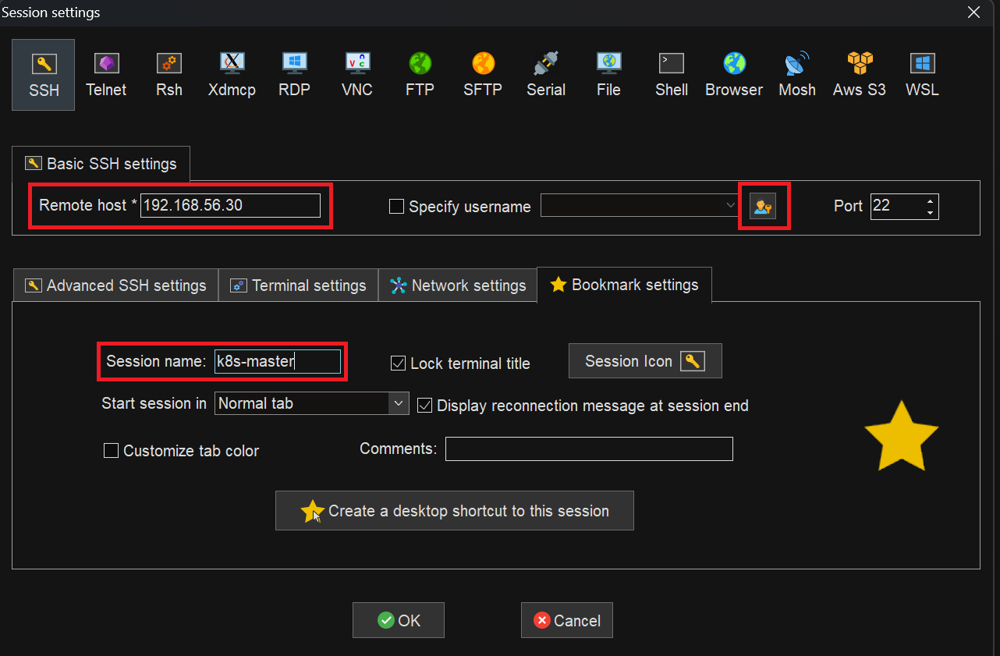
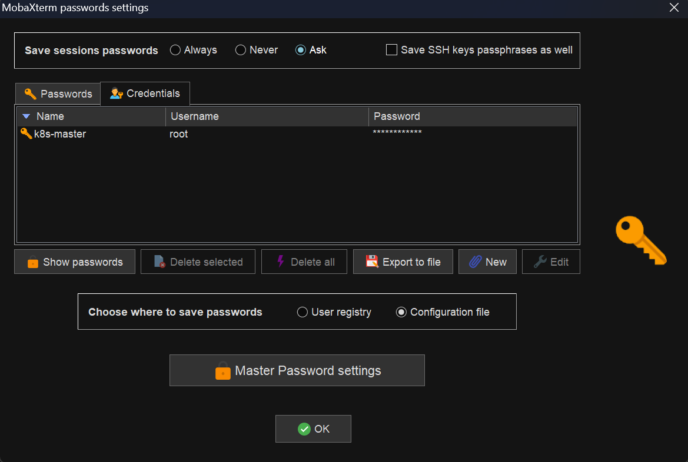
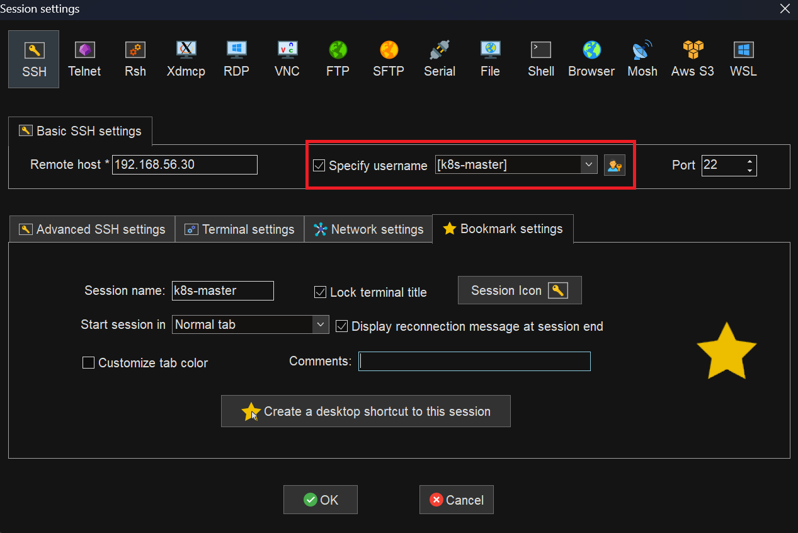
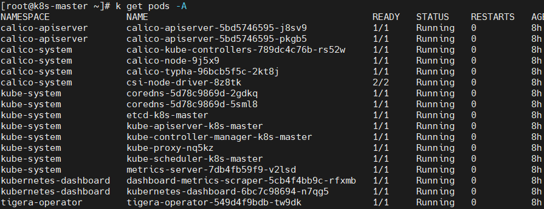
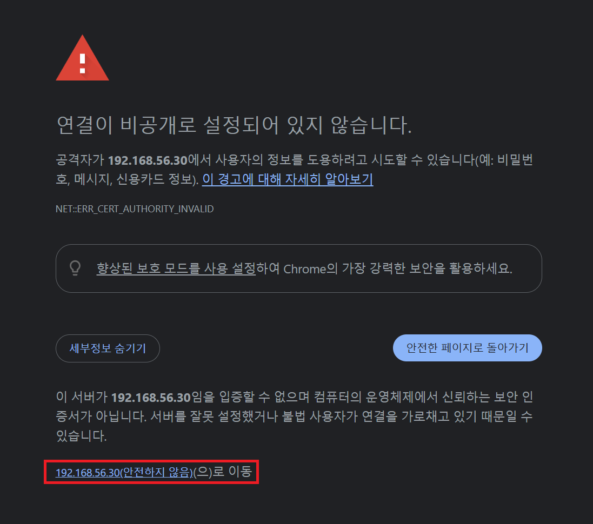
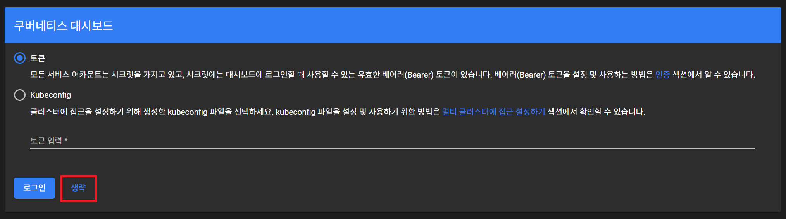
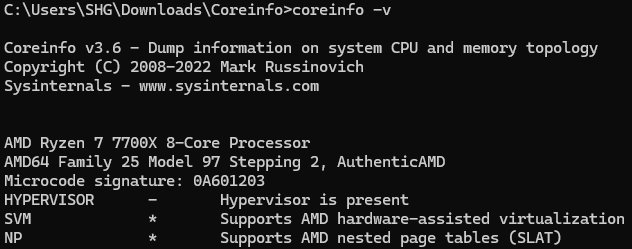

# 쿠버네티스 설치 (Windows + Vagrant + VirtualBox)

## 1. VirtualBox 설치

- 버전: 7.1.6
- 다운로드 링크: [VirtualBox-7.1.6-Win.exe](https://download.virtualbox.org/virtualbox/7.1.6/VirtualBox-7.1.6-167084-Win.exe)

---

## 2. Vagrant 설치

- 버전: 2.4.3
- 다운로드 링크: [Vagrant 2.4.3 Windows 64-bit](https://releases.hashicorp.com/vagrant/2.4.3/vagrant_2.4.3_windows_amd64.msi)

---

## 3. Vagrant 스크립트 실행

### 3-1. Vagrant 폴더 생성

```
C:\Users\사용자명> mkdir k8s && cd k8s
```

### 3-2. Vagrantfile 다운로드

```
C:\Users\사용자명\k8s> curl -O https://raw.githubusercontent.com/hyungeunShin/Kubernetes-Install/main/base/k8s-1.27/vagrant-2.4.3/Vagrantfile
```

### 3-3. Rocky Linux Repo 세팅

```
C:\Users\사용자명\k8s> curl -O https://raw.githubusercontent.com/hyungeunShin/Kubernetes-Install/main/base/k8s-1.27/vagrant-2.4.3/rockylinux-repo.json
                          
C:\Users\사용자명\k8s> vagrant box add rockylinux-repo.json
```

### 3-4. Vagrant Plugin 설치

```
C:\Users\사용자명\k8s> vagrant plugin install vagrant-vbguest vagrant-disksize
```

### 3-5. Vagrant VM 실행

```
C:\Users\사용자명\k8s> vagrant up
```

---

## 4. MobaXterm 설치

- 버전: 25.3 (Portable)
- 다운로드 링크: [MobaXterm_Portable_v25.3.zip](https://download.mobatek.net/2532025092512146/MobaXterm_Portable_v25.3.zip)

---

## 5. Master Node 원격 접속

- VM 실행 후 MobaXterm으로 Master Node 접속
  
- 최초 **id**는 **root**, **password**는 **vagrant**<br>
  
  

---

## 6. Pod 확인

```
kubectl get pods -A
```



---

## 7. 쿠버네티스 대시보드 접속

- 대시보드 URL: [https://192.168.56.30:30000/#/login](https://192.168.56.30:30000/#/login)

- SSL 경고:<br>
  

- 로그인 과정은 생략<br>
  

---

## ※ [설치확인](https://cafe.naver.com/f-e/cafes/30725715/articles/28?boardtype=L&menuid=13&referrerAllArticles=false&page=2)

## ※ [Virtualbox 확인](https://cafe.naver.com/f-e/cafes/30725715/articles/25?boardtype=L&menuid=15&referrerAllArticles=false)


## ※ [Vagrant 확인](https://cafe.naver.com/f-e/cafes/30725715/articles/26?boardtype=L&menuid=15&referrerAllArticles=false)


