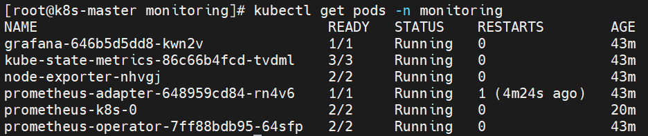
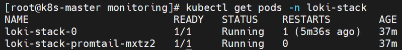
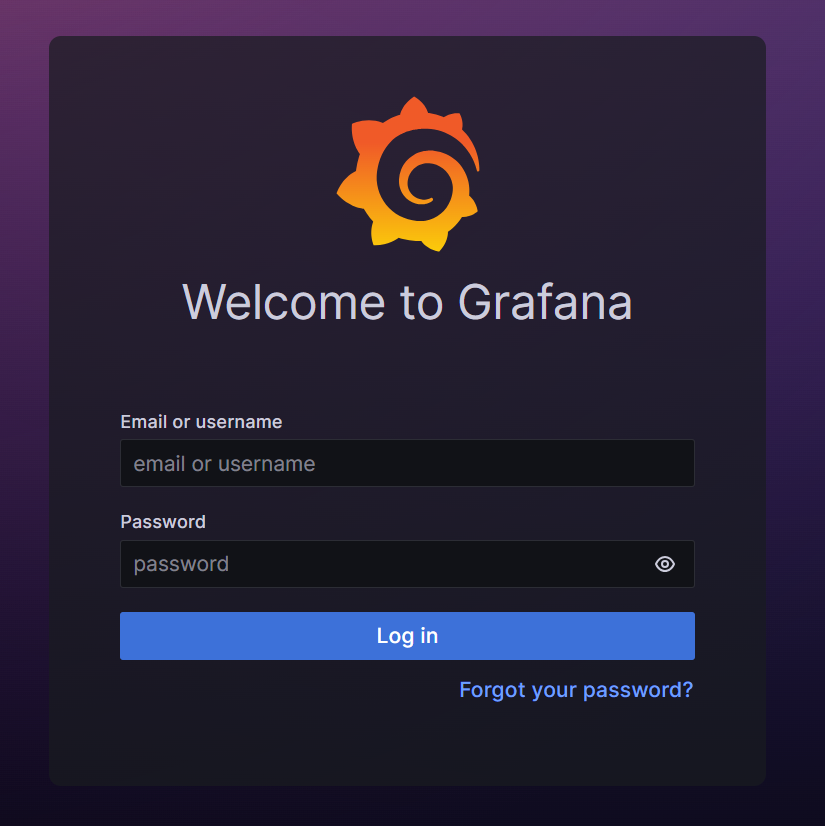
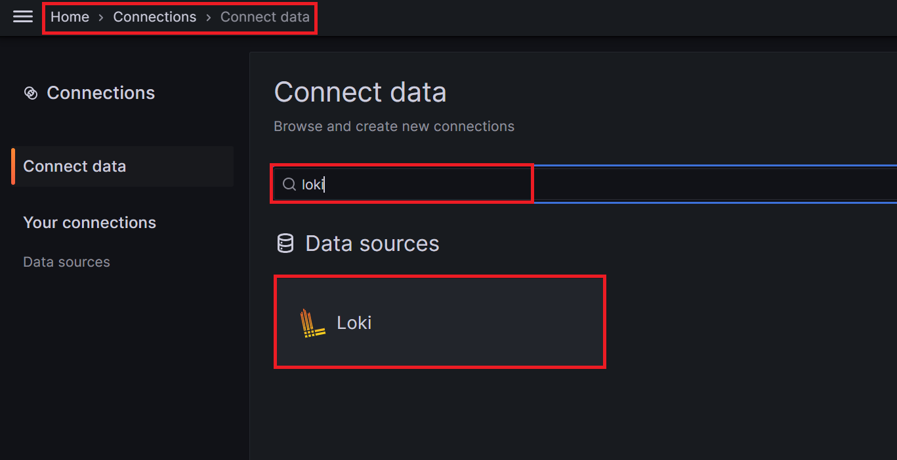
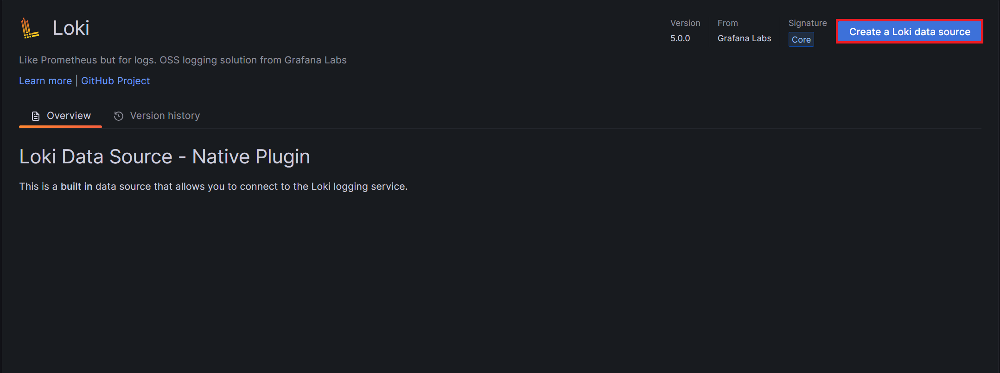
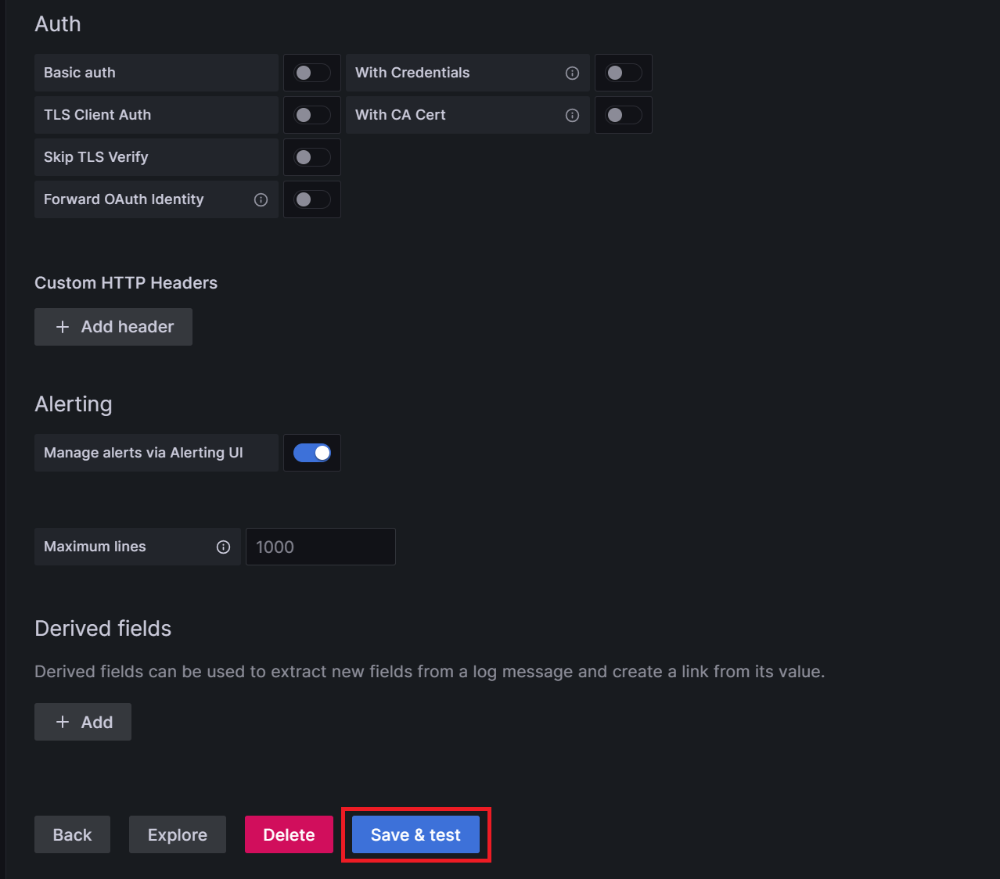

# 쿠버네티스가 편한 이유 > 모니터링 설치

<hr style="height:4px; border:none; color:#333; background-color:#333;" />

## 1. Github에서 Prometheus, Grafana, Loki-Stack yaml 다운로드

### 1-1. 깃 설치

```
[root@k8s-master ~]# yum -y install git
```

### 1-2. 로컬 저장소 생성

```
[root@k8s-master ~]# git init monitoring
[root@k8s-master ~]# git config --global init.defaultBranch main
[root@k8s-master ~]# cd monitoring
```

### 1-3. remote 추가

```
[root@k8s-master monitoring]# git remote add -f origin https://github.com/hyungeunShin/Kubernetes-Install.git
```

### 1-4. sparse checkout 설정

```
[root@k8s-master monitoring]# git config core.sparseCheckout true
[root@k8s-master monitoring]# echo "base/k8s-1.27/prometheus-2.44.0" >> .git/info/sparse-checkout
[root@k8s-master monitoring]# echo "base/k8s-1.27/loki-stack-2.6.1" >> .git/info/sparse-checkout
```

### 1-5. 다운로드

```
[root@k8s-master monitoring]# git pull origin main
```

### 1-6. 설치

```
[root@k8s-master monitoring]# kubectl apply --server-side -f base/k8s-1.27/prometheus-2.44.0/manifests/setup
[root@k8s-master monitoring]# kubectl wait --for condition=Established --all CustomResourceDefinition --namespace=monitoring
[root@k8s-master monitoring]# kubectl apply -f base/k8s-1.27/prometheus-2.44.0/manifests

[root@k8s-master monitoring]# kubectl apply -f base/k8s-1.27/loki-stack-2.6.1
```
- https://github.com/prometheus-operator/kube-prometheus/tree/release-0.14

### 1-7. 설치 확인

```
[root@k8s-master ~]# kubectl get pods -n monitoring
[root@k8s-master ~]# kubectl get pods -n loki-stack
```




---

## 2. Grafana 접속

### 2-1. 접속 URL: http://192.168.56.30:30001

### 2-2. 로그인: ID-admin, PW-admin



---

## 3. Grafana에 Loki-Stack 연결

### 3-1. Home > Connections > Connect data

### 3-2. 검색에 [loki] 입력



### 3-3. [Create a Loki data source]



### 3-4. URL에 내용 입력: http://loki-stack.loki-stack:3100


### 3-5. 하단에 [Save & Test]



---

## ※ Grafana에 데이터가 안나올 경우

```
//System clock synchronized: no 인지 확인
[root@k8s-master ~]# timedatectl

//yes로 변경
[root@k8s-master ~]# systemctl restart chronyd.service
```

---

## ※ Prometheus, Grafana, Loki-Stack 삭제

```
[root@k8s-master monitoring]# kubectl delete --ignore-not-found=true -f base/k8s-1.27/prometheus-2.44.0/manifests -f base/k8s-1.27/prometheus-2.44.0/manifests/setup
[root@k8s-master monitoring]# kubectl delete -f base/k8s-1.27/loki-stack-2.6.1
```