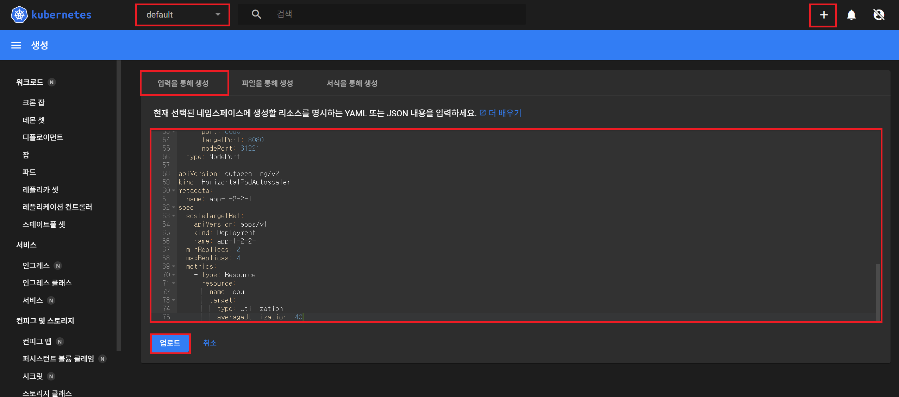
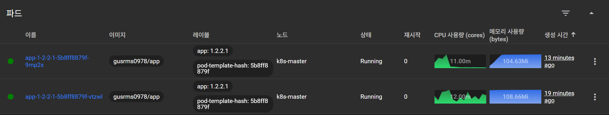
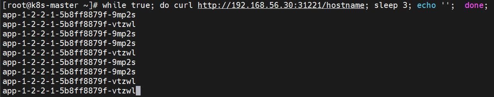
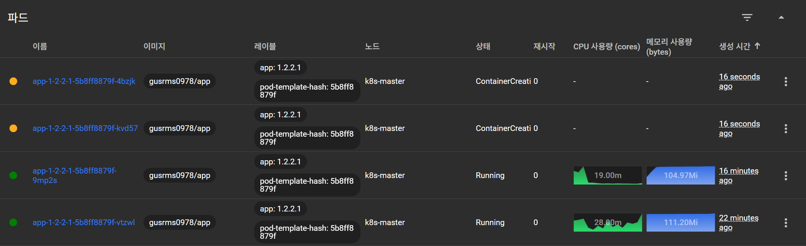
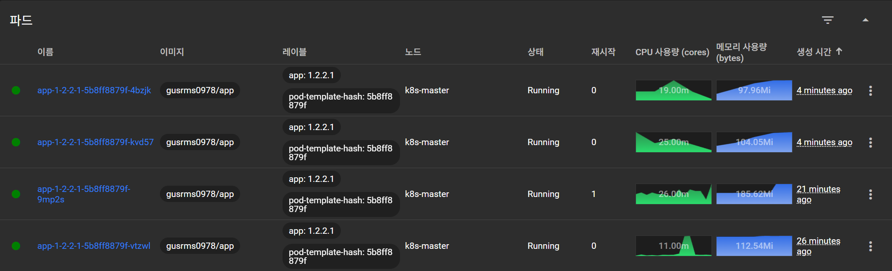
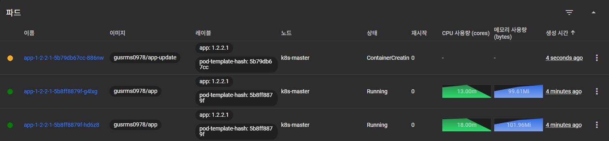
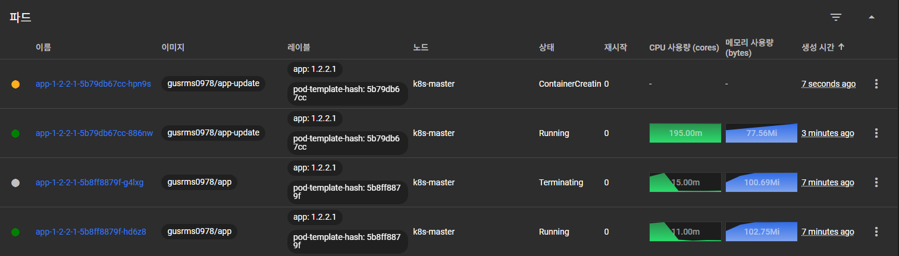
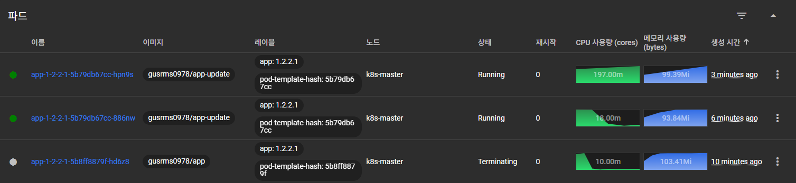
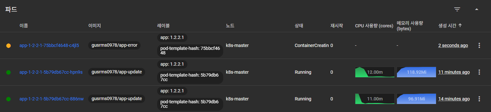
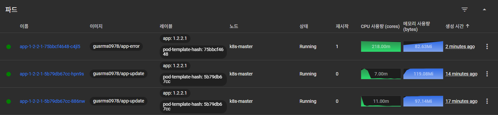

# 쿠버네티스가 편한 이유 > 쿠버네티스 대표 기능

## 1. App 배포 환경 구성

### 1-1. dashboard 접속 > Namespace [default] > [+] 버튼 > [입력을 통해 생성] > 업로드



### 1-2. yaml 파일
```yaml
apiVersion: apps/v1
kind: Deployment
metadata:
  name: app-1-2-2-1
spec:
  selector:
    matchLabels:
      app: '1.2.2.1'
  replicas: 2
  strategy:
    type: RollingUpdate
  template:
    metadata:
      labels:
        app: '1.2.2.1'
    spec:
      containers:
        - name: app-1-2-2-1
          image: gusrms0978/app
          imagePullPolicy: Always
          ports:
            - name: http
              containerPort: 8080
          startupProbe:
            httpGet:
              path: "/ready"
              port: http
            failureThreshold: 20
          livenessProbe:
            httpGet:
              path: "/ready"
              port: http
          readinessProbe:
            httpGet:
              path: "/ready"
              port: http
          resources:
            requests:
              memory: "100Mi"
              cpu: "100m"
            limits:
              memory: "200Mi"
              cpu: "200m"
---
apiVersion: v1
kind: Service
metadata:
  name: app-1-2-2-1
spec:
  selector:
    app: '1.2.2.1'
  ports:
    - port: 8080
      targetPort: 8080
      nodePort: 31221
  type: NodePort
---
apiVersion: autoscaling/v2
kind: HorizontalPodAutoscaler
metadata:
  name: app-1-2-2-1
spec:
  scaleTargetRef:
    apiVersion: apps/v1
    kind: Deployment
    name: app-1-2-2-1
  minReplicas: 2
  maxReplicas: 4
  metrics:
    - type: Resource
      resource:
        name: cpu
        target:
          type: Utilization
          averageUtilization: 40
```
- docker hub에 gusrms0978/app:latest가 존재해야 함

### 1-3. pod 확인
  

---

## 2. App에 지속적으로 트래픽 전송(Traffic Routing 테스트)

```
[root@k8s-master ~]# while true; do curl http://192.168.56.30:31221/hostname; sleep 3; echo '';  done;
```

- 현재 [iptalbes 모드](https://kubernetes.io/ko/docs/reference/networking/virtual-ips/)로 작동하기 때문에 Random으로 Pod에 트래픽이 분산된다.
  

---

## 3. App에 부하(AutoScaling 테스트)

```
[root@k8s-master ~]# curl 192.168.56.30:31221/cpu-load
```

- 2개의 pod 추가 생성
  

---

## 4. App에서 Memory Leak(Self-Healing 테스트)

```
[root@k8s-master ~]# curl 192.168.56.30:31221/memory-leak
```

- 재시작된 파드 존재 확인
  

---

## 5. App 이미지 업데이트(RollingUpdate 테스트)

### 5-1. 기동하는 App 업데이트

```
[root@k8s-master ~]# kubectl set image -n default deployment/app-1-2-2-1 app-1-2-2-1=gusrms0978/app-update
```

- 동작과정

  ① 업데이트된 새 Pod 생성<br>
  

  ② 기존 Pod 중 하나 삭제, 업데이트된 Pod 추가 생성<br>
  

  ③ 다시 기존 Pod 하나 삭제<br>
  

### 5-2. 기동되지 않는 App 업데이트

```
[root@k8s-master ~]# kubectl set image -n default deployment/app-1-2-2-1 app-1-2-2-1=gusrms0978/app-error
```

- 동작과정

  ① 업데이트된 새 Pod 생성<br>
  

  ② Pod 오류<br>
  

  ③ 계속 재시작 시도
  

- 업데이트 중지하고 롤백
  ```
  [root@k8s-master ~]# kubectl rollout undo -n default deployment/app-1-2-2-1
  ```

---

## 6. 배포한 Object 삭제

```
[root@k8s-master ~]# kubectl delete -n default deploy app-1-2-2-1
[root@k8s-master ~]# kubectl delete -n default svc app-1-2-2-1
[root@k8s-master ~]# kubectl delete -n default hpa app-1-2-2-1
```