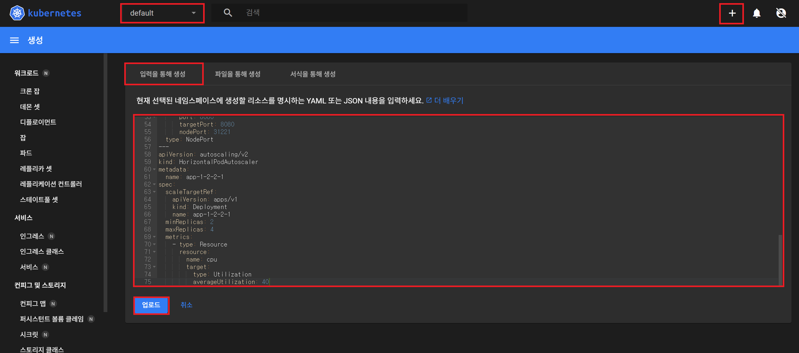

# 쿠버네티스가 편한 이유 > 쿠버네티스 대표 기능

## 1. App 배포 환경 구성

- dashboard 접속 > Namespace [default] > [+] 버튼 > [입력을 통해 생성] > 업로드
  
- docker hub에 gusrms0978/app:latest가 존재해야 함
- yaml 파일
```
apiVersion: apps/v1
kind: Deployment
metadata:
  name: app-1-2-2-1
spec:
  selector:
    matchLabels:
      app: '1.2.2.1'
  replicas: 2
  strategy:
    type: RollingUpdate
  template:
    metadata:
      labels:
        app: '1.2.2.1'
    spec:
      containers:
        - name: app-1-2-2-1
          image: gusrms0978/app
          imagePullPolicy: Always
          ports:
            - name: http
              containerPort: 8080
          startupProbe:
            httpGet:
              path: "/ready"
              port: http
            failureThreshold: 48
          livenessProbe:
            httpGet:
              path: "/ready"
              port: http
            failureThreshold: 24
          readinessProbe:
            httpGet:
              path: "/ready"
              port: http
            failureThreshold: 24
          resources:
            requests:
              memory: "100Mi"
              cpu: "100m"
            limits:
              memory: "200Mi"
              cpu: "200m"
---
apiVersion: v1
kind: Service
metadata:
  name: app-1-2-2-1
spec:
  selector:
    app: '1.2.2.1'
  ports:
    - port: 8080
      targetPort: 8080
      nodePort: 31221
  type: NodePort
---
apiVersion: autoscaling/v2
kind: HorizontalPodAutoscaler
metadata:
  name: app-1-2-2-1
spec:
  scaleTargetRef:
    apiVersion: apps/v1
    kind: Deployment
    name: app-1-2-2-1
  minReplicas: 2
  maxReplicas: 4
  metrics:
    - type: Resource
      resource:
        name: cpu
        target:
          type: Utilization
          averageUtilization: 40
```

---

## 2. App에 지속적으로 트래픽 전송(Traffic Routing 테스트)

```
[root@k8s-master ~]# while true; do curl http://192.168.56.30:31221/hostname; sleep 2; echo '';  done;
```

---

## 3. App에서 Memory Leak(Self-Healing 테스트)

```
[root@k8s-master ~]# curl 192.168.56.30:31221/memory-leak
```

---

## 4. App에 부하(AutoScaling 테스트)

```
[root@k8s-master ~]# curl 192.168.56.30:31221/cpu-load
```
