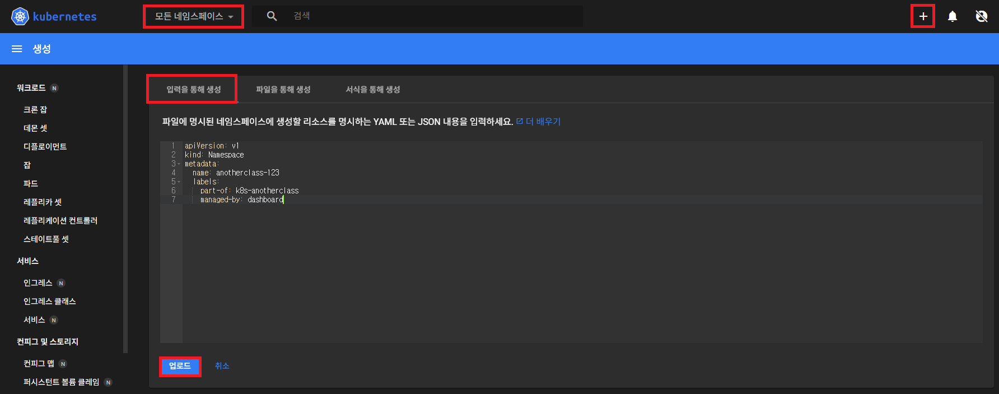

# 환경 구성

## 1. master node에 접속해서 디렉토리 생성

```
[root@k8s-master ~]# mkdir -p /root/k8s-local-volume/1231
```

## 2. dashboard 접속 > Namespace [모든 네임스페이스] > [+] 버튼 > [입력을 통해 생성] > 업로드



▶ Namespace
```yaml
apiVersion: v1
kind: Namespace
metadata:
  name: anotherclass-123
  labels:
    part-of: k8s-anotherclass
    managed-by: dashboard
```
▶ Deployment
```yaml
apiVersion: apps/v1
kind: Deployment
metadata:
  namespace: anotherclass-123
  name: api-tester-1231
  labels:
    part-of: k8s-anotherclass
    component: backend-server
    name: api-tester
    instance: api-tester-1231
    version: 1.0.0
    managed-by: dashboard
spec:
  selector:
    matchLabels:
      part-of: k8s-anotherclass
      component: backend-server
      name: api-tester
      instance: api-tester-1231
  replicas: 2
  strategy:
    type: RollingUpdate
  template:
    metadata:
      labels:
        part-of: k8s-anotherclass
        component: backend-server
        name: api-tester
        instance: api-tester-1231
        version: 1.0.0
    spec:
      nodeSelector:
        kubernetes.io/hostname: k8s-master
      containers:
        - name: api-tester-1231
          image: gusrms0978/api-tester:v1.0.0
          ports:
          - name: http
            containerPort: 8080
          envFrom:
            - configMapRef:
                name: api-tester-1231-properties
          startupProbe:
            httpGet:
              path: "/startup"
              port: 8080
            periodSeconds: 5
            failureThreshold: 36
          readinessProbe:
            httpGet:
              path: "/readiness"
              port: 8080
            periodSeconds: 10
            failureThreshold: 3
          livenessProbe:
            httpGet:
              path: "/liveness"
              port: 8080
            periodSeconds: 10
            failureThreshold: 3
          resources:
            requests:
              memory: "100Mi"
              cpu: "100m"
            limits:
              memory: "200Mi"
              cpu: "200m"
          volumeMounts:
            - name: files
              mountPath: /usr/src/myapp/files/dev
            - name: secret-datasource
              mountPath: /usr/src/myapp/datasource
      volumes:
        - name: files
          persistentVolumeClaim:
            claimName: api-tester-1231-files
        - name: secret-datasource
          secret:
            secretName: api-tester-1231-postgresql
```
▶ Service
```yaml
apiVersion: v1
kind: Service
metadata:
  namespace: anotherclass-123
  name: api-tester-1231
  labels:
    part-of: k8s-anotherclass
    component: backend-server
    name: api-tester
    instance: api-tester-1231
    version: 1.0.0
    managed-by: dashboard
spec:
  selector:
    part-of: k8s-anotherclass
    component: backend-server
    name: api-tester
    instance: api-tester-1231
  ports:
    - port: 80
      targetPort: http
      nodePort: 31231
  type: NodePort
```
▶ Configmap, Secret
```yaml
apiVersion: v1
kind: ConfigMap
metadata:
  namespace: anotherclass-123
  name: api-tester-1231-properties
  labels:
    part-of: k8s-anotherclass
    component: backend-server
    name: api-tester
    instance: api-tester-1231
    version: 1.0.0
    managed-by: dashboard
data:
  spring_profiles_active: "dev"
  application_role: "ALL"
  postgresql_filepath: "/usr/src/myapp/datasource/postgresql-info.yaml"
---
apiVersion: v1
kind: Secret
metadata:
  namespace: anotherclass-123
  name: api-tester-1231-postgresql
  labels:
    part-of: k8s-anotherclass
    component: backend-server
    name: api-tester
    instance: api-tester-1231
    version: 1.0.0
    managed-by: dashboard
stringData:
  postgresql-info.yaml: |
    driver-class-name: "org.postgresql.Driver"
    url: "jdbc:postgresql://postgresql:5431"
    username: "dev"
    password: "dev123"
```
▶ PVC, PV
```yaml
apiVersion: v1
kind: PersistentVolumeClaim
metadata:
  namespace: anotherclass-123
  name: api-tester-1231-files
  labels:
    part-of: k8s-anotherclass
    component: backend-server
    name: api-tester
    instance: api-tester-1231
    version: 1.0.0
    managed-by: kubectl
spec:
  resources:
    requests:
      storage: 2G
  accessModes:
    - ReadWriteMany
  selector:
    matchLabels:
      part-of: k8s-anotherclass
      component: backend-server
      name: api-tester
      instance: api-tester-1231-files
---
apiVersion: v1
kind: PersistentVolume
metadata:
  name: api-tester-1231-files
  labels:
    part-of: k8s-anotherclass
    component: backend-server
    name: api-tester
    instance: api-tester-1231-files
    version: 1.0.0
    managed-by: dashboard
spec:
  capacity:
    storage: 2G
  volumeMode: Filesystem
  accessModes:
    - ReadWriteMany
  local:
    path: "/root/k8s-local-volume/1231"
  nodeAffinity:
    required:
      nodeSelectorTerms:
        - matchExpressions:
            - {key: kubernetes.io/hostname, operator: In, values: [k8s-master]}
```
▶ HPA
```yaml
apiVersion: autoscaling/v2
kind: HorizontalPodAutoscaler
metadata:
  namespace: anotherclass-123
  name: api-tester-1231-default
  labels:
    part-of: k8s-anotherclass
    component: backend-server
    name: api-tester
    instance: api-tester-1231
    version: 1.0.0
    managed-by: dashboard
spec:
  scaleTargetRef:
    apiVersion: apps/v1
    kind: Deployment
    name: api-tester-1231
  minReplicas: 2
  maxReplicas: 4
  metrics:
    - type: Resource
      resource:
        name: cpu
        target:
          type: Utilization
          averageUtilization: 60
  behavior:
    scaleUp:
      stabilizationWindowSeconds: 120
```

## 3. 삭제

```
[root@k8s-master ~]# kubectl delete ns anotherclass-123
[root@k8s-master ~]# kubectl delete pv api-tester-1231-files
```
