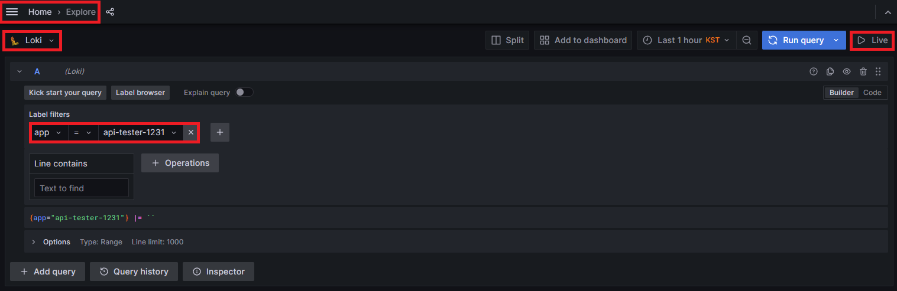
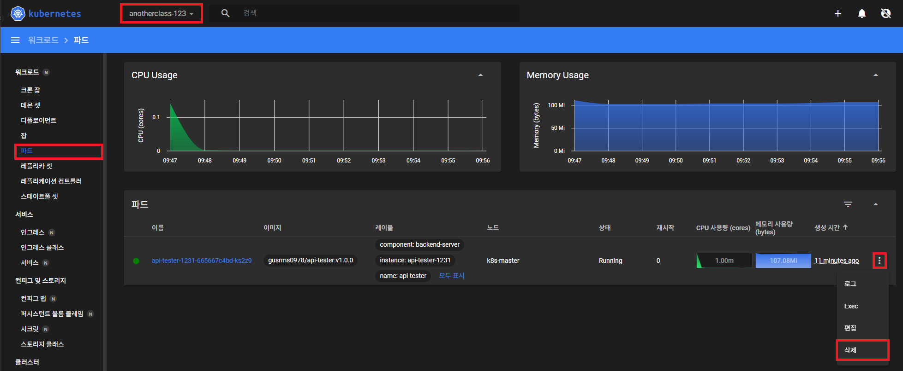
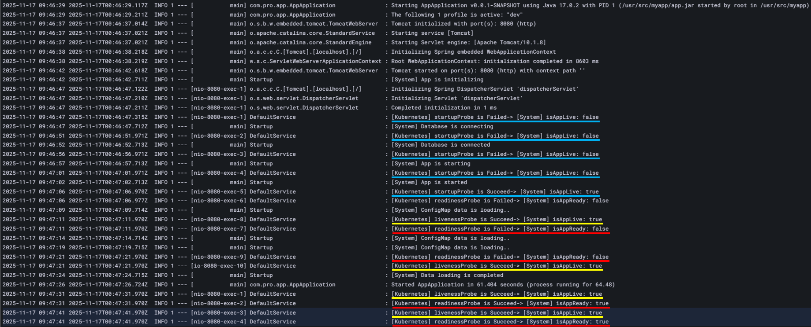

# Probe

<hr style="height:4px; border:none; color:#333; background-color:#333;" />

## 1. HPA의 minReplica 1로 변경

```
[root@k8s-master ~]# kubectl patch -n anotherclass-123 hpa api-tester-1231-default -p '{"spec":{"minReplicas":1}}'
```

---

## 2. Grafana 접속해서 Loki에 Pod 로그 화면 세팅



---

## 3. Pod 삭제



---

## 4. Application 로그 확인



| Probe      | 목적                                                         | 실패 시 동작                                                  |
|------------|-------------------------------------------------------------|----------------------------------------------------------|
| Startup    | 컨테이너의 애플리케이션이 성공적으로 시작 및 초기화되었는지 판단합니다. | 컨테이너를 재시작합니다.                                            |
| Readiness  | 컨테이너가 들어오는 네트워크 트래픽을 받을 준비가 되었는지 판단합니다.  | 파드의 IP 주소가 서비스 엔드포인트에서 제거되어 트래픽만 차단되며, 컨테이너는 재시작되지 않습니다. |
| Liveness   | 컨테이너가 정상적으로 작동 중인지(예: 교착 상태 아님) 판단합니다.     |  kubelet이 컨테이너를 종료하고 재시작 정책에 따라 재시작됩니다.                  |

- **[App 초기화]** 중 시스템 연동 작업을 하고, **[User 초기화]** 중에 초기 데이터 로딩 작업이 있음. 그리고 이 작업이 다 끝나야 **[기동완료]** 가 되는 상황
- **startupProbe**가 **5초** 간격으로 호출 되고, **성공할 때까지 반복**, 성공 후 readinessProbe와 livenessProbe가 시작
- **livenessProbe**는 바로 **성공**을 하지만, **readinessProbe**는 처음 **실패** 후에 **[기동완료]** 가 되서야 **성공**을 함
- **livenessProbe**와 **readinessProbe**는 **10초** 간격으로 계속 호출 됨

---

## 5. API 날려보며 프로브 동작 확인하기

```
//외부 API
[root@k8s-master ~]# curl http://192.168.56.30:31231/hello

//내부 API
[root@k8s-master ~]# kubectl exec -n anotherclass-123 -it <pod-name> -- curl localhost:8080/hello

//트래픽 중단 - App 내부 isAppReady를 False로 바꿈
[root@k8s-master ~]# curl http://192.168.56.30:31231/traffic-off

//트래픽 재개 - App 내부 isAppReady를 True로 바꿈
[root@k8s-master ~]# kubectl exec -n anotherclass-123 -it <pod-name> -- curl localhost:8080/traffic-on

//장애발생 - App 내부 isAppLive를 False로 바꿈
[root@k8s-master ~]# curl http://192.168.56.30:31231/server-error
```