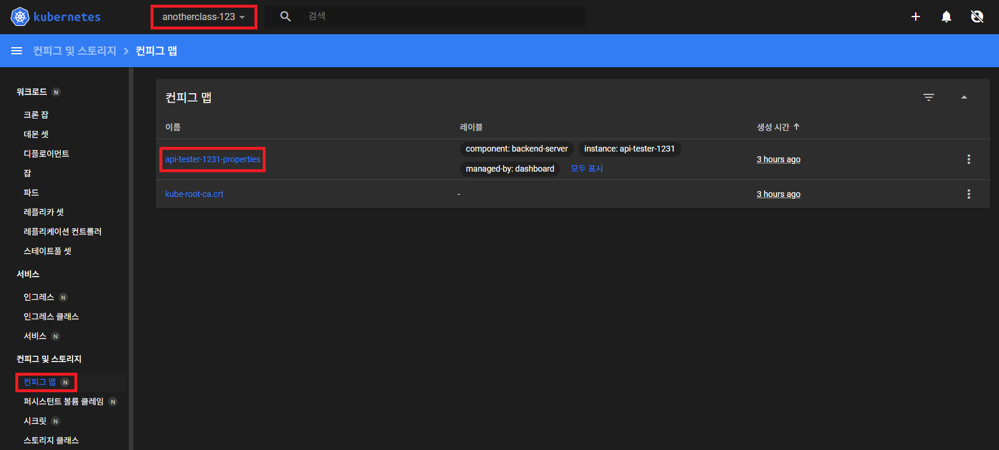
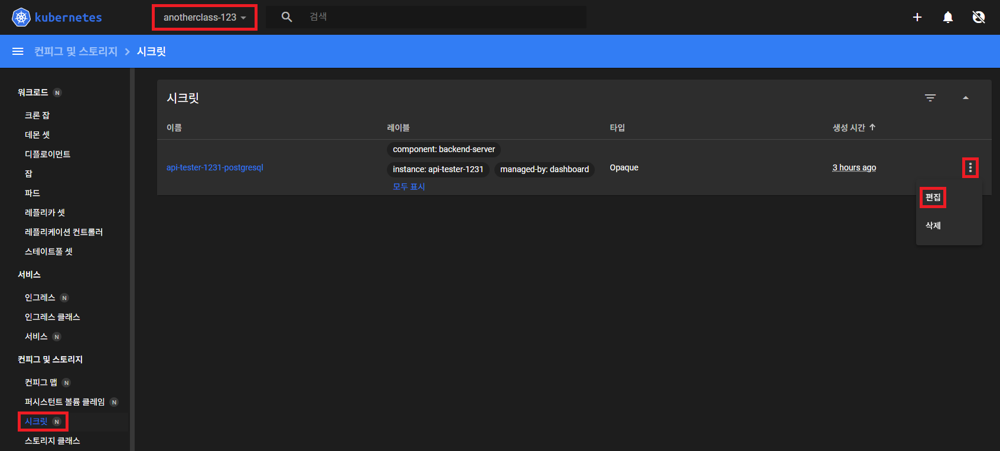
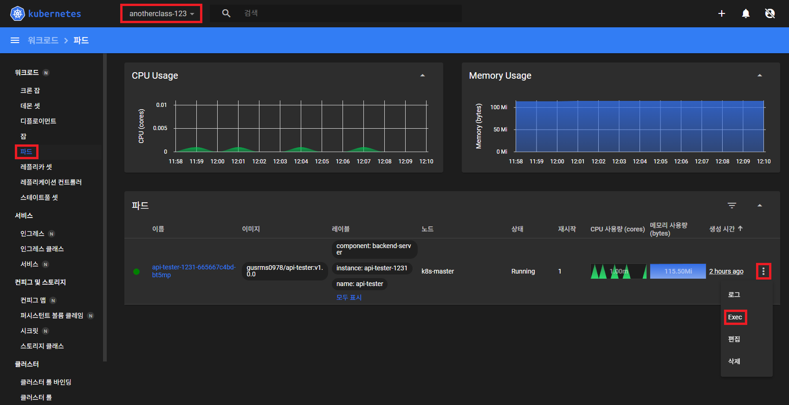
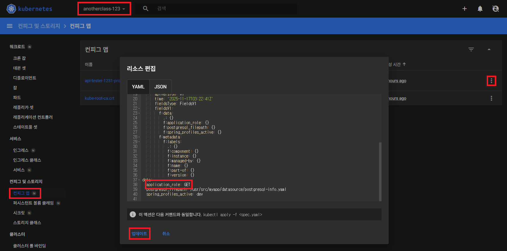
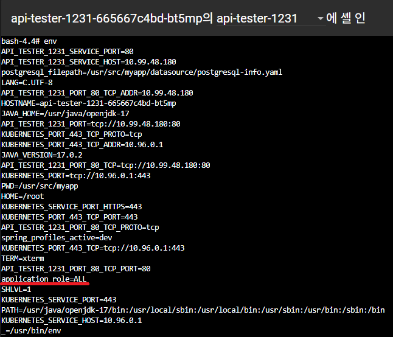
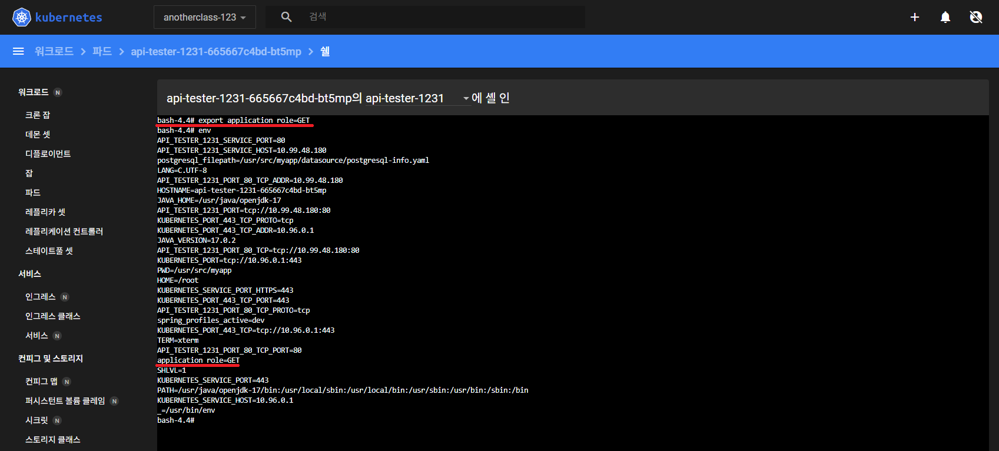
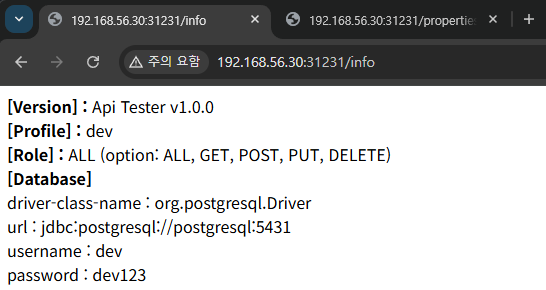
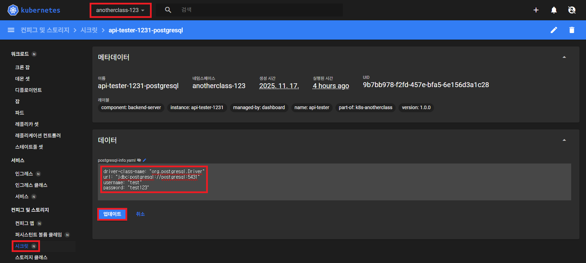
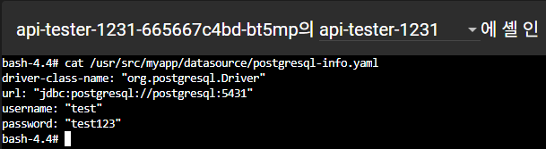
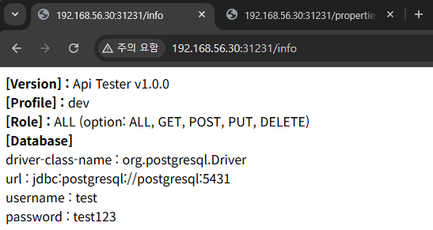

# Configmap, Secret

## 1. 입력값 확인

▶ kubectl
```
//Configmap 확인
[root@k8s-master ~]# kubectl describe -n anotherclass-123 configmaps api-tester-1231-properties
[root@k8s-master ~]# kubectl get -n anotherclass-123 configmaps api-tester-1231-properties -o yaml
[root@k8s-master ~]# kubectl get -n anotherclass-123 configmaps api-tester-1231-properties -o jsonpath='{.data}'

//Secret 확인
[root@k8s-master ~]# kubectl get -n anotherclass-123 secret api-tester-1231-postgresql -o yaml
[root@k8s-master ~]# kubectl get -n anotherclass-123 secret api-tester-1231-postgresql -o jsonpath='{.data}'

//Secret data에서 postgresql-info가 Key인 Value값만 조회 하기
[root@k8s-master ~]# kubectl get -n anotherclass-123 secret api-tester-1231-postgresql -o jsonpath='{.data.postgresql-info\.yaml}'

//Secret data에서 postgresql-info가 Key인 Value값을 Base64 디코딩해서 보기
[root@k8s-master ~]# kubectl get -n anotherclass-123 secret api-tester-1231-postgresql -o jsonpath='{.data.postgresql-info\.yaml}' | base64 -d
```

▶ dashboard





---

## 2. 컨테이너 내부 확인

▶ kubectl
```
//사용 포맷
[root@k8s-master ~]# kubectl exec -n <namespace-name> -it <pod-name> -- <command>

[root@k8s-master ~]# kubectl exec -n anotherclass-123 -it <pod-name> -- env
[root@k8s-master ~]# kubectl exec -n anotherclass-123 -it <pod-name> -- cat /usr/src/myapp/datasource/postgresql-info.yaml
[root@k8s-master ~]# kubectl exec -n anotherclass-123 -it <pod-name> -- jps -v
```

▶ dashboard



```
//Configmap 환경 변수 확인
env

//Secret 파일 확인
ls /usr/src/myapp/datasource
cat /usr/src/myapp/datasource/postgresql-info.yaml

//java 실행 인자 확인
jps -v
```

---

## 3. API 확인

- Application 정보 확인 (version, profile, role, database): http://192.168.56.30:31231/info 
- Application Properties 파일 구성 확인: http://192.168.56.30:31231/properties

---

## 4. Configmap 수정



- 환경변수는 Pod가 생성될 때, 처음 한 번만 주입되기 때문에 이렇게 Configmap의 값만 수정한다고 해서 바뀌지 않는다.<br>
  

- 아래 명령어를 통해 강제로 수정해도 마찬가지이다.
  ```
  export application_role=GET
  ```
  
  

---

## 5. Secret 수정



- Secret이 바뀌는 이유는 Secret을 볼륨 마운팅으로 연결해 놨기 때문이다.<br>
  
- 이 App에서는 이 파일을 5초 간격으로 계속 조회하게끔 로직이 구성되어 있다.<br>
  