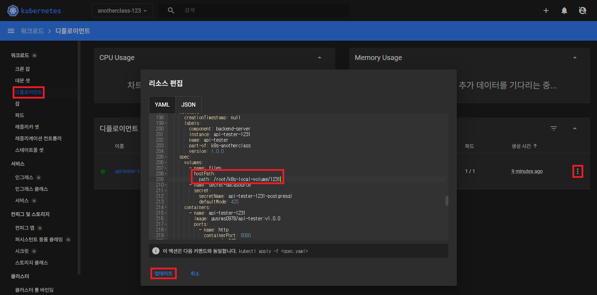
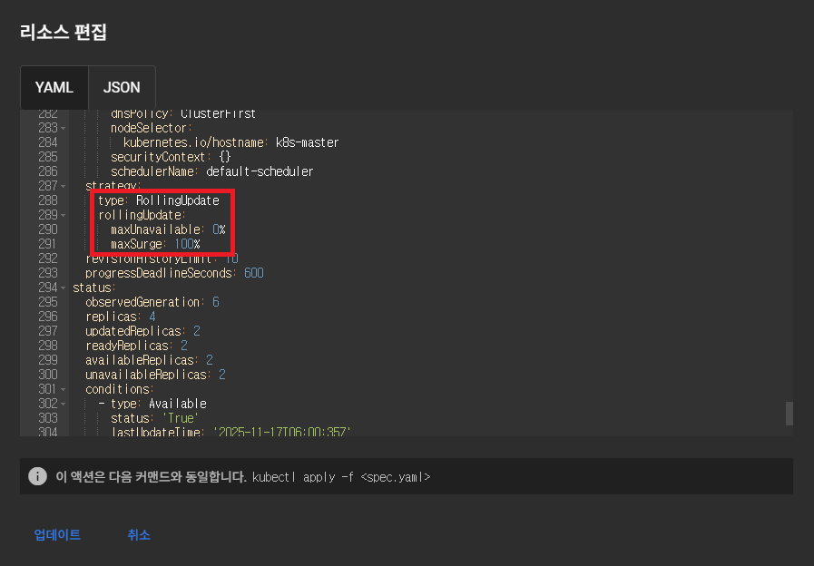

# Application 기능으로 이해하기 - PV/PVC, Deployment, Service, HPA

<hr style="height:4px; border:none; color:#333; background-color:#333;" />

## 1. PV/PVC

### 1-1. 파일 생성 API 호출

- http://192.168.56.30:31231/create-file-pod
- http://192.168.56.30:31231/create-file-pv

### 1-2. 폴더 확인

```
//Container 임시 폴더 확인
[root@k8s-master ~]# kubectl exec -n anotherclass-123 -it <pod-name> -- ls /usr/src/myapp/tmp

//Container 영구저장 폴더 확인
[root@k8s-master ~]# kubectl exec -n anotherclass-123 -it <pod-name> -- ls /usr/src/myapp/files/dev

//master node 폴더 확인
[root@k8s-master ~]# ls /root/k8s-local-volume/1231
```

### 1-3. Pod 삭제

```
[root@k8s-master ~]# kubectl delete -n anotherclass-123 pod <pod-name>
```

### 1-4. 파일 조회 API 호출

- http://192.168.56.30:31231/list-file-pod
- http://192.168.56.30:31231/list-file-pv

### 1-5. hostPath 동작 확인 - Deployment 수정 후 1-1 ~ 1-4 수행

```yaml
apiVersion: apps/v1
kind: Deployment
metadata:
  namespace: anotherclass-123
  name: api-tester-1231
spec:
  template:
    spec:
      nodeSelector:
        kubernetes.io/hostname: k8s-master
      containers:
        - name: api-tester-1231
          volumeMounts:
            - name: files
              mountPath: /usr/src/myapp/files/dev
            - name: secret-datasource
              mountPath: /usr/src/myapp/datasource
      volumes:
        - name: files
          persistentVolumeClaim:             # 삭제
            claimName: api-tester-1231-files # 삭제
          # 아래 hostPath 추가
          hostPath:
            path: /root/k8s-local-volume/1231
        - name: secret-datasource
          secret:
            secretName: api-tester-1231-postgresql
```



---

## 2. Deployment

### 2-1. RollingUpdate 하기

```
//1) HPA minReplica 2로 바꾸기 (이전에 minReplicas를 1로 바꿔놨었음)
//방법1
[root@k8s-master ~]# kubectl patch -n anotherclass-123 hpa api-tester-1231-default -p '{"spec":{"minReplicas":2}}'
//방법2
[root@k8s-master ~]# kubectl scale -n anotherclass-123 deployment api-tester-1231 --replicas=2
//방법3
[root@k8s-master ~]# kubectl edit -n anotherclass-123 deployment api-tester-1231

//2) 지속적으로 Version호출 하기 (업데이트 동안 리턴값 관찰)
[root@k8s-master ~]# while true; do curl http://192.168.56.30:31231/version; sleep 3; echo ''; done; 

//3) 별도의 원격 콘솔창을 열어서 업데이트 실행
[root@k8s-master ~]# kubectl set image -n anotherclass-123 deployment/api-tester-1231 api-tester-1231=gusrms0978/api-tester:v2.0.0
```

### 2-2. RollingUpdate (maxUnavailable: 0%, maxSurge: 100%) 하기

```yaml
apiVersion: apps/v1
kind: Deployment
metadata:
  namespace: anotherclass-123
  name: api-tester-1231
spec:
  replicas: 2
  strategy:
    type: RollingUpdate
    rollingUpdate:
      maxUnavailable: 25% -> 0%  # 수정
      maxSurge: 25% -> 100%      # 수정
```

```
[root@k8s-master ~]# kubectl set image -n anotherclass-123 deployment/api-tester-1231 api-tester-1231=gusrms0978/api-tester:v1.0.0
```




### 2-3. Recreate 하기

```yaml
apiVersion: apps/v1
kind: Deployment
metadata:
  namespace: anotherclass-123
  name: api-tester-1231
spec:
  replicas: 2
  strategy:
    type: RollingUpdate -> Recreate   # 수정
    rollingUpdate:        # 삭제
      maxUnavailable: 0%  # 삭제
      maxSurge: 100%      # 삭제
```

```
[root@k8s-master ~]# kubectl set image -n anotherclass-123 deployment/api-tester-1231 api-tester-1231=gusrms0978/api-tester:v2.0.0
```

---

## 3. Service

### 3-1. [Pod 내부]에서 Service 명으로 API 호출

```
curl http://api-tester-1231:80/version
```

### 3-2. Deployment에서 Pod의 ports 전체 삭제, Service targetPort를 http -> 8080으로 수정

```yaml
apiVersion: apps/v1
kind: Deployment
metadata:
  namespace: anotherclass-123
  name: api-tester-1231
spec:
  template:
    spec:
      nodeSelector:
        kubernetes.io/hostname: k8s-master
      containers:
        - name: api-tester-1231
          ports:                # 삭제
          - name: http          # 삭제
            containerPort: 8080 # 삭제
---
apiVersion: v1
kind: Service
metadata:
  namespace: anotherclass-123
  name: api-tester-1231
spec:
  ports:
    - port: 80
      targetPort: http -> 8080  # 변경
      nodePort: 31231
  type: NodePort
```

### 3-3. 다시 [Pod 내부]에서 Service 명으로 API 호출

```
curl http://api-tester-1231:80/version
```

---

## 4. HPA

### 4-1. 부하 발생

- http://192.168.56.30:31231/cpu-load?min=3&thread=5

### 4-1. 부하 확인

▶ 명령어

```
[root@k8s-master ~]# kubectl top -n anotherclass-123 pods
[root@k8s-master ~]# kubectl get hpa -n anotherclass-123
```

▶ Grafana: Home > Dashboards > Default > Kubernetes / Compute Resources / Pod

### 4-2. behavior 미사용으로 적용

```yaml
apiVersion: autoscaling/v2
kind: HorizontalPodAutoscaler
metadata:
  namespace: anotherclass-123
  name: api-tester-1231-default
spec:
  behavior:                             # 삭제
    scaleUp:                            # 삭제
      stabilizationWindowSeconds: 120   # 삭제
```

### 4-2. 부하 발생

- http://192.168.56.30:31231/cpu-load

### 4-2. 부하 확인

▶ 명령어

```
[root@k8s-master ~]# kubectl top -n anotherclass-123 pods
[root@k8s-master ~]# kubectl get hpa -n anotherclass-123
```

▶ Grafana: Home > Dashboards > Default > Kubernetes / Compute Resources / Pod<br>
▶ Grafana: Grafana > Home > Dashboards > New > Import > ID: 17125 > Load