# CI/CD 서버 구축 (Windows + Vagrant + VirtualBox)

<hr style="height:4px; border:none; color:#333; background-color:#333;" />

## 1. Vagrant 스크립트 실행

### 1-1. Vagrant 폴더 생성

```
C:\Users\사용자명> mkdir cicd && cd cicd
```

### 1-2. Vagrantfile 다운로드

```
C:\Users\사용자명\cicd> curl -O https://raw.githubusercontent.com/hyungeunShin/Kubernetes-Install/main/base/cicd-server/vagrant-2.4.3/Vagrantfile
```

### 1-3. Rocky Linux Repo 세팅

```
C:\Users\사용자명\cicd> curl -O https://raw.githubusercontent.com/hyungeunShin/Kubernetes-Install/main/base/cicd-server/vagrant-2.4.3/rockylinux-repo.json
                          
C:\Users\사용자명\cicd> vagrant box add rockylinux-repo.json
```

### 1-4. Vagrant Plugin 설치

```
C:\Users\사용자명\cicd> vagrant plugin install vagrant-vbguest vagrant-disksize
```

### 1-5. Vagrant VM 실행

```
C:\Users\사용자명\cicd> vagrant up
```

---

## 2. CI/CD 원격 접속

- Sessions > New session을 선택해서 접속 세션 생성<br>
  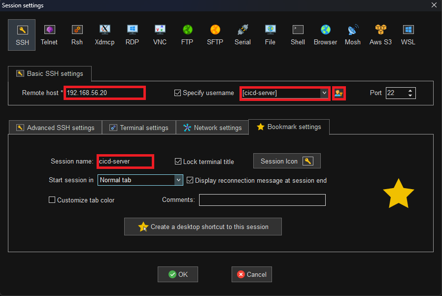
- 최초 **id**는 **root**, **password**는 **vagrant**<br>
  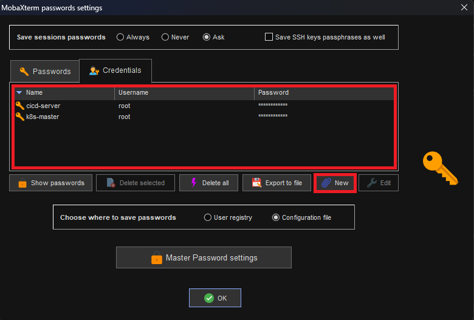

---

## 3. Jenkins 초기 세팅

### 3-1. CI/CD 서버에서 초기 비밀번호 확인

```
[root@cicd-server ~]# cat /var/lib/jenkins/secrets/initialAdminPassword
```

### 3-2. Jenkins 대시보드 접속해서 확인한 비밀번호 입력

- http://192.168.56.20:8080/login<br>

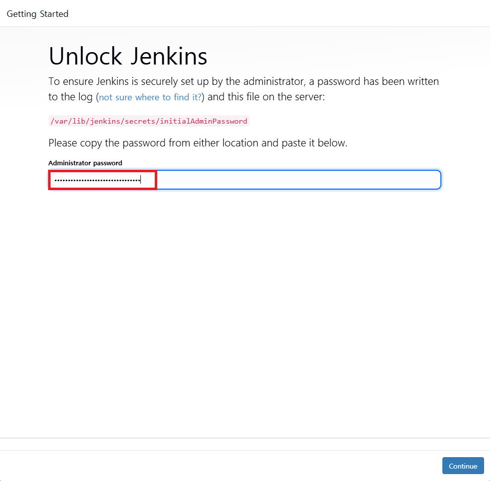

### 3-3. 플러그인 설치

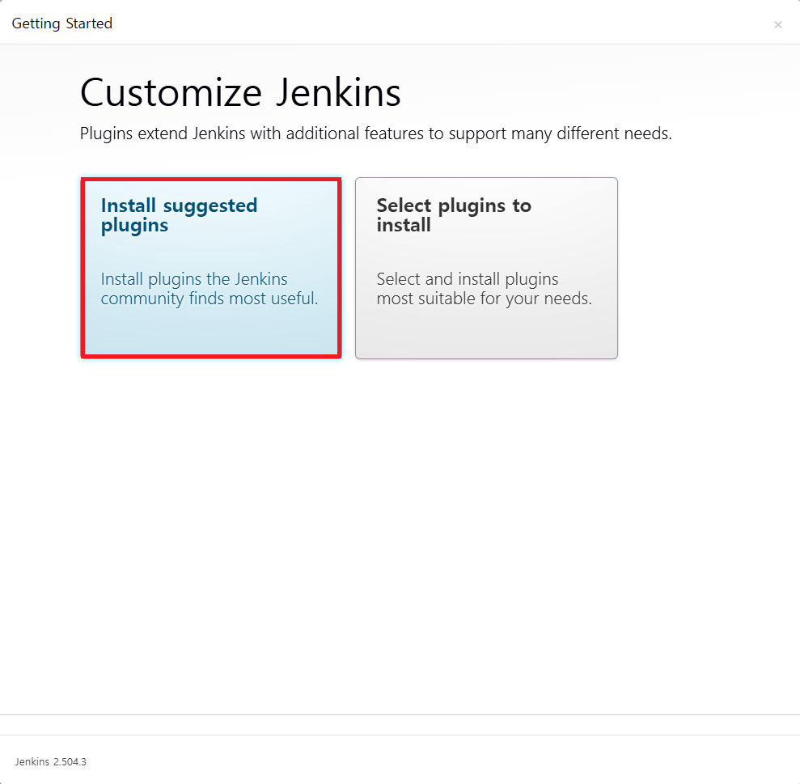

### 3-4. Admin 사용자 생성

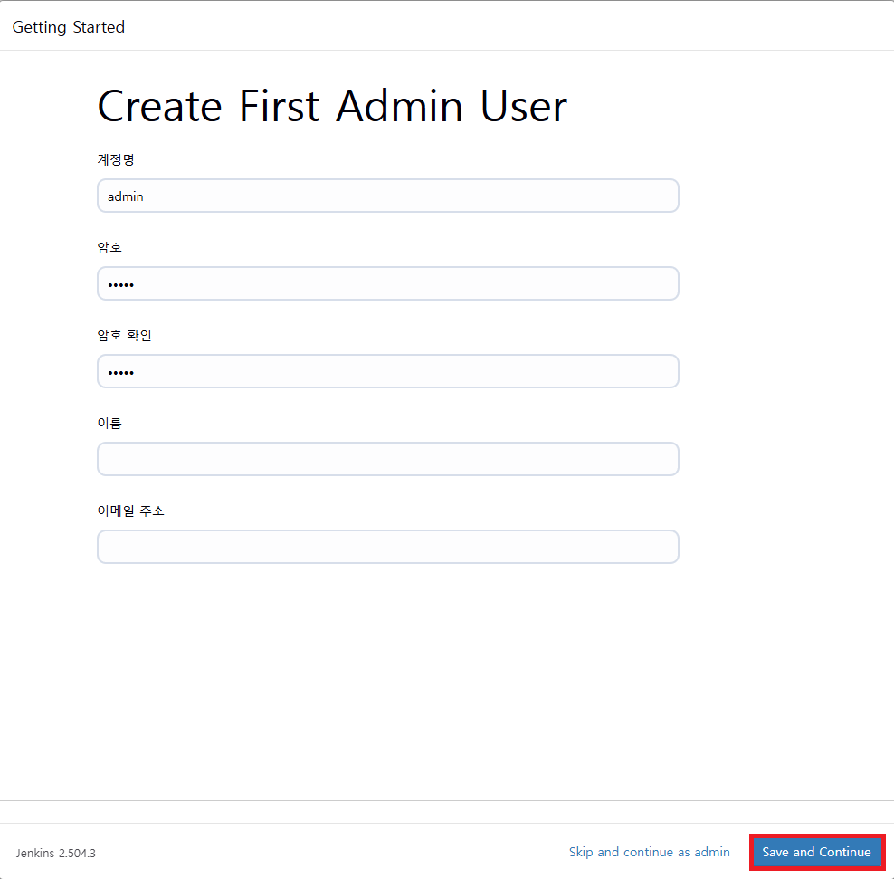

### 3-5. [Save and Continue] > [Save and Finish] > [Start Using Jenkins]

---

## 4. Jenkins 설정 (JDK, Gradle)

### 4-1. [Dashboard] > [Jenkins 관리] > [Tools]

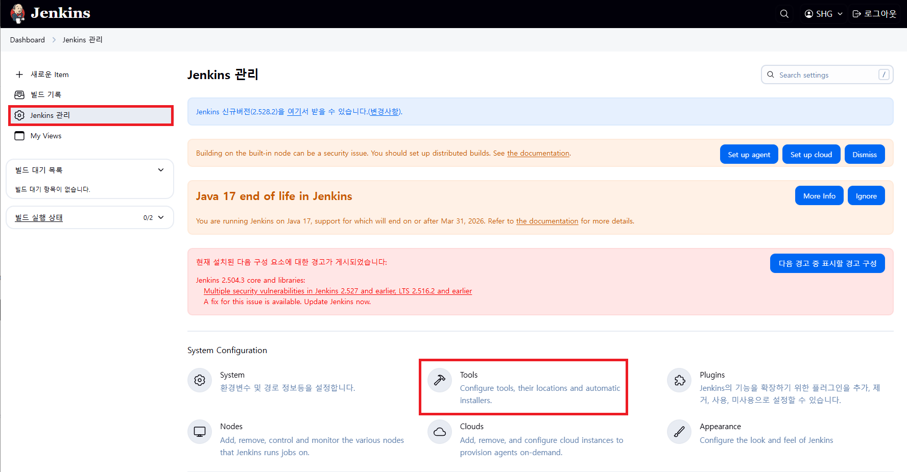

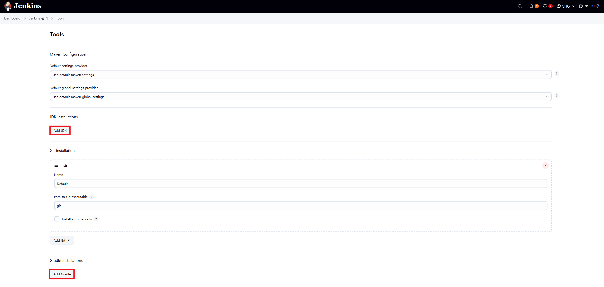

### 4-2. JDK 세팅

▶ 본인의 JDK17 설치 경로 확인
```
[root@cicd-server ~]# find / -name java | grep java-17-openjdk
/usr/lib/jvm/java-17-openjdk-17.0.17.0.10-1.el8.x86_64/bin/java
```
<b style="color: red;">※ /bin/java 부분은 제외하고 복사</b>

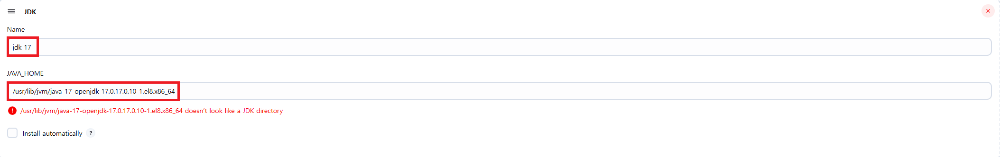

### 4-3. Gradle 세팅

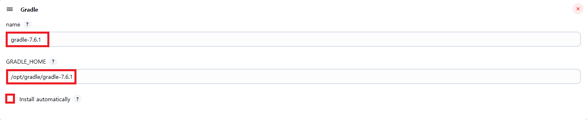

### 4-4. Save

---

## 5. Docker Hub 가입

### 5-1. Docker 가입

- https://hub.docker.com/

### 5-2. 도커 설정

```
//jeknins가 Docker를 사용할 수 있도록 권한 부여
[root@cicd-server ~]# chmod 666 /var/run/docker.sock
[root@cicd-server ~]# usermod -aG docker jenkins

//Jeknins로 사용자 변경 
[root@cicd-server ~]# su - jenkins -s /bin/bash

//자신의 Dockerhub로 로그인 하기
[jenkins@cicd-server ~]$ docker login
Username: 
Password: 
```

▶ 결과 확인
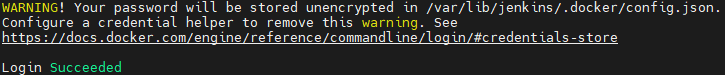

---

### 6. Master Node에서 인증서 복사

- k8s-master가 정상적으로 실행중인지 확인
- root가 아닌 Jenkins 유저 상태에서 작업

```
//폴더 생성
[jenkins@cicd-server ~]$ mkdir ~/.kube

//Master Node에서 인증서 가져오기
[jenkins@cicd-server ~]$ scp root@192.168.56.30:/root/.kube/config ~/.kube/
```

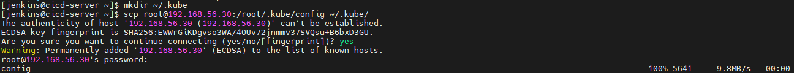

▶ 동작 확인
```
[jenkins@cicd-server ~]$ kubectl get pods -A
```