# Jenkins Pipeline

## 1. Jenkins Pipeline 기본 구성 만들기

### 1-1. Stage View 플러그인 다운로드

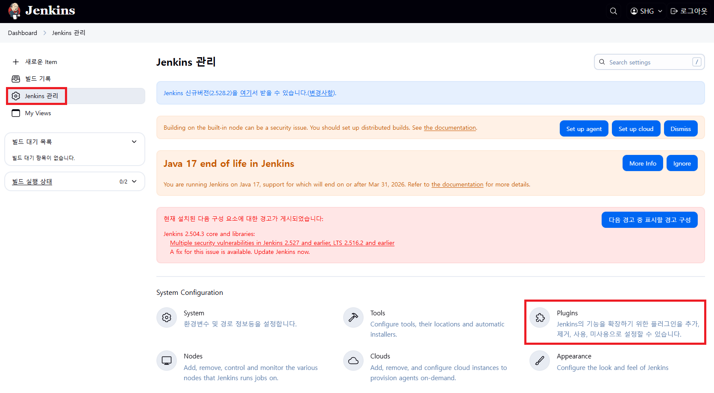

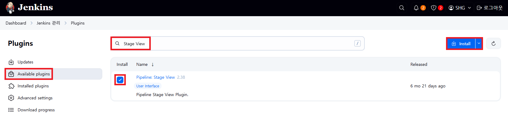

### 1-2. View 생성 후 [새로운 Item] 클릭

```
조회명: 221
Type: List View
```

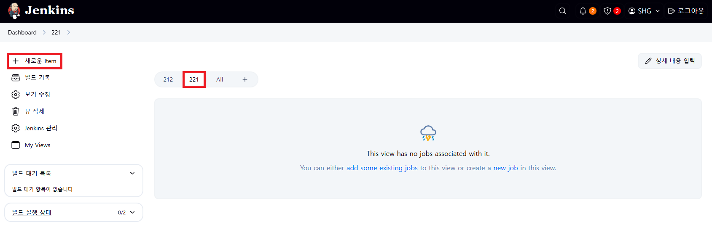

### 1-3. item name 입력 및 Pipeline 선택

```
2211-jenkins_pipeline-step1
```

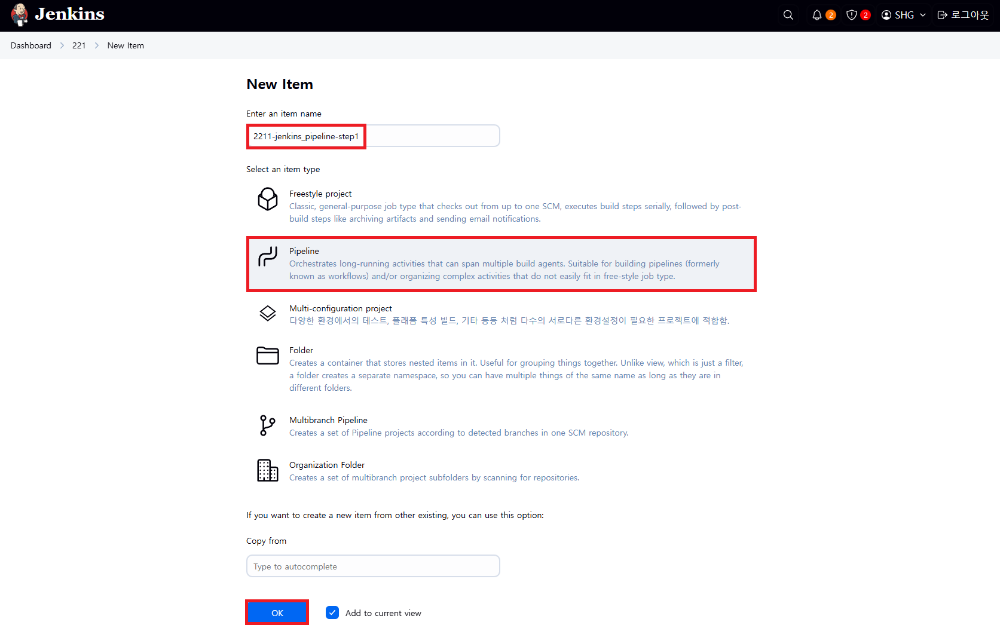

### 1-4. Script 입력

```groovy
pipeline {
    agent any

    tools {
        gradle 'gradle-7.6.1'
        jdk 'jdk-17'
    }

    environment {
        //본인의 username
        DOCKERHUB_USERNAME = ""
        GITHUB_USERNAME = ""

        GITHUB_URL = "https://github.com/${GITHUB_USERNAME}/Kubernetes-Sprint2-Config.git"
        CLASS_NUM = '2211'
    }

    stages {
        stage('Source Build') {
            steps {
                //소스파일 체크아웃 (Source Repo는 변경없이 그대로 사용)
                git branch: 'main', url: 'https://github.com/hyungeunShin/Kubernetes-App.git'

                //소스 빌드
                //755권한 필요 (윈도우에서 Git으로 소스 업로드시 권한은 644)
                sh "chmod +x ./gradlew"
                sh "gradle clean build"
            }
        }

        stage('Container Build') {
            steps {	
                //릴리즈파일 체크아웃
                checkout scmGit(branches: [[name: '*/main']], 
                    extensions: [[$class: 'SparseCheckoutPaths', 
                    sparseCheckoutPaths: [[path: "/${CLASS_NUM}"]]]], 
                    userRemoteConfigs: [[url: "${GITHUB_URL}"]])

                //jar 파일 복사
                sh "cp ./build/libs/app-0.0.1-SNAPSHOT.jar ./${CLASS_NUM}/build/docker/app-0.0.1-SNAPSHOT.jar"

                //컨테이너 빌드 및 업로드
                sh "docker build -t ${DOCKERHUB_USERNAME}/api-tester:v1.0.0 ./${CLASS_NUM}/build/docker"
                //영상과 달리 if문이 없어지고 항상 본인의 Docker Hub에서 빌드가 되도록 수정 됨
                sh "docker push ${DOCKERHUB_USERNAME}/api-tester:v1.0.0"
            }
        }

        stage('K8S Deploy') {
            steps {
                //쿠버네티스 배포 
                sh "kubectl apply -f ./${CLASS_NUM}/deploy/k8s/namespace.yaml"
				sh "kubectl apply -f ./${CLASS_NUM}/deploy/k8s/configmap.yaml"
				sh "kubectl apply -f ./${CLASS_NUM}/deploy/k8s/secret.yaml"
				sh "kubectl apply -f ./${CLASS_NUM}/deploy/k8s/service.yaml"
				sh "kubectl apply -f ./${CLASS_NUM}/deploy/k8s/deployment.yaml"
            }
        }
    }
}
```

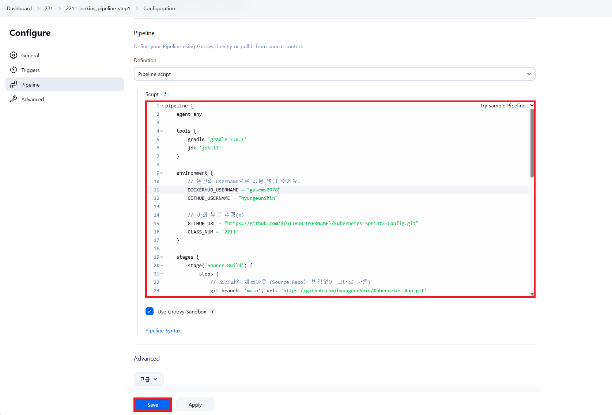

### 1-5. [지금 빌드] 샐행 후 Stage View 결과 확인

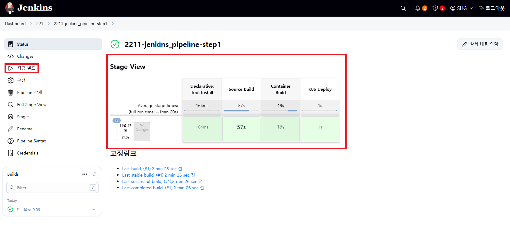

---

## 2. Github 연결 및 파이프라인 세분화

### 2-1. item name 입력 및 Pipeline 선택

```
2212-jenkins_pipeline-step2
```


### 2-2. Configure > General > GitHub project > Project url

```
https://github.com/hyungeunShin/Kubernetes-Sprint2-Config/
```

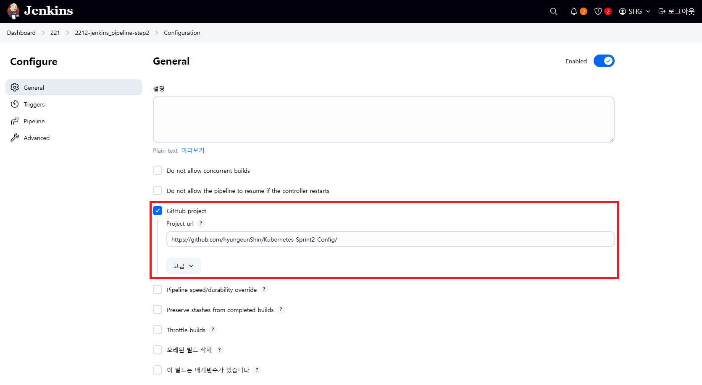

```
https://github.com/hyungeunShin/Kubernetes-Sprint2-Config.git
```

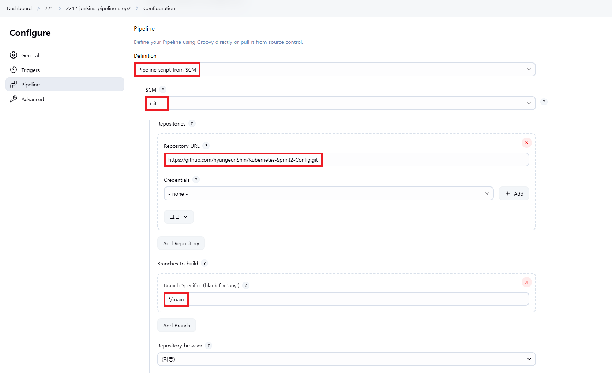

```
Path: 2212
Script Path: 2212/Jenkinsfile
```

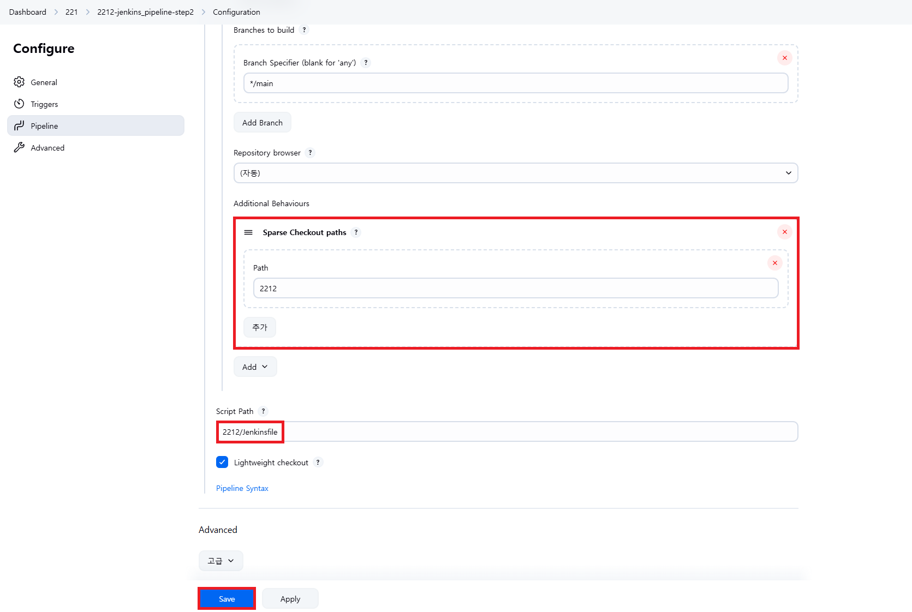

### 2-3. [지금 빌드] 샐행 후 Stage View 결과 확인

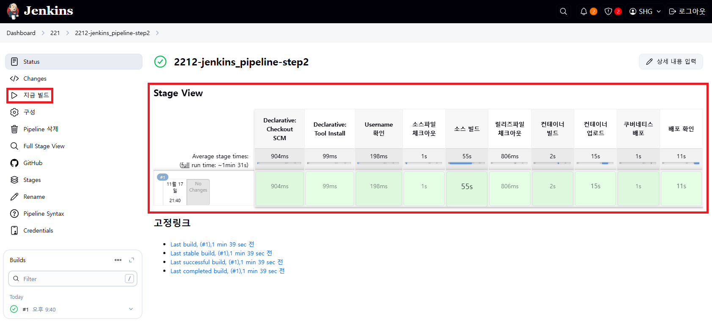

---

## 3. Blue/Green 배포 만들기

### 3-1. item name 입력

```
item name: 2213-jenkins_pipeline-step3
Copy from: 2212-jenkins_pipeline-step2
```

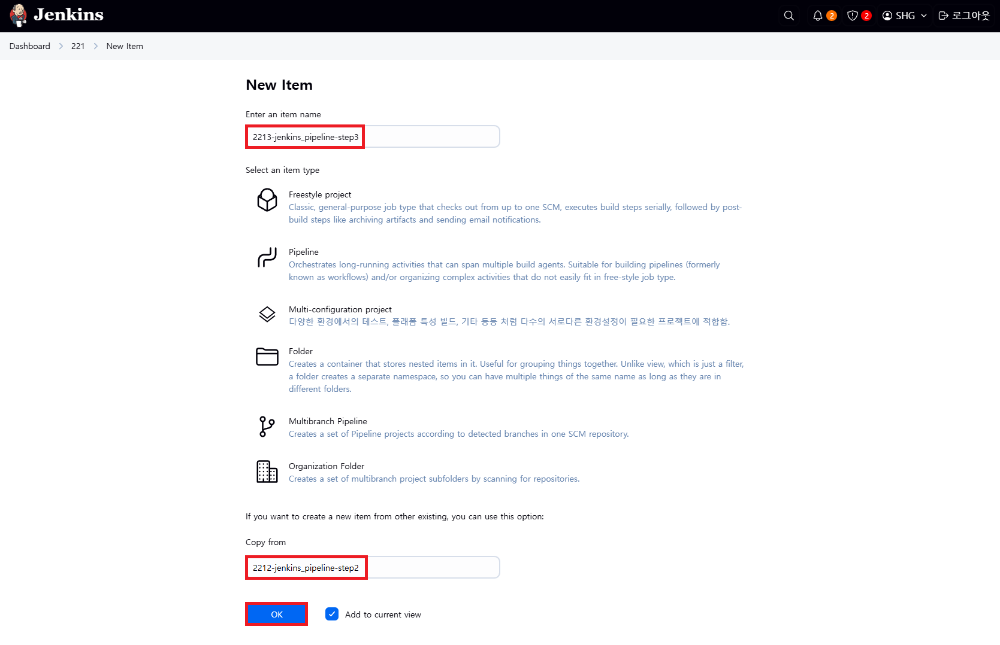

### 3-2. Configure > Pipeline

```
Path: 2213
Script Path: 2213/Jenkinsfile
```


### 3-3. Master Node에서 version 조회 시작

```
[root@k8s-master ~]# while true; do curl http://192.168.56.30:32213/version; sleep 3; echo '';  done;
```

### 3-4. [지금 빌드] 실행

### 3-5. [수동배포 시작] yes 클릭 - Green이 배포됨

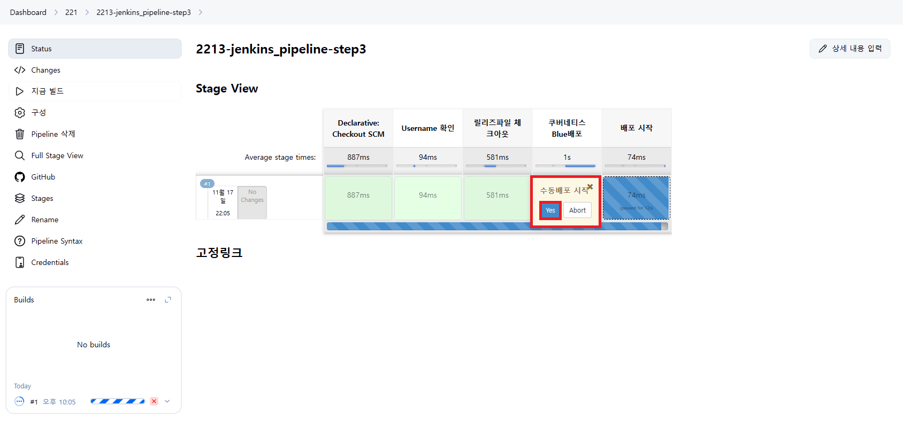

### 3-6. V2 Service 호출 가능

```
[root@k8s-master ~]# curl http://192.168.56.30:32223/version
```

### 3-7. [Green 전환] yes 클릭 및 v2로 버전 변경 확인

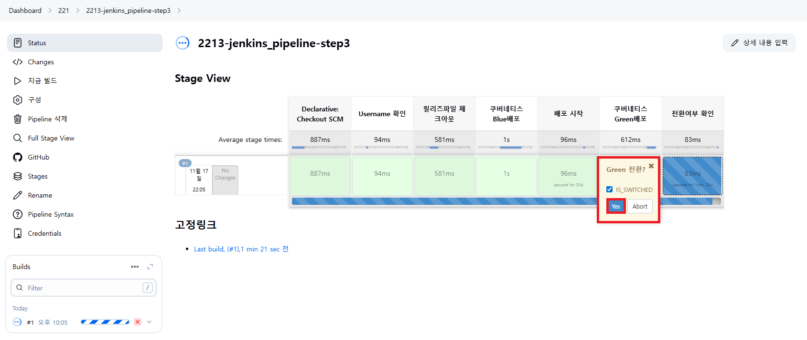

### 3-8. 롤백 여부 선택

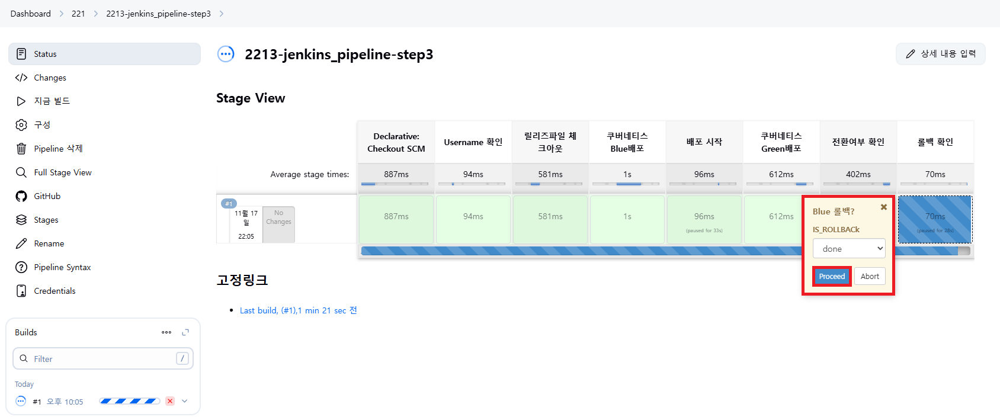

- done: Blue 배포 삭제
- rollback: Blue로 다시 전환

---

## 4. Blue/Green 자동 배포 Script 만들기

### 4-1. item name 입력

```
item name: 2214-jenkins_pipeline-step4
Copy from: 2213-jenkins_pipeline-step3
```

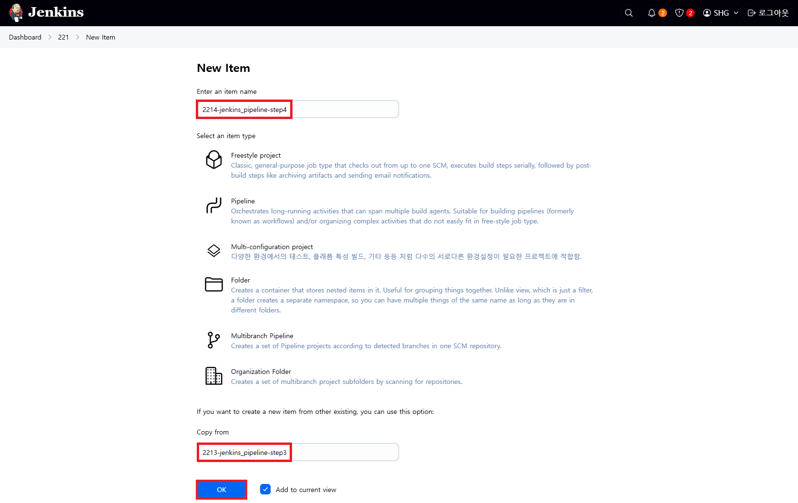

### 4-2. Configure > Pipeline

```
Path: 2214
Script Path: 2214/Jenkinsfile
```

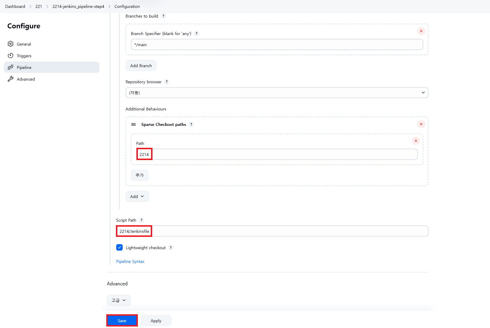

### 4-3. Master Node에서 version 조회 시작

```
[root@k8s-master ~]# while true; do curl http://192.168.56.30:32214/version; sleep 3; echo '';  done;
```

### 4-4. [지금 빌드] 실행

### 4-5. [자동배포 시작] yes 클릭


### 4-6. 진행 과정 확인

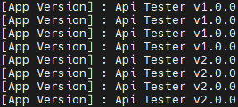

---

## ※ 각 과정마다 헷갈리지 않게 삭제 명령어 실행

```
[root@k8s-master ~]# kubectl delete ns anotherclass-221
```