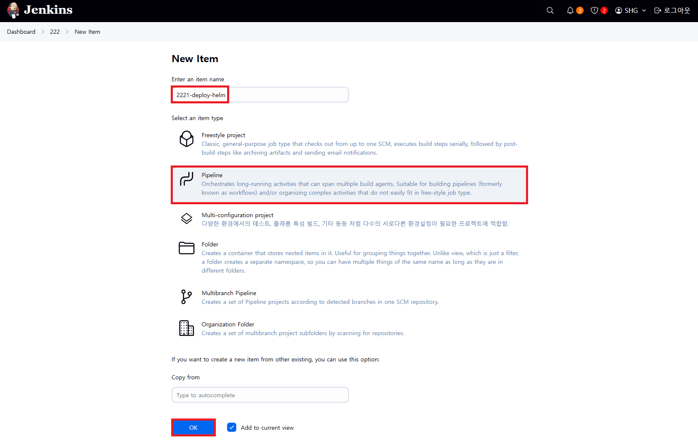
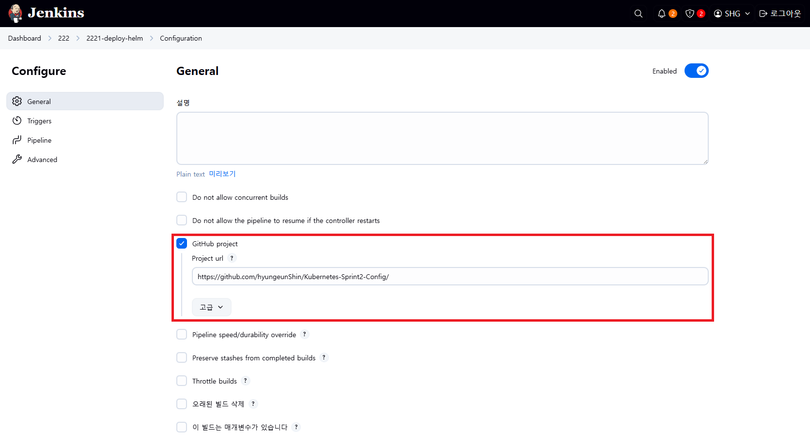
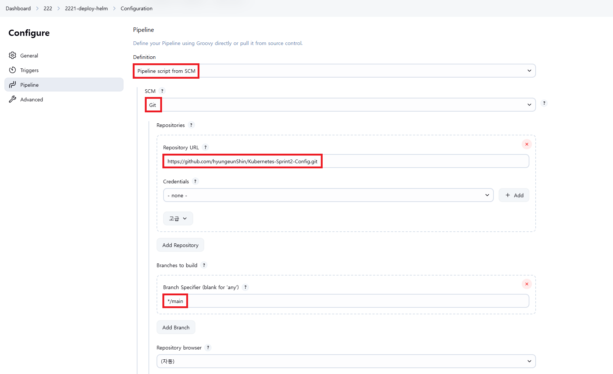
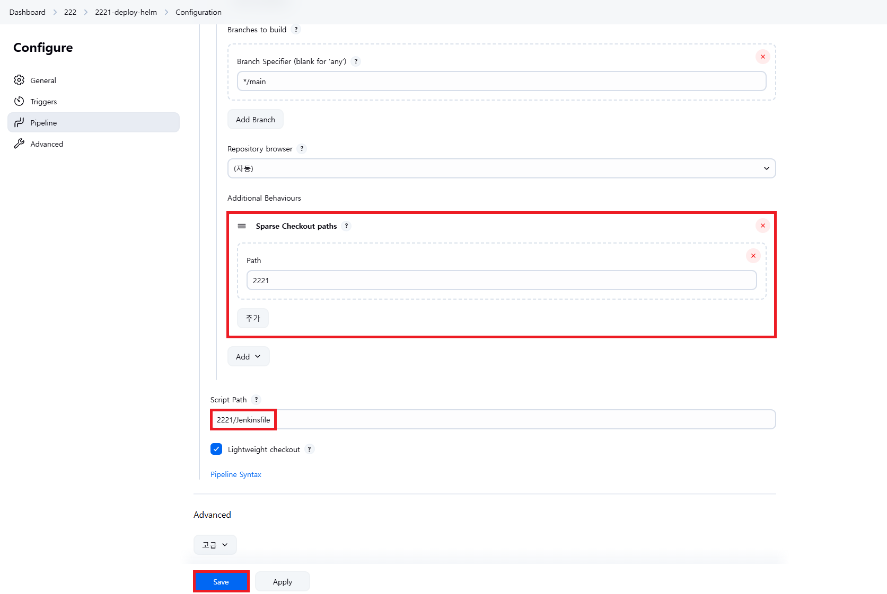

# Helm과 Kustomize 설정

<hr style="height:4px; border:none; color:#333; background-color:#333;" />

## 1. Helm(Ver. 3.13.2) 설치

```
//설치
[root@cicd-server ~]# curl -O https://get.helm.sh/helm-v3.13.2-linux-amd64.tar.gz
[root@cicd-server ~]# tar -zxvf helm-v3.13.2-linux-amd64.tar.gz
[root@cicd-server ~]# mv linux-amd64/helm /usr/bin/helm

//확인
[root@cicd-server ~]# su - jenkins -s /bin/bash
[jenkins@cicd-server ~]$ helm
```

- [Site](https://helm.sh/docs/intro/install/)
- [Release](https://github.com/helm/helm/releases)

---

## 2. Kustomize(Ver. 5.0.1) 설치

**별도 설치 필요없음 (kubectl v1.14부터 포함되어 있음)**

- [Site](https://kubectl.docs.kubernetes.io/)
- [kubernetes Docs](https://kubernetes.io/docs/tasks/manage-kubernetes-objects/kustomization/)

---

## 3. Helm 배포

### 3-1. View 생성 후 [새로운 Item]

```
조회명: 222
Type: List View
```

### 3-2. item name 입력 및 Pipeline 선택

```
2221-deploy-helm
```



### 3-3. Configure > General > GitHub project > Project url

```
https://github.com/hyungeunShin/Kubernetes-Sprint2-Config/
```



### 3-4. Configure > Pipeline

```
https://github.com/hyungeunShin/Kubernetes-Sprint2-Config.git
```



```
Path: 2221
Script Path: 2221/Jenkinsfile
```



### 3-5. [지금 빌드] 샐행 후 Stage View 결과 확인


---

## 정리

```
//helm 조회
[jenkins@cicd-server ~]$ helm list -n anotherclass-222

//helm 삭제
[jenkins@cicd-server ~]$ helm uninstall -n anotherclass-222 api-tester-2221

//namespace 삭제
[jenkins@cicd-server ~]$ kubectl delete ns anotherclass-222
```