# Helm과 Kustomize 사용

<hr style="height:4px; border:none; color:#333; background-color:#333;" />

## 1. Kustomize 배포

### 1-1. item name 입력

```
item name: 2222-deploy-kustomize
Copy from: 2221-deploy-helm
```

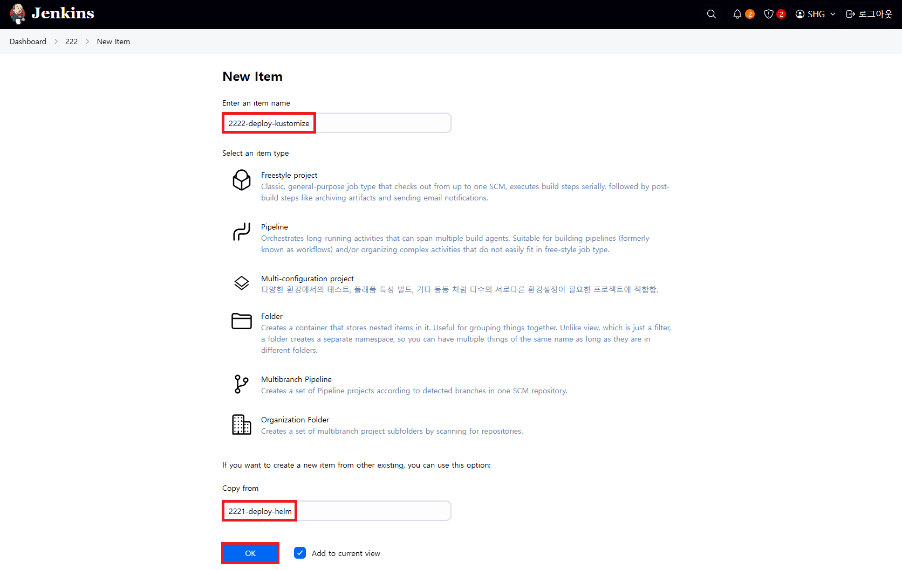

### 1-2. Configure > Pipeline

```
Path: 2222
Script Path: 2222/Jenkinsfile
```


### 1-3. [저장] 후 [지금 빌드] 실행 후 [Abort] 그리고 [페이지 새로고침]

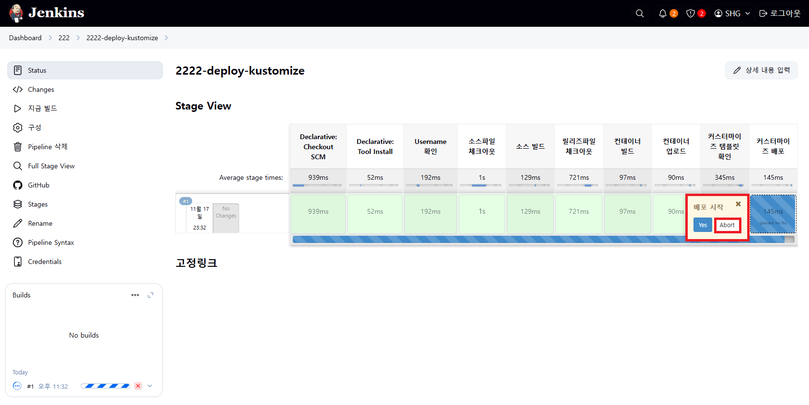

### 1-4. [파라미터와 함께 빌드] 실행 후 PROFILE을 [dev]로 선택하고 [빌드하기] 클릭

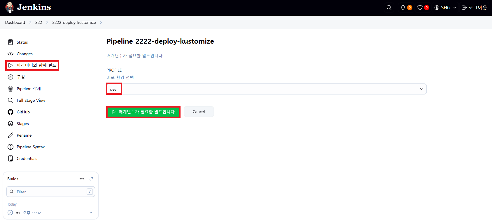

### 1-5. [Stage View] 결과 확인

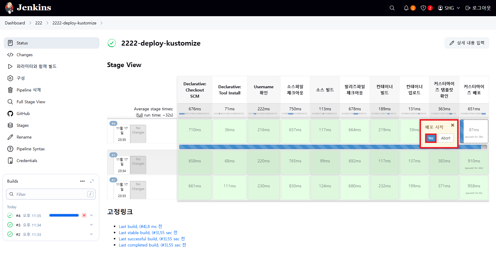

### 1-6. [파라미터와 함께 빌드] 실행 후 PROFILE을 [qa], [prod]로 선택하고 [빌드하기] 클릭 그리고 [대시보드] 확인

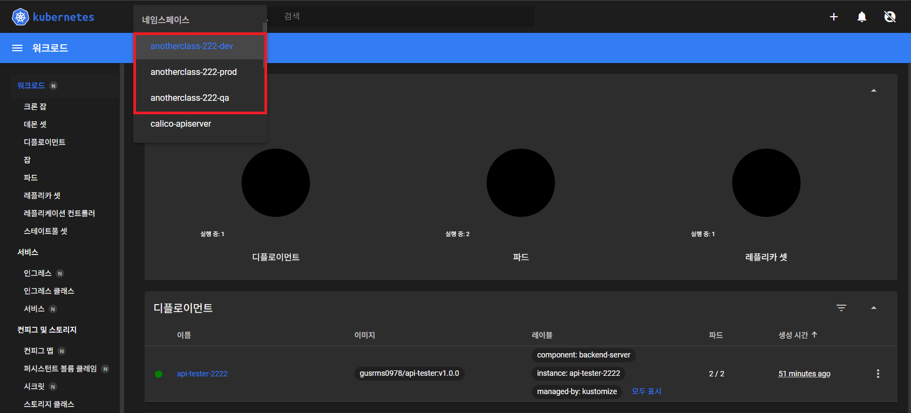

### 1-7. 정리

```
[root@k8s-master ~]# kubectl delete ns anotherclass-222-dev
[root@k8s-master ~]# kubectl delete ns anotherclass-222-qa
[root@k8s-master ~]# kubectl delete ns anotherclass-222-prod
```

---

## 2. Helm 배포

### 2-1. item name 입력

```
item name: 2223-deploy-helm
Copy from: 2222-deploy-kustomize
```

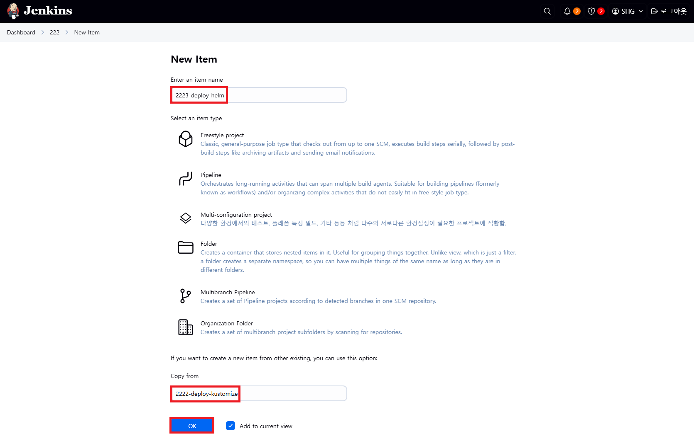

### 1-2. Configure > Pipeline

```
Path: 2223
Script Path: 2223/Jenkinsfile
```

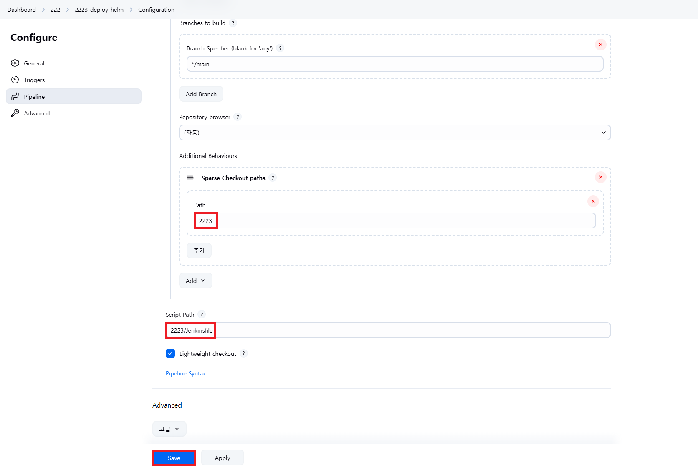

### 2-3. [저장] 후 [파라미터와 함께 빌드] 실행 후 PROFILE을 [dev]로 선택하고 [빌드하기] 클릭

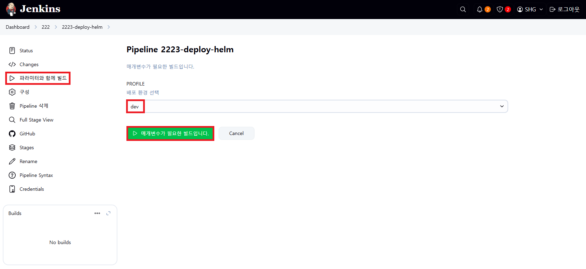

### 2-4. [Stage View] 결과 확인

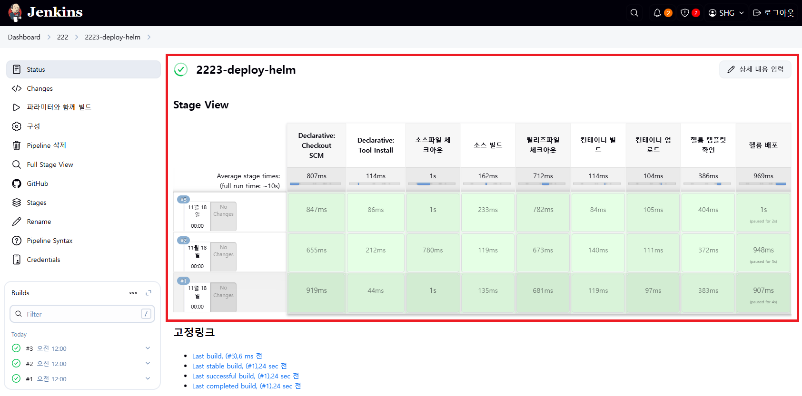

### 2-5. [파라미터와 함께 빌드] 실행 후 PROFILE을 [qa], [prod]로 선택하고 [빌드하기] 클릭 그리고 [대시보드] 확인


### 2-6. 정리

```
//helm 조회
[jenkins@cicd-server ~]$ helm list -A
[jenkins@cicd-server ~]$ helm list -n <namespace>

//helm 삭제
[jenkins@cicd-server ~]$ helm uninstall -n anotherclass-222-dev api-tester-2223
[jenkins@cicd-server ~]$ helm uninstall -n anotherclass-222-qa api-tester-2223
[jenkins@cicd-server ~]$ helm uninstall -n anotherclass-222-prod api-tester-2223

//namespace 삭제
[jenkins@cicd-server ~]$ kubectl delete ns anotherclass-222-dev
[jenkins@cicd-server ~]$ kubectl delete ns anotherclass-222-qa
[jenkins@cicd-server ~]$ kubectl delete ns anotherclass-222-prod
```

---

## 3. 배포 파이프라인 구축 후 마주하게 되는 고민들

### 3-1. item name 입력

```
item name: 2224-deploy-helm
Copy from: 2223-deploy-helm
```

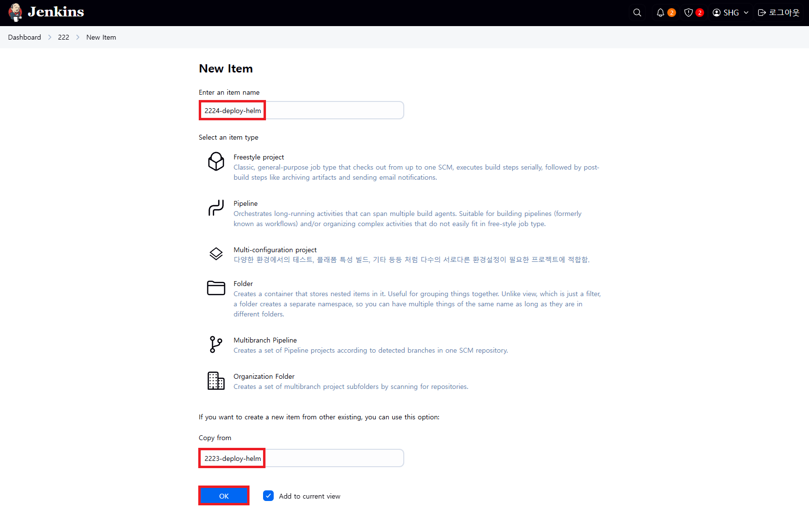

### 3-2. Configure > Pipeline

```
Path: 2224
Script Path: 2224/Jenkinsfile
```


### 3-3. 고민들

① 중요 데이터 암호화 관리

1) Dashboard > Jenkins 관리 > Credentials > System > Global credentials (unrestricted) > [Add Credentials]
   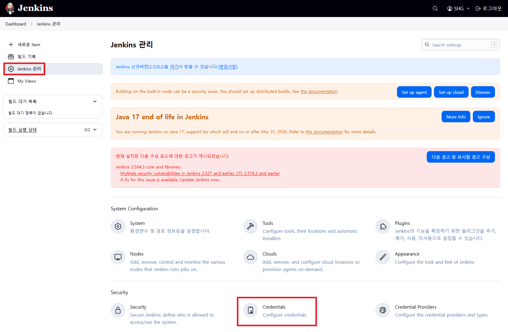
   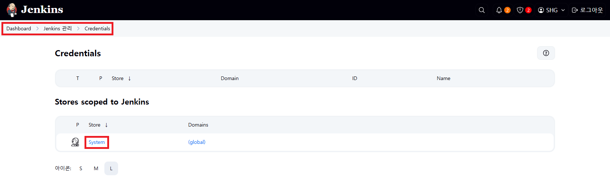
   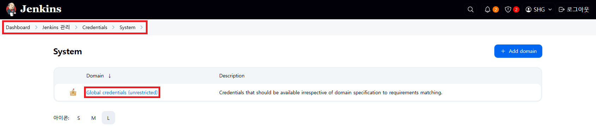
   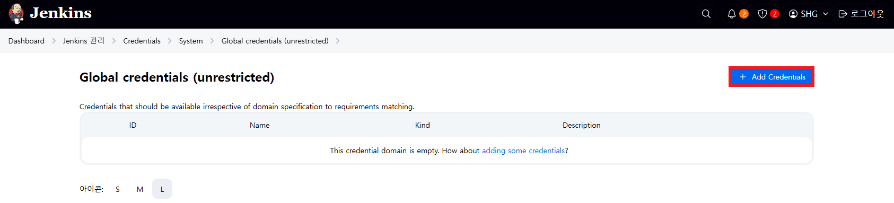
2) Docker 접속정보 Credentials 등록
   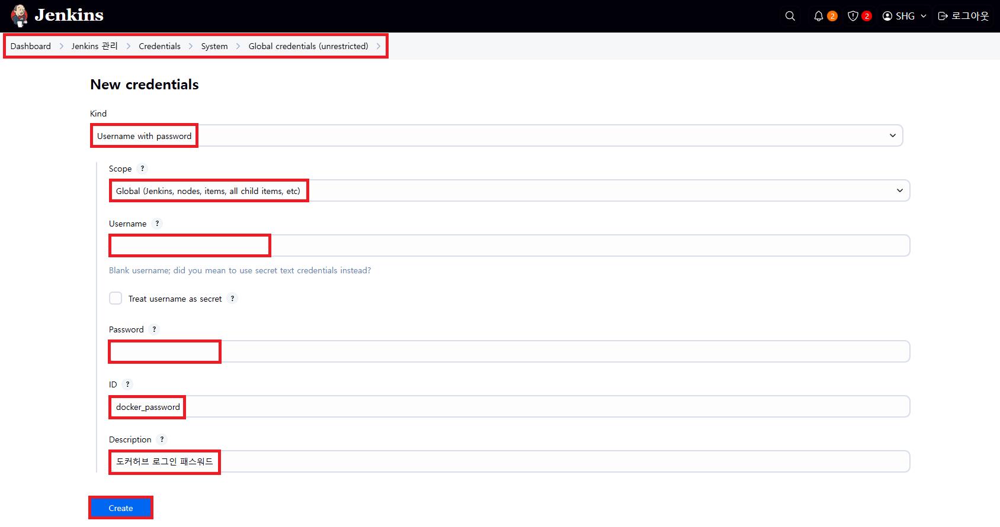
3) Kubernetes config 파일 Credentials 등록<br>
   ▶ config 파일을 첨부파일에 등록해야 하기 때문에 **/var/lib/jenkins/.kube에서 config 파일**을 **드래그**해서 내 PC로 옮기기<br>
   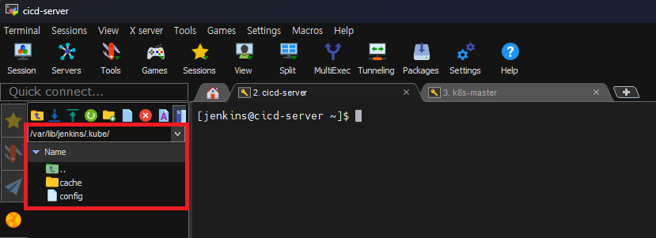
   ▶ 해당 config 파일을 **k8s_master_config**로 이름을 변경한 후 첨부파일에 첨부<br>
   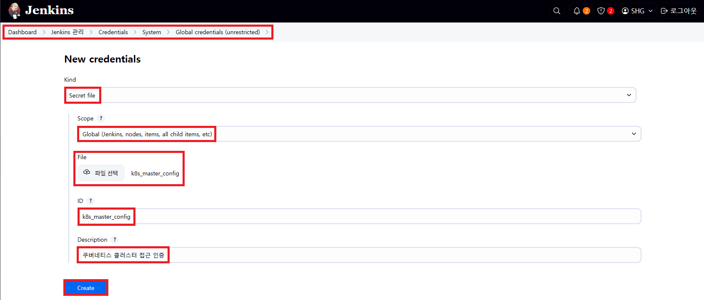
4) Jenkinsfile 내용
   ```
   withCredentials([usernamePassword(credentialsId: 'docker_password', passwordVariable: 'PASSWORD', usernameVariable: 'USERNAME')])
   
   withCredentials([file(credentialsId: 'k8s_master_config', variable: 'KUBECONFIG')])
   ```
5) CI/CD Server에서 Docker Logout 및 kubeconfig 삭제
   ```
   //Docker 로그아웃
   [jenkins@cicd-server ~]$ docker logout
   
   //로그아웃 확인
   [jenkins@cicd-server ~]$ cat ~/.docker/config.json
   
   //.kube/config 파일명 변경
   [jenkins@cicd-server ~]$ mv ~/.kube/config ~/.kube/config_bak
   ```
   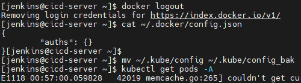

② 잦은 배포 - Versioning 무의미, 계획된 배포 - Versioning 필수 - Jenkinsfile
```
environment {
  APP_VERSION = '1.0.1'
  BUILD_DATE = sh(script: "echo `date +%y%m%d.%d%H%M`", returnStdout: true).trim()
  TAG = "${APP_VERSION}-" + "${BUILD_DATA}"

stage('컨테이너 빌드 및 업로드') {
  steps {
	script{
      sh "docker build ./2224/build/docker -t gusrms0978/api-tester:${TAG}"
      sh "docker push gusrms0978/api-tester:${TAG}"

stage('헬름 배포') {
  steps {
    withCredentials([file(credentialsId: 'k8s_master_config', variable: 'KUBECONFIG')]) {
      sh "helm upgrade api-tester-2224 ./2224/deploy/helm/api-tester -f ./2224/deploy/helm/api-tester/values-dev.yaml" +
         ...
         " --set image.tag=${TAG}"
``` 

③ 업로드 후 CI/CD Server에 만들어진 이미지 삭제 - Jenkinsfile
```
stage('컨테이너 빌드 및 업로드') {
  steps {
	script{
      sh "docker build ./${CLASS_NUM}/build/docker -t ${DOCKERHUB_USERNAME}/api-tester:${TAG}"
      sh "docker push ${DOCKERHUB_USERNAME}/api-tester:${TAG}"
      sh "docker rmi ${DOCKERHUB_USERNAME}/api-tester:${TAG}"
```

④ 네임스페이스는 배포와 별도로 관리 - Jenkinsfile
```
//배포시 apply로 Namespace 생성 or 배포와 별개로 미리 생성 (추후 삭제시 별도 삭제)
stage('네임스페이스 생성') {
  steps {
    withCredentials([file(credentialsId: 'k8s_master_config', variable: 'KUBECONFIG')]) {
      sh "kubectl apply -f ./2224/deploy/kubectl/namespace-dev.yaml --kubeconfig " + '"${KUBECONFIG}"'
```

⑤ Helm 부가기능(배포 후 Pod 업그레이드가 안될 수 있음) - deployment.yaml
```yaml
apiVersion: apps/v1
kind: Deployment
spec:
  template:
    metadata:      
      annotations:
        # 항상 새 배포를 위해 랜덤값 적용
        rollme: {{ randAlphaNum 5 | quote }} 
```

⑦ Helm 부가기능(Pod가 완전 기동 될때까지 결과값 기다림) - Jenkinsfile
```
stage('헬름 배포') {
  steps {
    withCredentials([file(credentialsId: 'k8s_master_config', variable: 'KUBECONFIG')]) {
      sh "helm upgrade api-tester-2224 ./2224/deploy/helm/api-tester -f ./2224/deploy/helm/api-tester/values-dev.yaml" +
         ...
         " --wait --timeout=10m" +  //최대 10분으로 설정
```

⑧ 사용 안하는 이미지는 자동 삭제됨 - config.yaml
```
//GC 속성 추가
[root@k8s-master ~]# vi /var/lib/kubelet/config.yaml
-----------------------------------
imageMinimumGCAge : 3m // 이미지 생성 후 해당 시간이 지나야 GC 대상이 됨 (Default : 2m)
imageGCHighThresholdPercent : 80 // Disk가 80% 위로 올라가면 GC 수행 (Default : 85)
imageGCLowThresholdPercent : 70 // Disk가 70% 밑으로 떨어지면 GC 수행 안함(Default : 80)
-----------------------------------

//kubelet 재시작
[root@k8s-master ~]# systemctl restart kubelet
```

### 3-4. [파라미터와 함께 빌드] 실행 후 PROFILE을 [dev]로 선택하고 [빌드하기] 클릭


### 3-5. 정리

```
# helm 조회
[jenkins@cicd-server ~]$ helm list -n anotherclass-222

# helm 삭제
[jenkins@cicd-server ~]$ helm uninstall -n anotherclass-222-dev api-tester-2224
[jenkins@cicd-server ~]$ helm uninstall -n anotherclass-222-qa api-tester-2224
[jenkins@cicd-server ~]$ helm uninstall -n anotherclass-222-prod api-tester-2224

# namespace 삭제
[root@k8s-master ~]# kubectl delete ns anotherclass-222-dev
[root@k8s-master ~]# kubectl delete ns anotherclass-222-qa
[root@k8s-master ~]# kubectl delete ns anotherclass-222-prod
```