# ArgoCD

### Argo Site: https://argoproj.github.io/
### Argo Github: https://github.com/argoproj

### ArgoCD(Ver. 2.9.3) 설치 (k8s v1.25~28 지원)

- Docs : https://argo-cd.readthedocs.io/en/stable/
- Artifact Hub : https://artifacthub.io/packages/helm/argo/argo-cd/5.52.1

<hr style="height:4px; border:none; color:#333; background-color:#333;" />

## 1. ArgoCD 설치

### 1-1. View 생성 후 [새로운 Item]

```
조회명: add-on
Type: List View
```

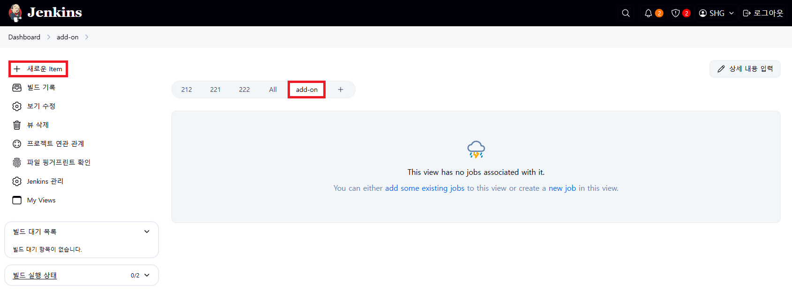

### 1-2. item name 입력 및 Pipeline 선택

```
deploy-argo
```

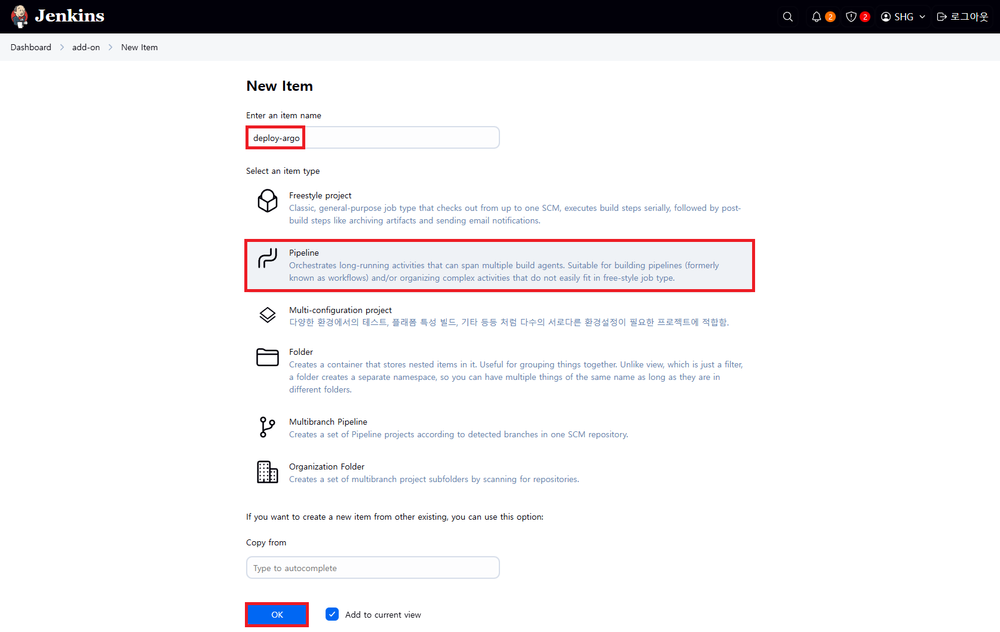

### 1-3. Configure > General > GitHub project > Project url

```
https://github.com/hyungeunShin/Kubernetes-Install/
```

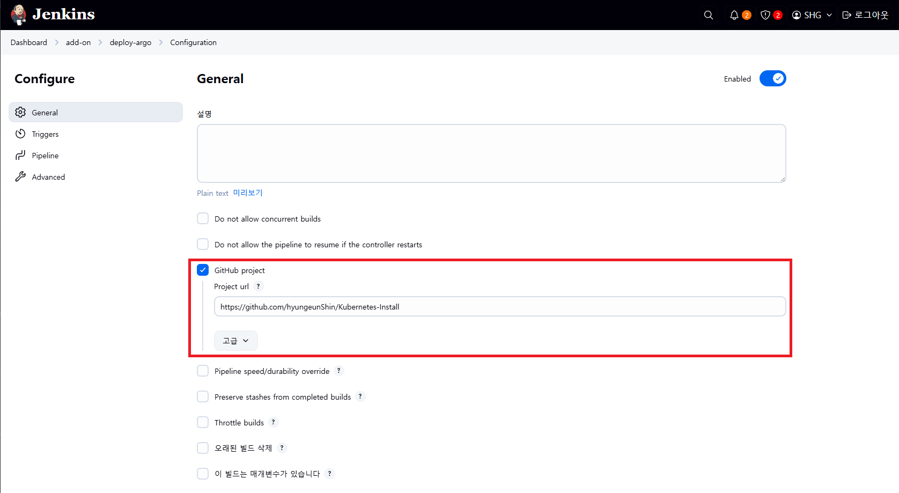

### 1-4. Configure > Pipeline

```
https://github.com/hyungeunShin/Kubernetes-Install.git
```


```
Path: base/cicd-server/argo
Script Path: base/cicd-server/argo/Jenkinsfile
```


### 1-5. [저장] 후 [파라미터와 함께 빌드] 실행

▶ Namespace 생성
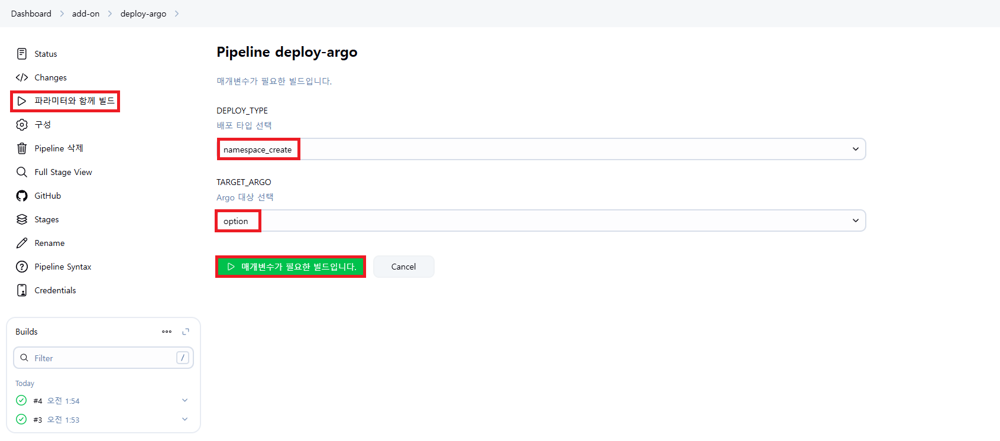

▶ ArgoCD 배포
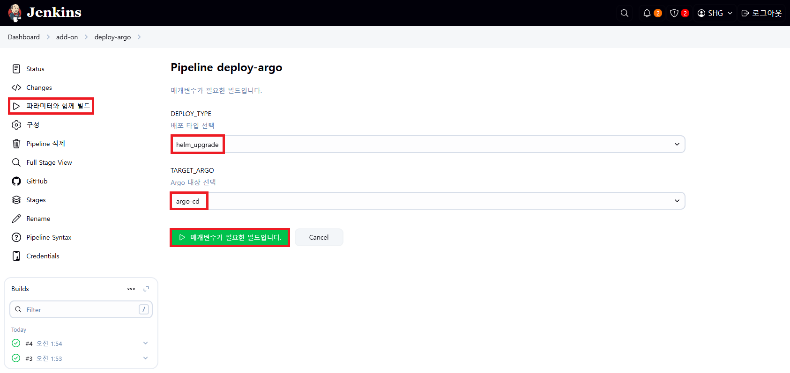

### 1-6. ArgoCD 접속

- https://192.168.56.30:30002/login
- Username: admin
- Password는 아래 명령어로 조회
  ```
  [root@k8s-master ~]# kubectl get -n argo secret argocd-initial-admin-secret -o jsonpath='{.data.password}' | base64 -d
  ```
- 로그인 이후 [User Info] > [UPDATE PASSWORD]에서 비밀번호 변경

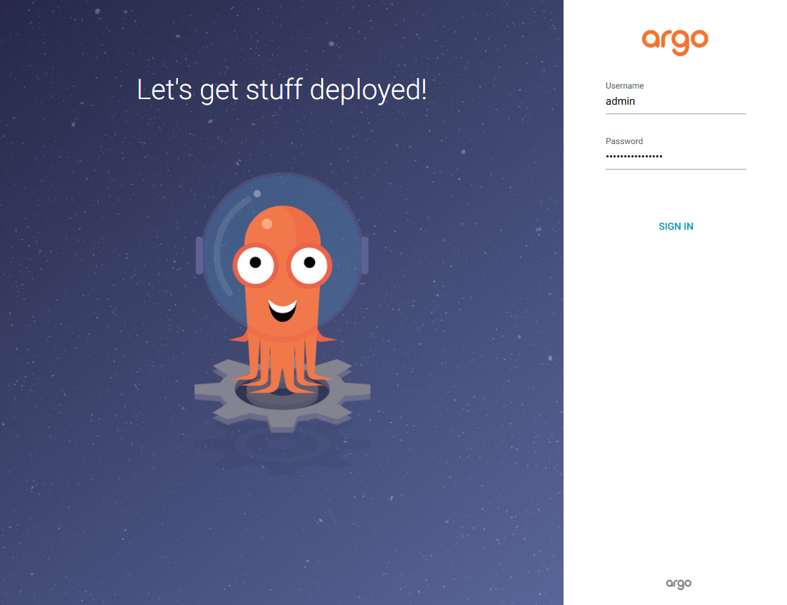

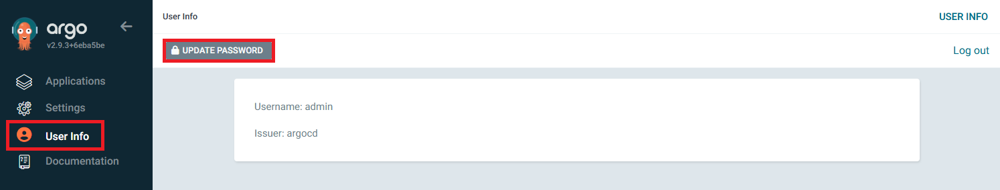

---

## 2. App 배포 (kubectl)

### 2-1. [+ NEW APP]

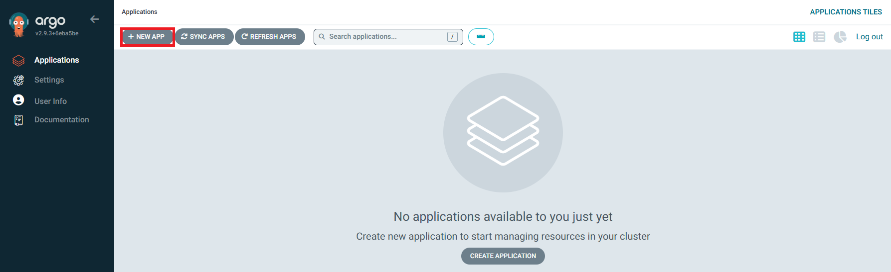

### 2-2. GENERAL

```
Application Name: api-tester-2231
Project Name: default
SYNC POLICY: Manual
[체크] AUTO-CREATE-NAMESPACE
```

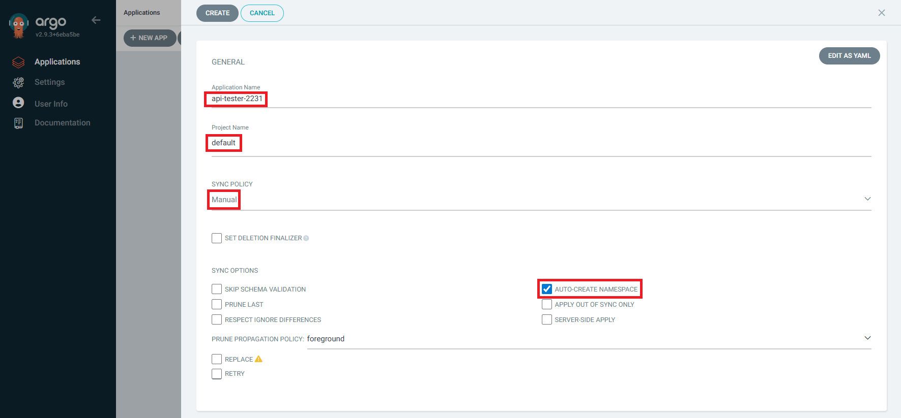

▶ SYNC OPTIONS
- SKIP SCHEMA VALIDATION: 매니패스트에 대한 yaml 스키마 유효성 검사를 건너뛰고 배포 (kubectl apply --validate=false)
- PRUNE LAST: 동기화 작업이 끝난 이후에 Prune(git에 없는 리소스를 제거하는 작업)를 동작시킴
- RESPECT IGNORE DIFFERENCES: 동기화 상태에서 특정 상태의 필드를 무시하도록 함
- AUTO-CREATE NAMESPACE: 클러스터에 네임스페이스가 없을 시 argocd에 입력한 이름으로 자동 생성
- APPLY OUT OF SYNC ONLY: 현재 동기화 상태가 아닌 리소스만 배포
- SERVER-SIDE APPLY: 쿠버네티스 서버에서 제공하는 Server-side Apply API 기능 활성화

▶ PRUNE PROPAGATION POLICY
- foreground: 부모(소유자, ex. deployment) 자원을 먼저 삭제함
- background: 자식(종속자, ex. pod) 자원을 먼저 삭제함
- orphan: 고아(소유자는 삭제됐지만, 종속자가 삭제되지 않은 경우) 자원을 삭제함

※ 참고자료
- https://kubernetes.io/docs/reference/using-api/server-side-apply/
- https://kubernetes.io/ko/docs/concepts/architecture/garbage-collection/
- https://kubernetes.io/ko/docs/tasks/administer-cluster/use-cascading-deletion/#set-orphan-deletion-policy

### 2-3. SOURCE

```
Repository URL: https://github.com/hyungeunShin/Kubernetes-Sprint2-Config.git
Revision: main
Path: 2231/deploy/k8s
```

### 2-4. DESTINATION

```
Cluster URL: https://kubernetes.default.svc
Namespace: anotherclass-223
[선택] Directory
```

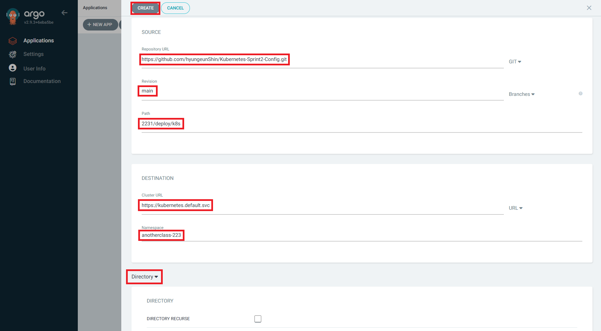

### 2-5. [SYNC] > [SYNCHRONIZE]

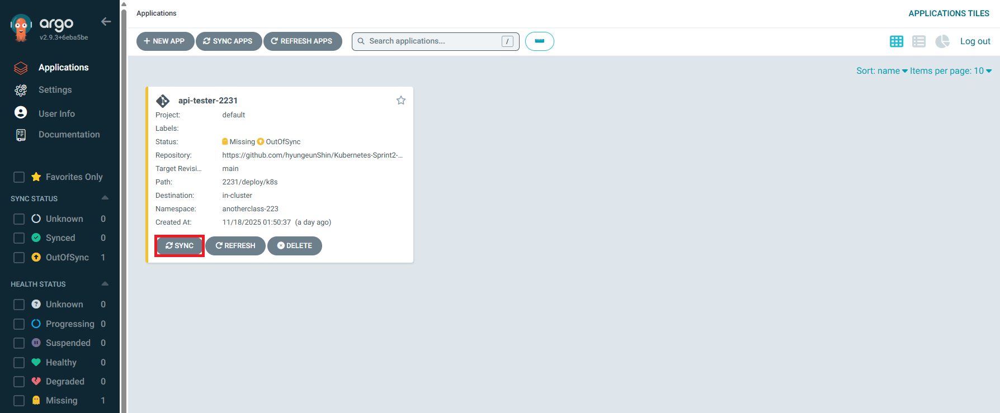

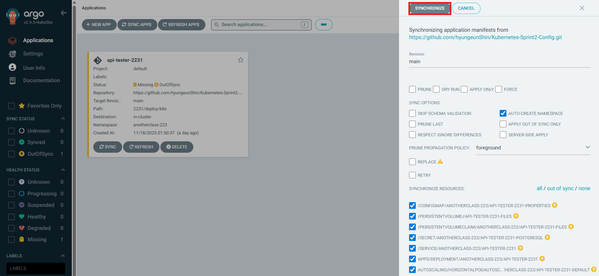

### 2-6. 배포 확인

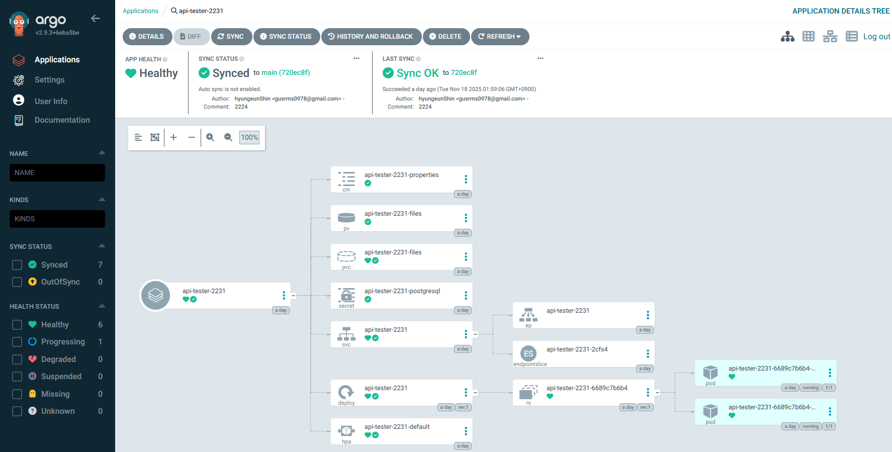

---

## 3. App 배포 (helm)

### 3-1. [+ NEW APP]


### 3-2. GENERAL

```
Application Name: api-tester-2232
Project Name: default
SYNC POLICY: Manual
```

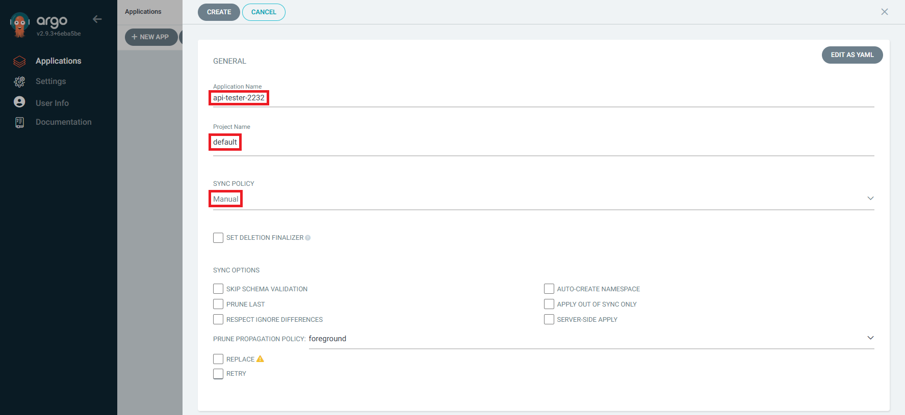

### 3-3. SOURCE

```
Repository URL: https://github.com/hyungeunShin/Kubernetes-Sprint2-Config.git
Revision: main
Path: 2232/deploy/helm/api-tester
```

### 3-4. DESTINATION

```
Cluster URL: https://kubernetes.default.svc
Namespace: anotherclass-223
[선택] Helm
VALUES FILES: values-dev.yaml
```

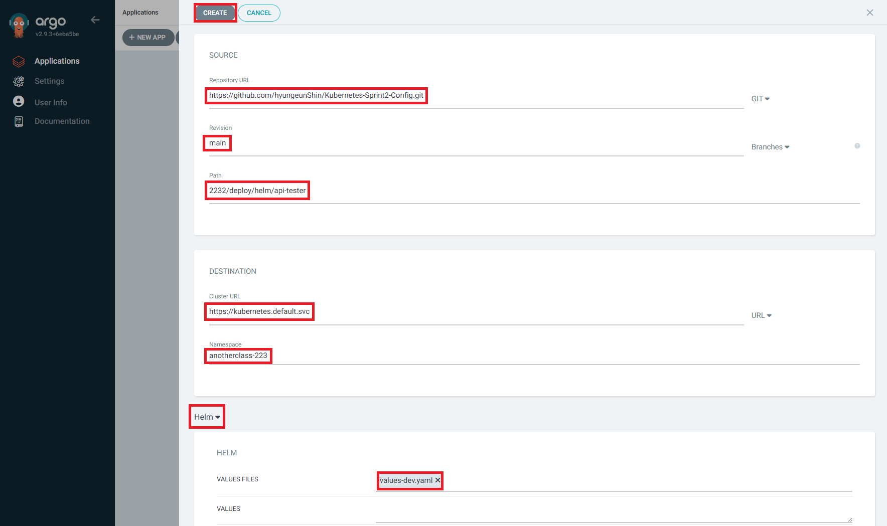

### 3-5. [SYNC] > [SYNCHRONIZE]

### 3-6. 배포 확인

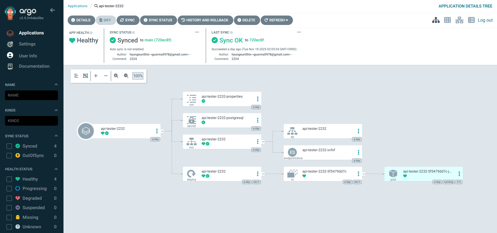