# Argo Image Updater

### ArgoCD Image Updater(Ver. 0.9.2) 설치

- Docs : https://argocd-image-updater.readthedocs.io/en/stable/
- Artifact Hub : https://artifacthub.io/packages/helm/argo/argocd-image-updater/0.9.2

---

## 1. Argo Image Updater 설치

▶ Dashboard > add-on > deploy-argo > 파라미터와 함께 빌드

```
DEPLOY_TYPE: helm_upgrade
TARGET_ARGO: argocd-image-updater
```

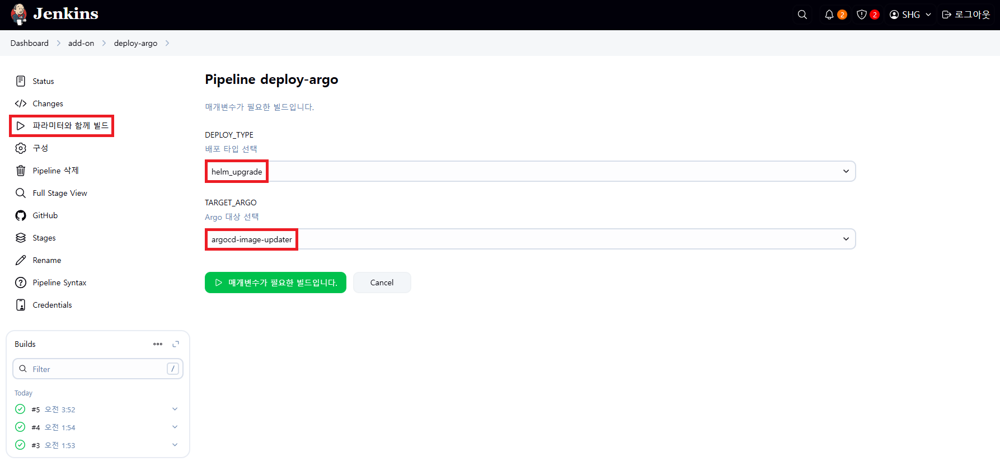

---

## 2. Argo Image Update 동작

### 2-1. Argo Image Update 로그 띄우기

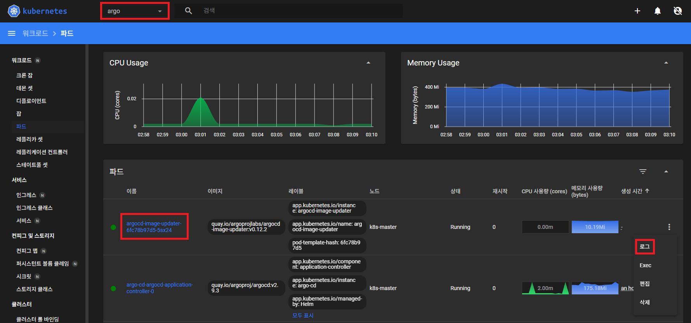

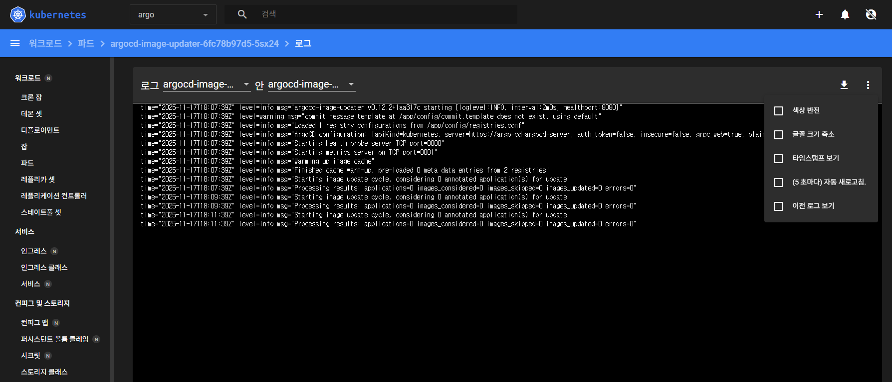

### 2-2. ArgoCD > Application > api-tester-2232 > DETAILS

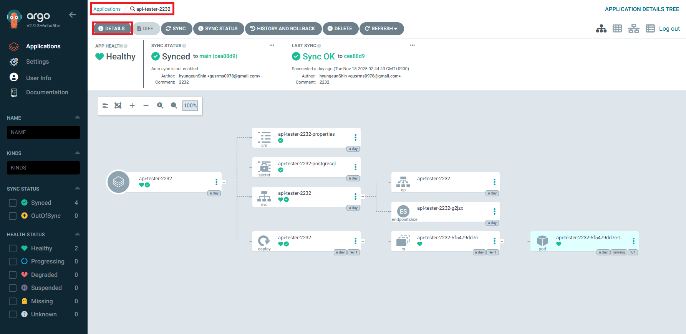

### 2-3. SUMMARY > [EDIT]

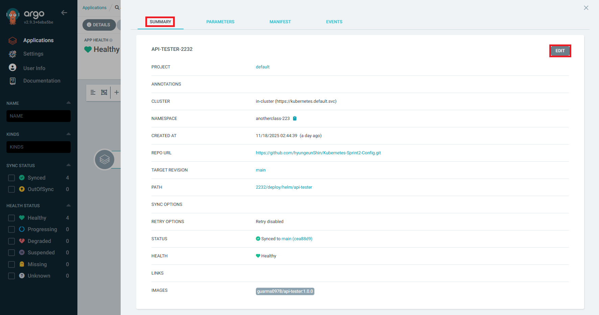

### 2-4. ANNOTATIONS 내용 입력 후 > [SAVE] 클릭

```
//도커 허브에서 이미지 대상 지정
argocd-image-updater.argoproj.io/image-list=<alias>=<Dockerhub-Username>/api-tester
//ex) argocd-image-updater.argoproj.io/image-list=gusrms0978-api-tester=gusrms0978/api-tester

//업데이트 전략 선택
argocd-image-updater.argoproj.io/<alias>.update-strategy=name
//ex) argocd-image-updater.argoproj.io/gusrms0978-api-tester.update-strategy=name

//태그 정규식 설정
argocd-image-updater.argoproj.io/<alias>.allow-tags=regexp:^1.1.1-[0-9]{6}.[0-9]{6}$
//ex) argocd-image-updater.argoproj.io/gusrms0978-api-tester.allow-tags=regexp:^1.1.1-[0-9]{6}.[0-9]{6}$
```

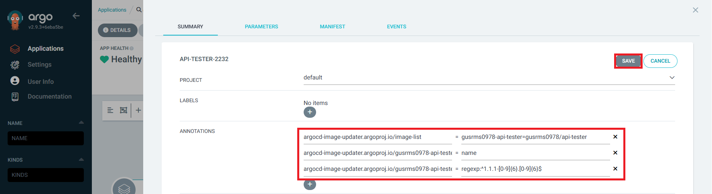

### 2-5. SYNC POLICY에서 [ENABLE AUTO-SYNC] 클릭해서 아래 상태로 변경

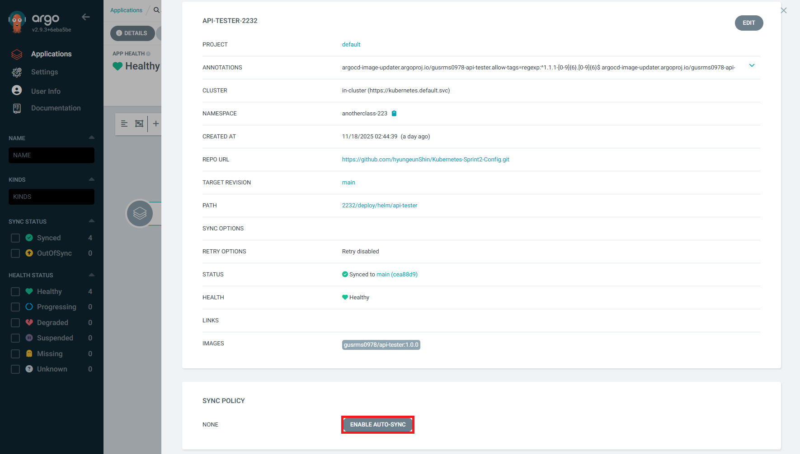

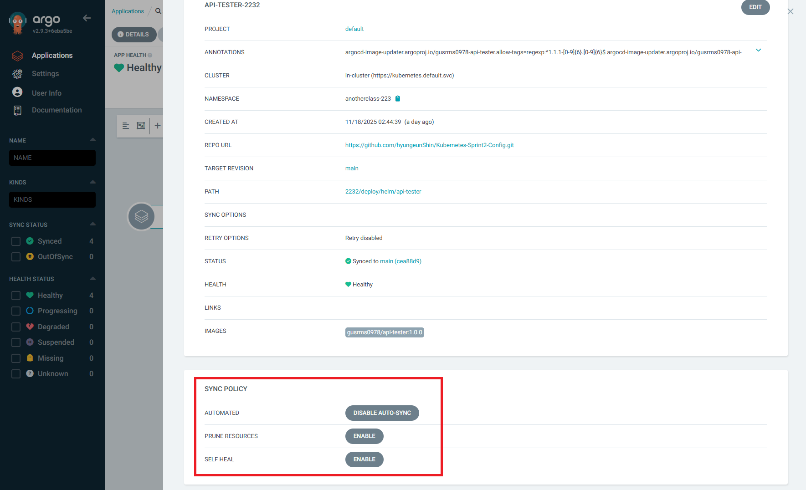

### 2-6. 로그 확인

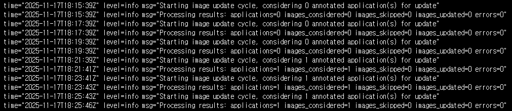

---

## 3. 도커 빌드 Job 생성

### 3-1. View 생성 후 [새로운 Item] 클릭

```
조회명: 223
Type: List View
```


### 3-2. item name 입력 및 Pipeline 선택

```
2232-build-docker-for-image-updater
```

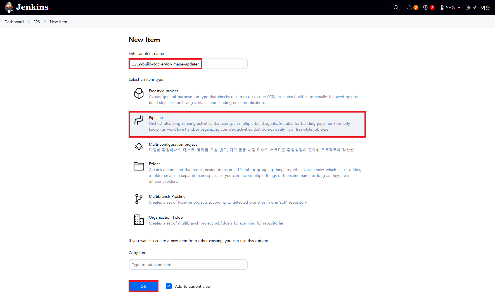

### 3-3. Configure > General > GitHub project > Project url

```
https://github.com/hyungeunShin/Kubernetes-Sprint2-Config/
```

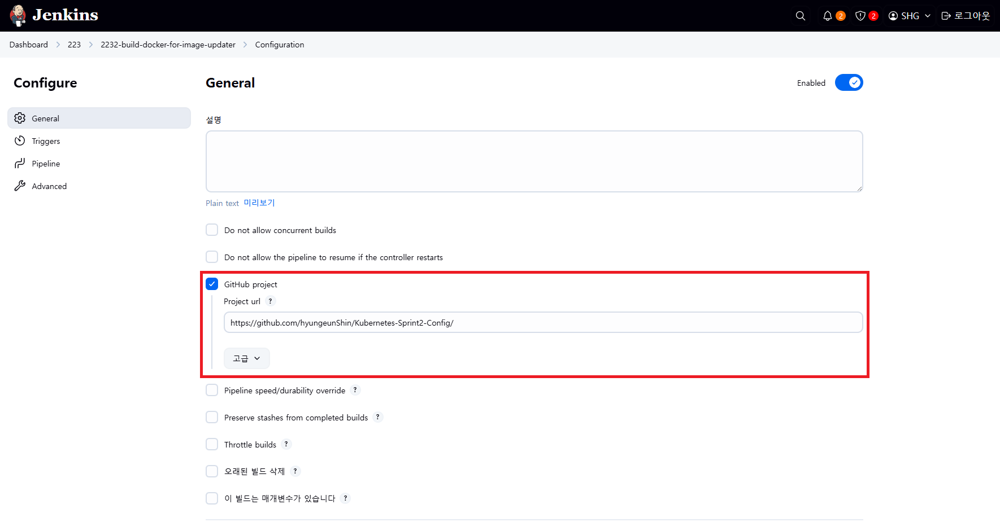

### 3-4. Configure > Pipeline

```
https://github.com/hyungeunShin/Kubernetes-Sprint2-Config.git
```

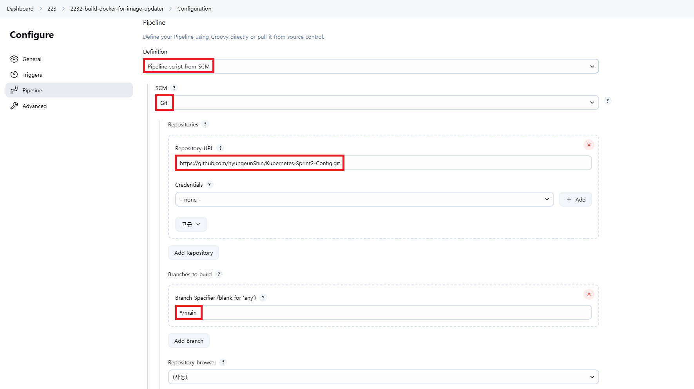

```
Path: 2232
Script Path: 2232/Jenkinsfile
```

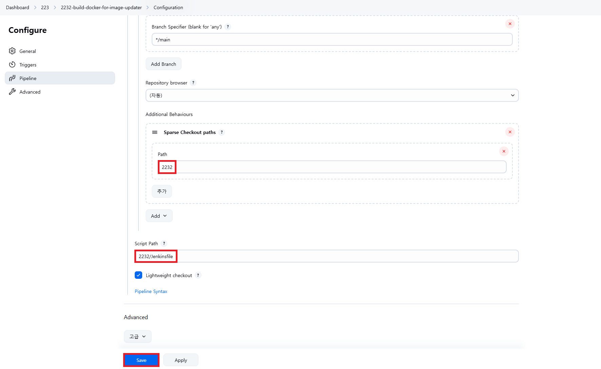

### 3-5. [저장] 후 [파라미터와 함께 빌드] 실행

### 3-6. 자동 업데이트 확인

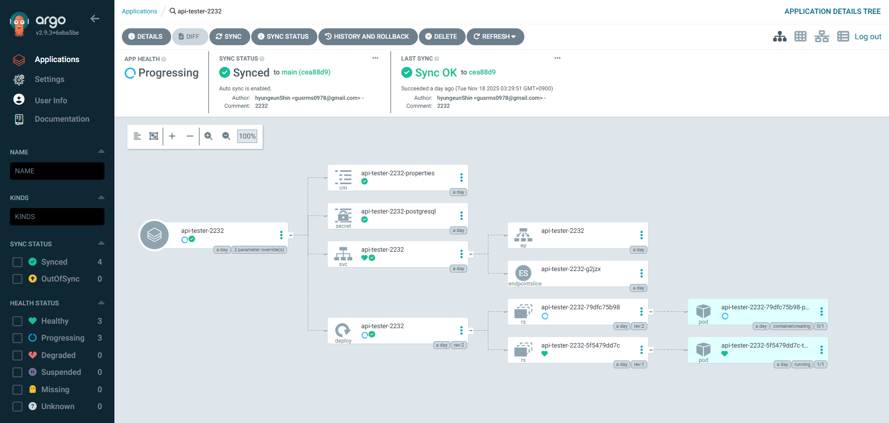

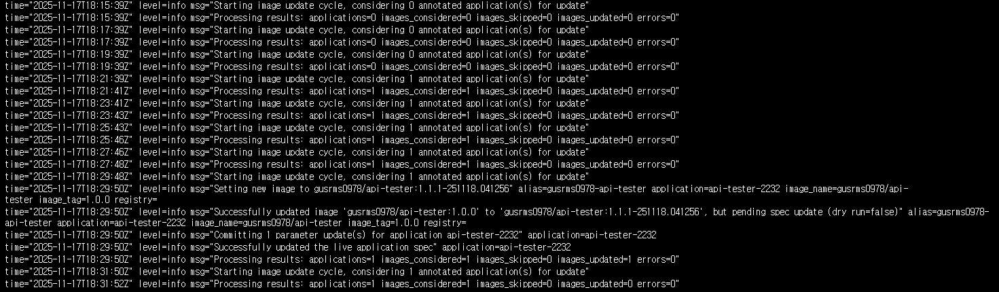

---

## 정리

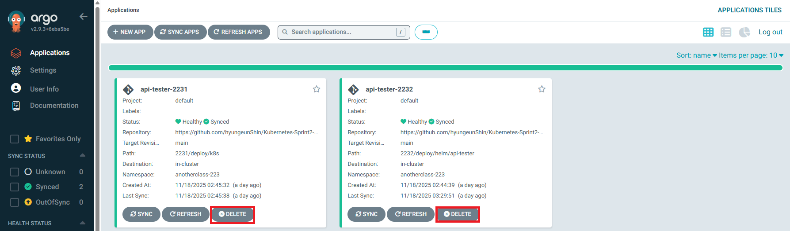