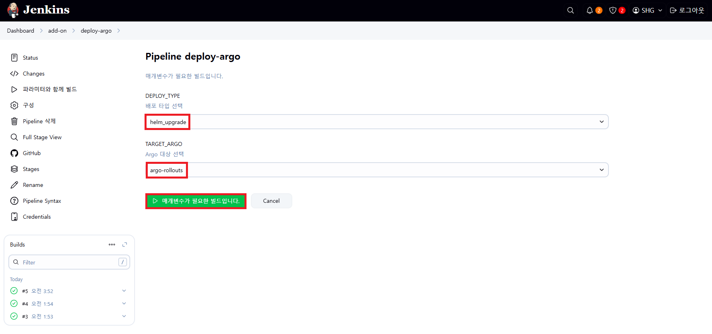
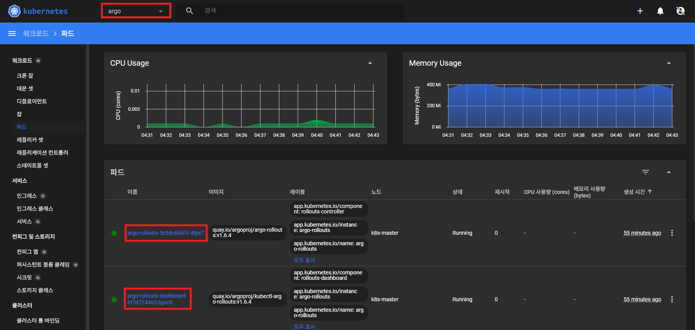
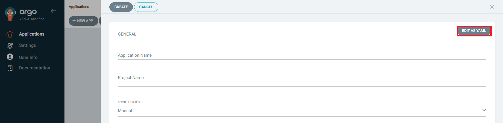
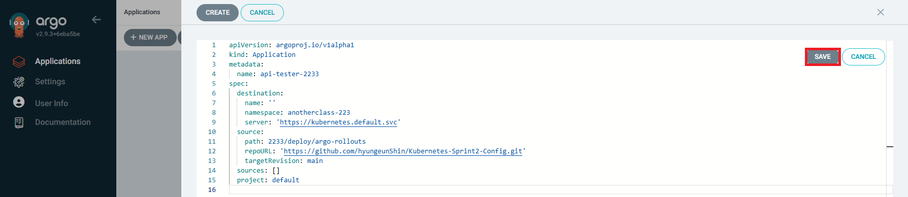
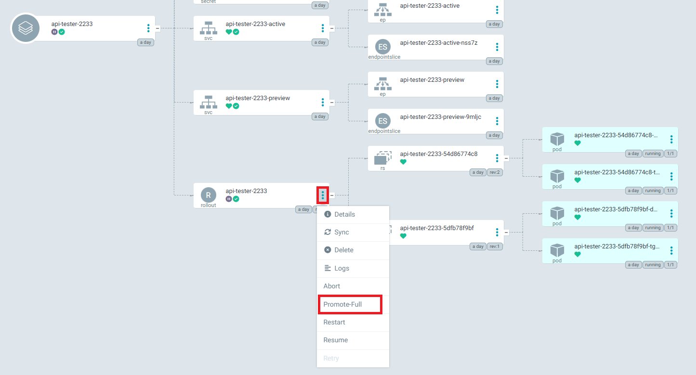
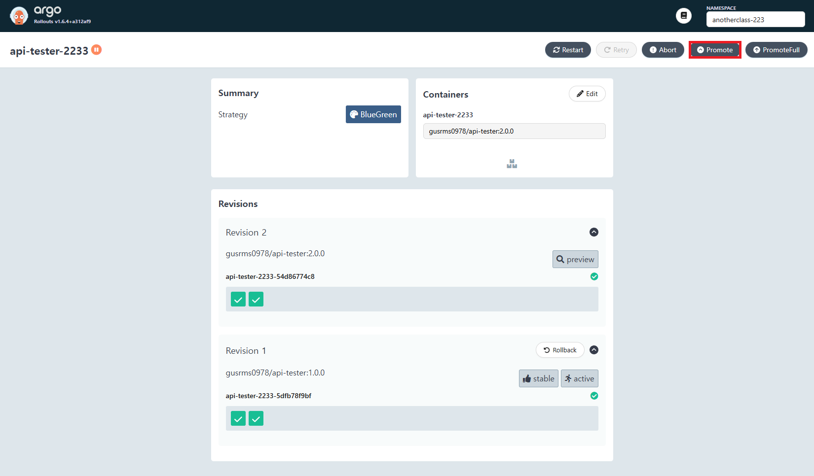
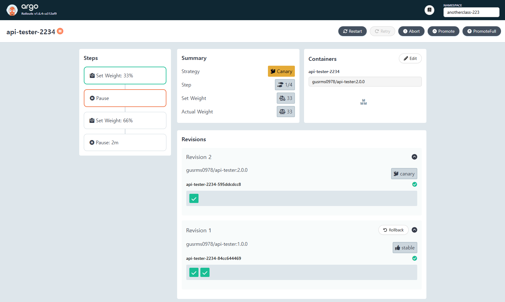
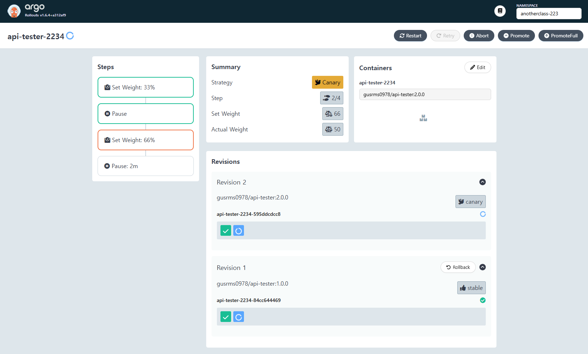
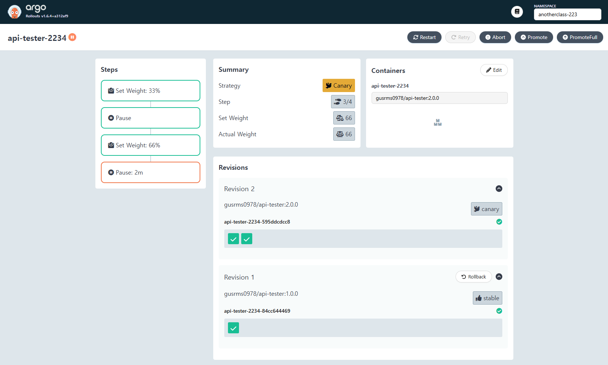

# Argo Rollouts

### Argo Rollouts(Ver. 1.6.4) 설치

- [Docs](https://argoproj.github.io/argo-rollouts/)
- [Artifact Hub](https://artifacthub.io/packages/helm/argo/argo-rollouts/2.34.1)

<hr style="height:4px; border:none; color:#333; background-color:#333;" />

## 1. Argo Rollouts 설치

▶ Dashboard > add-on > deploy-argo > 파라미터와 함께 빌드

```
DEPLOY_TYPE: helm_upgrade
TARGET_ARGO: argocd-rollouts
```



▶ 설치 확인



---

## 2. 동작 확인

### 2-1. [+ NEW APP] > [EDIT AS YAML] > [SAVE] > [CREATE]

```yaml
apiVersion: argoproj.io/v1alpha1
kind: Application
metadata:
  name: api-tester-2233
spec:
  destination:
    name: ''
    namespace: anotherclass-223
    server: 'https://kubernetes.default.svc'
  source:
    path: 2233/deploy/argo-rollouts
    repoURL: 'https://github.com/hyungeunShin/Kubernetes-Sprint2-Config.git'
    targetRevision: main
  sources: []
  project: default
```





### 2-2. [SYNC] > [SYNCHRONIZE]

### 2-3. 트래픽 보내기

```
//Active Service
[root@k8s-master ~]# while true; do curl http://192.168.56.30:32233/version; sleep 3; echo ''; done;
[App Version] : Api Tester v1.0.0
[App Version] : Api Tester v1.0.0

//Preview Service
[root@k8s-master ~]# while true; do curl http://192.168.56.30:32243/version; sleep 3; echo ''; done;
[App Version] : Api Tester v1.0.0
[App Version] : Api Tester v1.0.0
```

### 2-4. Git에서 image의 tag 변경 - rollout.yaml

```yaml
    spec:
      nodeSelector:
        kubernetes.io/hostname: k8s-master
      containers:
        - name: api-tester-2233
          image: gusrms0978/api-tester:2.0.0
```

### 2-5. api-tester-2233 > [SYNC] > [SYNCHRONIZE]

### 2-6. 트래픽 확인

```
//Active Service
[App Version] : Api Tester v1.0.0
[App Version] : Api Tester v1.0.0

//Preview Service
[App Version] : Api Tester v2.0.0
[App Version] : Api Tester v2.0.0
```

### 2-7. Promote 진행

▶ ArgoCD > Applications > api-tester-2233 > rollout > [...] > Promote-Full



▶ Argo Rollouts Dashboard

- http://192.168.56.30:30003/rollouts/anotherclass-223



### 2-8. 트래픽 확인

```
//Active Service
[App Version] : Api Tester v2.0.0
[App Version] : Api Tester v2.0.0

//Preview Service
[App Version] : Api Tester v2.0.0
[App Version] : Api Tester v2.0.0
```

---

## 3. Rollout CLI로 조회

### 3-1. Argo Rollouts CLI 설치(v1.6.4)

```
[root@k8s-master ~]# curl -LO https://github.com/argoproj/argo-rollouts/releases/download/v1.6.4/kubectl-argo-rollouts-linux-amd64
[root@k8s-master ~]# chmod +x ./kubectl-argo-rollouts-linux-amd64
[root@k8s-master ~]# mv ./kubectl-argo-rollouts-linux-amd64 /usr/local/bin/kubectl-argo-rollouts
```

▶ 설치 확인

```
[root@k8s-master ~]# kubectl argo rollouts version
kubectl-argo-rollouts: v1.6.4+a312af9
  BuildDate: 2023-12-11T18:31:15Z
  GitCommit: a312af9f632b985ec13f64918b918c5dcd02a15e
  GitTreeState: clean
  GoVersion: go1.20.12
  Compiler: gc
  Platform: linux/amd64
```

▶ 조회

```
kubectl argo rollouts get rollout api-tester-2233 -n anotherclass-223 -w
```

### 3-2. 리소스 정리

---

## 4. Argo Rollouts를 이용한 Canary 배포

### 4-1. Master에서 Kubectl로 Rollouts 배포

```
[root@k8s-master ~]# kubectl apply -f https://raw.githubusercontent.com/hyungeunShin/Kubernetes-Sprint2-Config/main/2234/deploy/argo-rollouts/rollout.yaml -n anotherclass-223
[root@k8s-master ~]# kubectl apply -f https://raw.githubusercontent.com/hyungeunShin/Kubernetes-Sprint2-Config/main/2234/deploy/argo-rollouts/configmap.yaml -n anotherclass-223
[root@k8s-master ~]# kubectl apply -f https://raw.githubusercontent.com/hyungeunShin/Kubernetes-Sprint2-Config/main/2234/deploy/argo-rollouts/secret.yaml -n anotherclass-223
[root@k8s-master ~]# kubectl apply -f https://raw.githubusercontent.com/hyungeunShin/Kubernetes-Sprint2-Config/main/2234/deploy/argo-rollouts/service.yaml -n anotherclass-223

kubectl apply -f https://raw.githubusercontent.com/hyungeunShin/Kubernetes-Sprint2-Config/main/2234/deploy/argo-rollouts/rollout.yaml -n anotherclass-223
kubectl apply -f https://raw.githubusercontent.com/hyungeunShin/Kubernetes-Sprint2-Config/main/2234/deploy/argo-rollouts/configmap.yaml -n anotherclass-223
kubectl apply -f https://raw.githubusercontent.com/hyungeunShin/Kubernetes-Sprint2-Config/main/2234/deploy/argo-rollouts/secret.yaml -n anotherclass-223
kubectl apply -f https://raw.githubusercontent.com/hyungeunShin/Kubernetes-Sprint2-Config/main/2234/deploy/argo-rollouts/service.yaml -n anotherclass-223
```

### 4-2. 배포 모니터링

```
kubectl argo rollouts get rollout api-tester-2234 -n anotherclass-223 -w
```

### 4-3. 트래픽 보내기

```
[root@k8s-master ~]# while true; do curl http://192.168.56.30:32234/version; sleep 3; echo ''; done;
```

### 4-4. rollout.yaml 내용 

```yaml
spec:
  replicas: 2
  strategy:
    canary:
      steps:
        - setWeight: 33
        - pause: {}
        - setWeight: 66
        - pause: { duration: 2m }
```

- https://argo-rollouts.readthedocs.io/en/stable/features/canary/

### 4-5. 이미지 태그 변경

```
//kubectl argo rollouts set image <ROLLOUT_NAME> <CONTAINER_NAME>=<IMAGE>:<TAG> -n <NAMESPACE_NAME>
kubectl argo rollouts set image api-tester-2234 api-tester-2234=gusrms0978/api-tester:2.0.0 -n anotherclass-223
```

### 4-6. Argo Rollout Dashboard에서 [Promote]를 통해 반영 확인

- http://192.168.56.30:30003/rollouts/rollout/anotherclass-223/api-tester-2234





① Set Weight: 33%: Stable 2 pod, Canary 1 pod 상태로 만듬<br>
② Pause: Promote 클릭 때까지 멈춤<br>
③ Set Weight: 66% : Stable 1 pod, Canary 2 pod 상태로 만듬<br>
④ Pause (2m):  2분 동안 멈춤<br>
⑤ Canary 2 pod 상태로 만듬

### 4-7. 리소스 정리

```
[root@k8s-master ~]# kubectl delete -f https://raw.githubusercontent.com/hyungeunShin/Kubernetes-Sprint2-Config/main/2234/deploy/argo-rollouts/rollout.yaml -n anotherclass-223
[root@k8s-master ~]# kubectl delete -f https://raw.githubusercontent.com/hyungeunShin/Kubernetes-Sprint2-Config/main/2234/deploy/argo-rollouts/configmap.yaml -n anotherclass-223
[root@k8s-master ~]# kubectl delete -f https://raw.githubusercontent.com/hyungeunShin/Kubernetes-Sprint2-Config/main/2234/deploy/argo-rollouts/secret.yaml -n anotherclass-223
[root@k8s-master ~]# kubectl delete -f https://raw.githubusercontent.com/hyungeunShin/Kubernetes-Sprint2-Config/main/2234/deploy/argo-rollouts/service.yaml -n anotherclass-223

kubectl delete -f https://raw.githubusercontent.com/hyungeunShin/Kubernetes-Sprint2-Config/main/2234/deploy/argo-rollouts/rollout.yaml -n anotherclass-223
kubectl delete -f https://raw.githubusercontent.com/hyungeunShin/Kubernetes-Sprint2-Config/main/2234/deploy/argo-rollouts/configmap.yaml -n anotherclass-223
kubectl delete -f https://raw.githubusercontent.com/hyungeunShin/Kubernetes-Sprint2-Config/main/2234/deploy/argo-rollouts/secret.yaml -n anotherclass-223
kubectl delete -f https://raw.githubusercontent.com/hyungeunShin/Kubernetes-Sprint2-Config/main/2234/deploy/argo-rollouts/service.yaml -n anotherclass-223
```