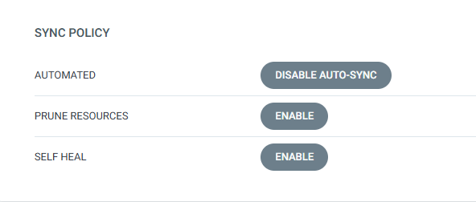
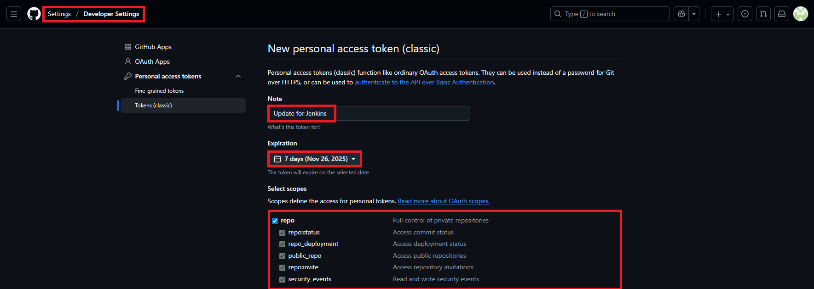
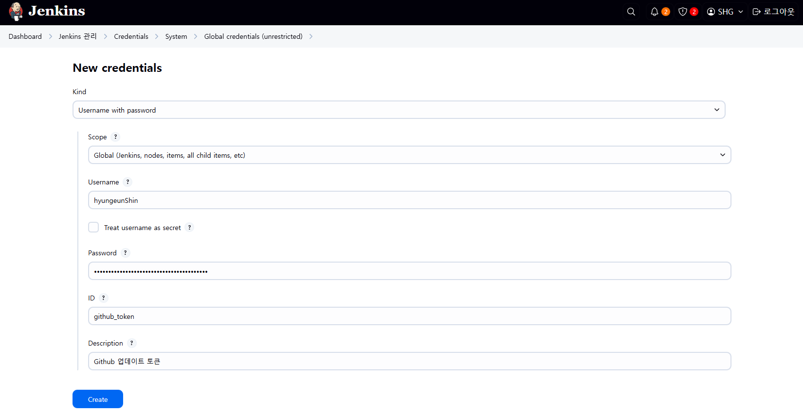
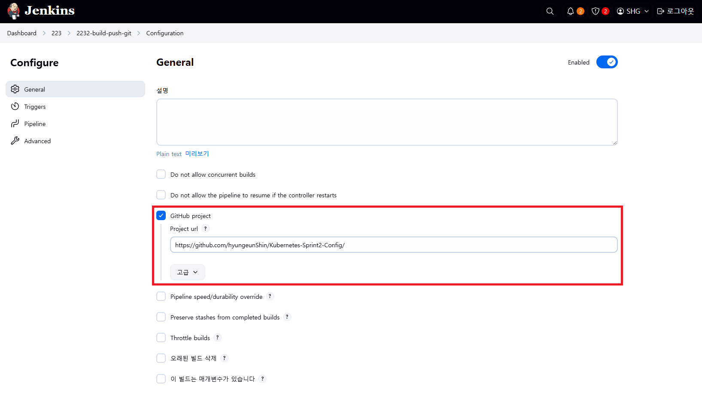
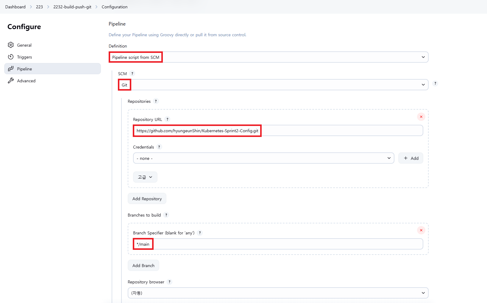
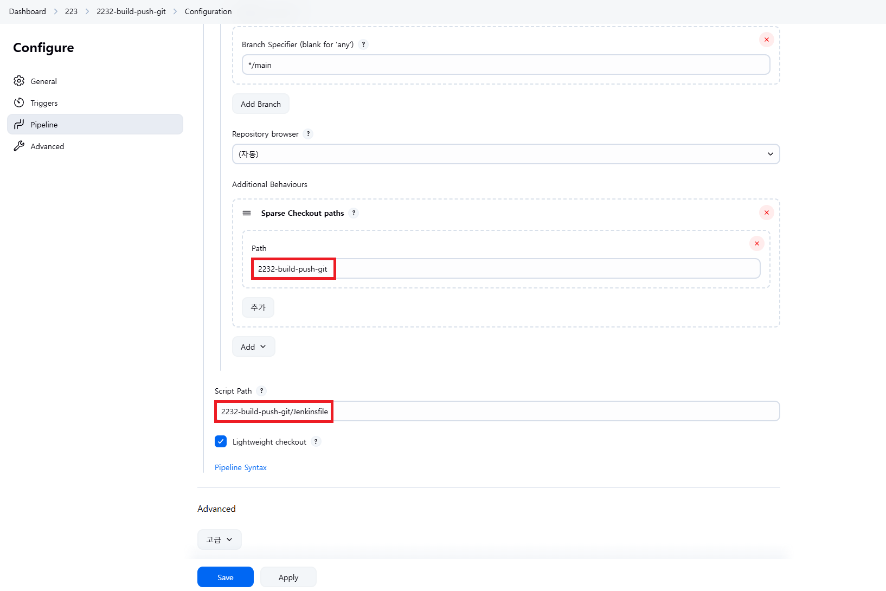

# Jenkins 빌드 후 Image Tag 변경 내용을 Github로 Push, ArgoCD로 자동 배포

## 1. ArgoCD로 App 생성 및 배포

### 1-1. [+ NEW APP] > [CREATE]

▶ GENERAL

```
Application Name: api-tester-2232-build-push-git
Project Name: default
SYNC POLICY: Manual
```

▶ SOURCE

```
Repository URL: https://github.com/hyungeunShin/Kubernetes-Sprint2-Config.git
Revision: main
Path: 2232-build-push-git/deploy/helm/api-tester
```

▶ DESTINATION

```
Cluster URL: https://kubernetes.default.svc
Namespace: anotherclass-223
```

▶ HELM 확인 후 Values files 지정

```
VALUES FILES: values-dev.yaml 
```

### 1-2. 자동 배포 설정



---

## 2. Jenkins에 Github Token 등록

## 2-1. Github > Settings > Developer Settings > Tokens(classic)

```
Note: Update for Jenkins 
Expiration: *
Select scopes: repo [체크]
```



## 2-2. Dashboard > Jenkins 관리 > Credentials > System > Global credentials (unrestricted) > [Add Credentials]

```
Kind: Username with password
Scope: Global
Username: <Github-Username>
Password: <Github에서 발급 받은 토큰>
ID: github_token
Description: Github 업데이트 토큰
```



---

## 3. Jeknins에서 Source/Container 빌드 후 Docker로 업로드 하기

### 3-1. item name 입력 및 Pipeline 선택

```
2232-build-push-git
```

### 3-2. Configure > General > GitHub project > Project url

```
https://github.com/hyungeunShin/Kubernetes-Sprint2-Config/
```



```
https://github.com/hyungeunShin/Kubernetes-Sprint2-Config.git
```



```
Path: 2232-build-push-git
Script Path: 2232-build-push-git/Jenkinsfile
```



### 3-3. [저장] > [지금 빌드]

### 3-4. ArgoCD 자동 배포 확인

### 3-5. 리소스 정리