# 로컬 환경 구성

## 1. Docker Desktop 설치

- https://docs.docker.com/get-docker/
- https://www.docker.com/products/docker-desktop/

---

## 2. IntelliJ에서 Docker Plugins 설치

### 2-1. File > Settings > Plugins > Marketplace > Docker 검색 > [Install] > [OK]

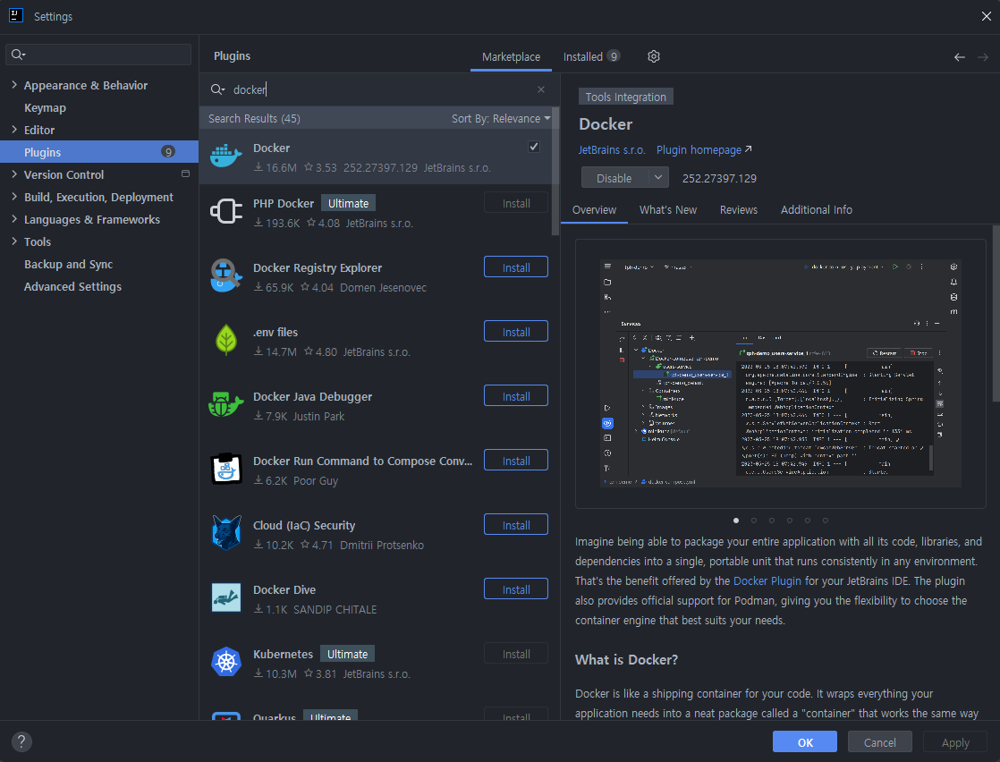

### 2-2. File > Settings > Build, Execution, Deployment > Docker > [Refresh] > [Connection successful] 문구 확인

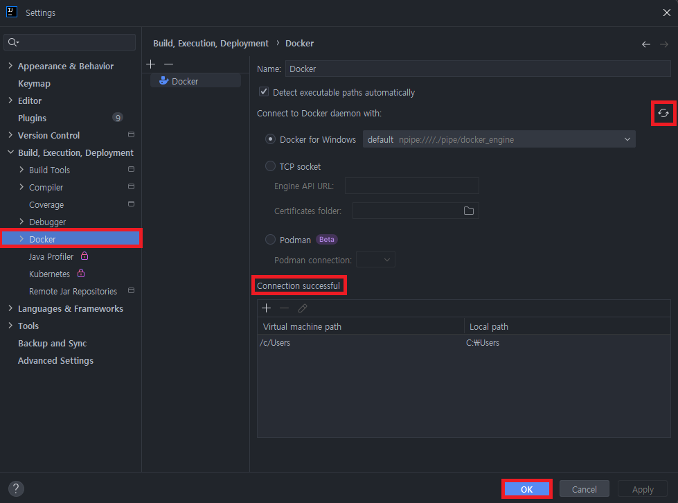

### 2-3. View > Tool Windows > Services [alt+8] > Docker 실행

| 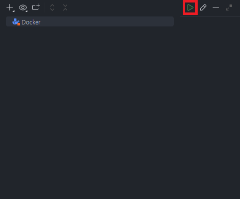 | 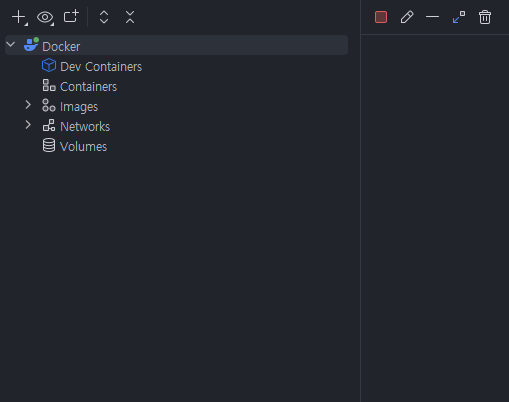 |
|---------------------|---------------------|

---

## 3. IntelliJ에서 Docker Build 

### 3-1. Dockerfile 생성

```
FROM openjdk:17.0.2
COPY ./build/libs/app-0.0.1-SNAPSHOT.jar /usr/src/myapp/app.jar
ENTRYPOINT ["java", "-Dspring.profiles.active=${spring_profiles_active}", "-Dapplication.role=${application_role}", "-Dpostgresql.filepath=${postgresql_filepath}", "-jar", "/usr/src/myapp/app.jar"]
EXPOSE 8080
WORKDIR /usr/src/myapp
```

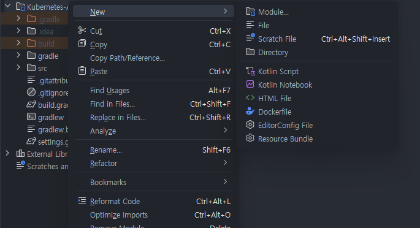

### 3-2. 빌드

▶ Run > Edit Configurations

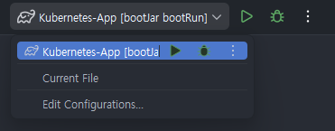

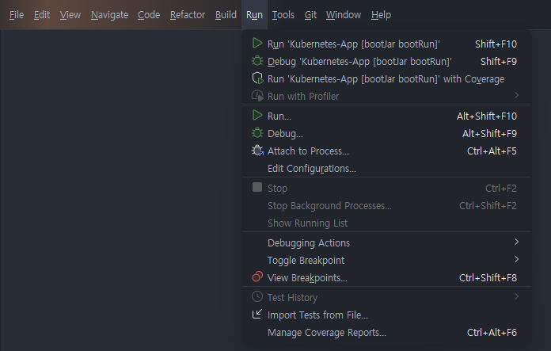

▶ [+] > Docker > Dockerfile

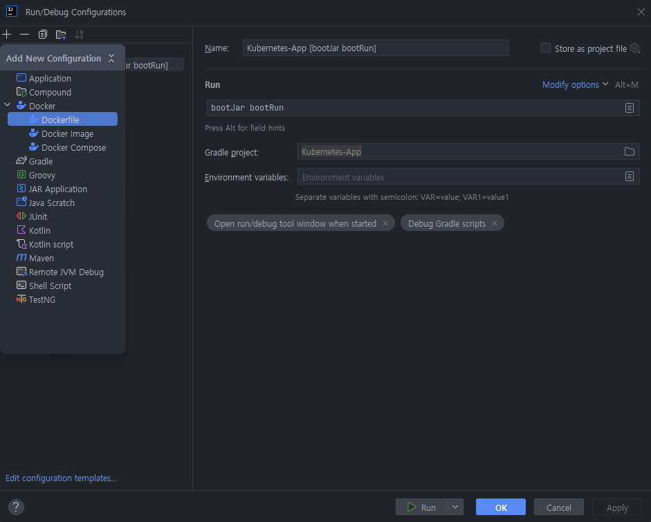

▶ Name 입력 및 [Modify options]에서 Bind ports, Bind mounts, Environment variables 선택

```
Name: api-tester
Dockerfile: Dockerfile [자동 선택되어 있음] -> 안되 있으면 직접 지정해주기

Container name: 입력하지 않으면 자동 생성됨
```

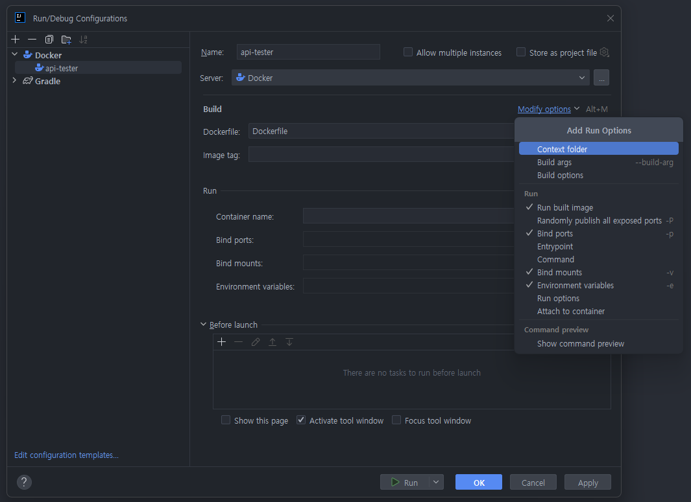

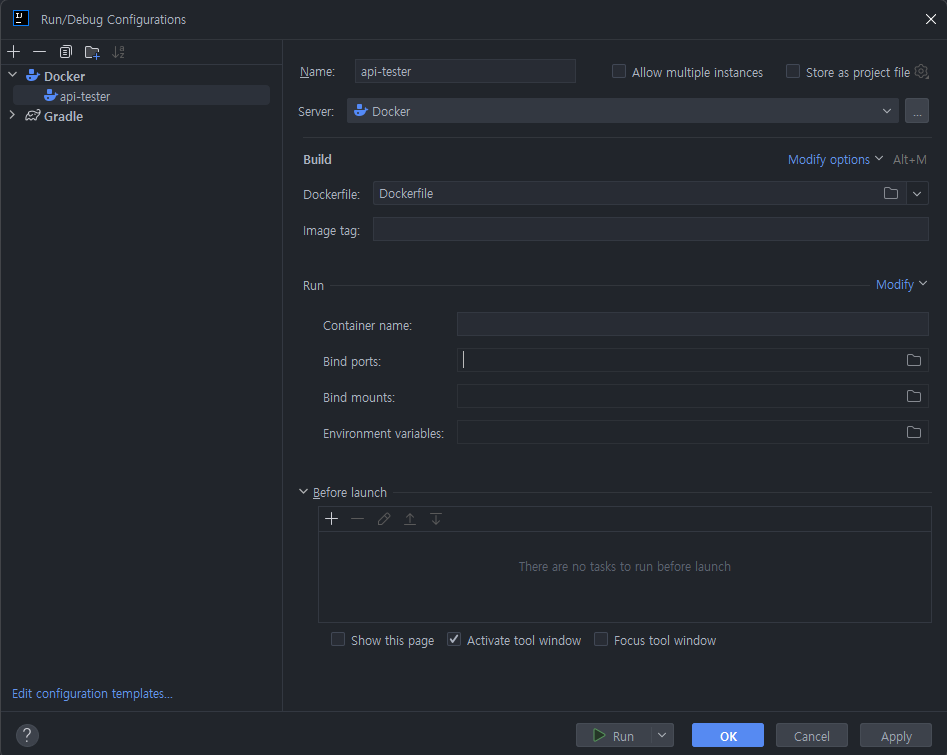

▶ Bind ports 값 넣기

```
Host port: 18080
Contaienr Port: 8080
```

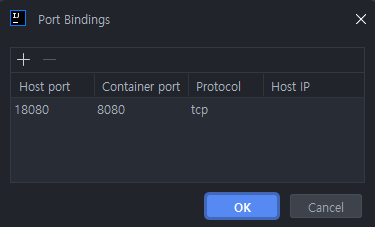

▶ Bind Mounts 값 넣기

```
Host path: C:\volume\container\pv
Container path: /usr/src/myapp/files/dev
```

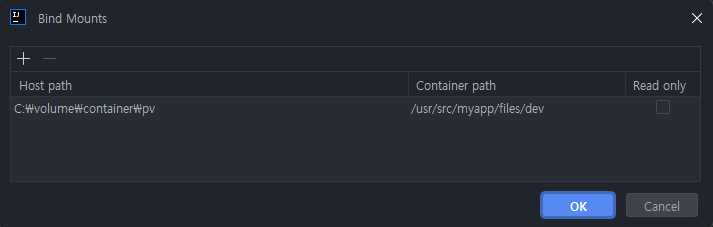

▶ Environment Variables 값 넣기

```
spring_profiles_active: container
application_role: ALL
postgresql_filepath: /usr/src/myapp/datasource/postgresql-info.yaml
```

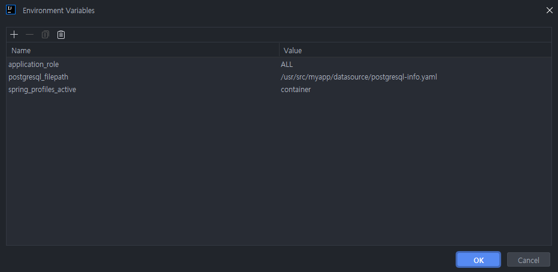

▶ Run 실행

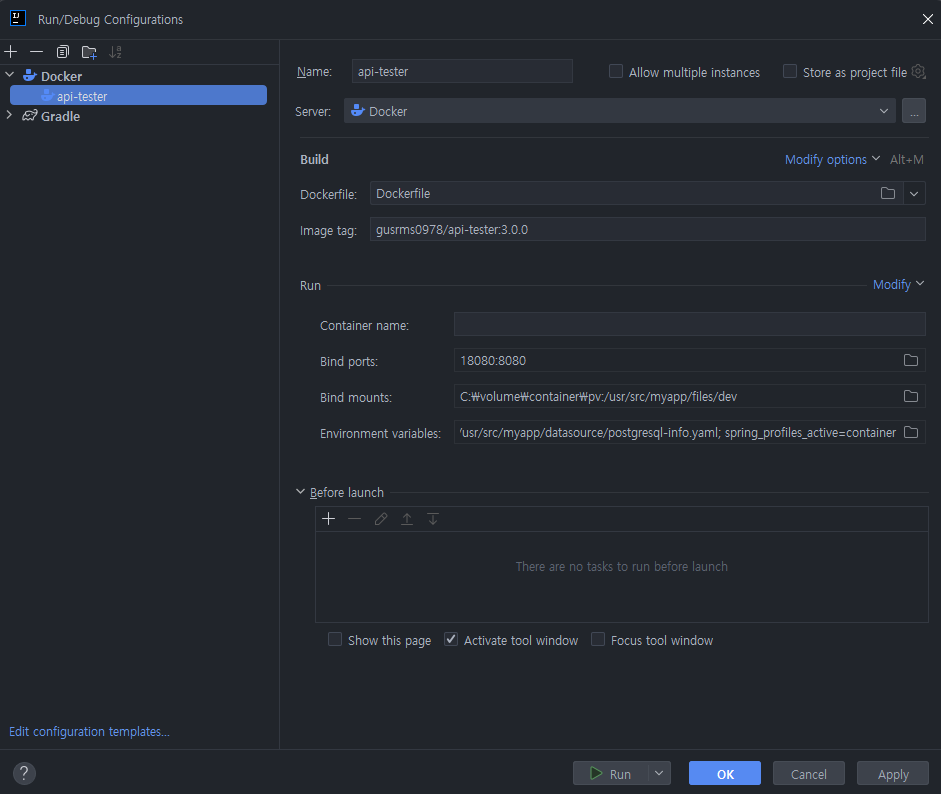

---

## 4. API 호출

- localhost:18080/info
- localhost:18080/hostname

▶ Pod에 파일 관리 (컨테이너 삭제 후 재기동시 파일이 없어야 함)
- localhost:18080/create-file-pod
- localhost:18080/list-file-pod

▶ PV에 파일 관리
- localhost:18080/create-file-pv
- localhost:18080/list-file-pv
