# Pod 기능

<hr style="height:4px; border:none; color:#333; background-color:#333;" />

## 1. Pod 정보 API로 내보내기

### 1-1. View 생성 후 [새로운 Item]

```
조회명: 321
Type: List View
```

### 1-2. item name 입력 및 Pipeline 선택

```
3211-downward-api
```

### 1-3. Configure > General > GitHub project > Project url

```
https://github.com/hyungeunShin/Kubernetes-Sprint3-Config/
```

### 1-4. Configure > Pipeline

```
Definition: Pipeline script from SCM
SCM: Git
Repository URL: https://github.com/hyungeunShin/Kubernetes-Sprint3-Config.git
Branch Specifier: */main
Path: 3211
Script Path: 3211/Jenkinsfile
```

### 1-5. [Save] > [지금 빌드]

### 1-6. Downward API 설정 확인

- http://192.168.56.30:30211/pod-downward-api-env
- http://192.168.56.30:30211/pod-downward-api-volume

### 1-7. Dashboard > 파드 > 로그

```
//환경변수 확인
env | grep downward

//마운팅 정보 확인
cd /usr/src/myapp/downward-api/
cat metadata_annotations
cat metadata_labels
```

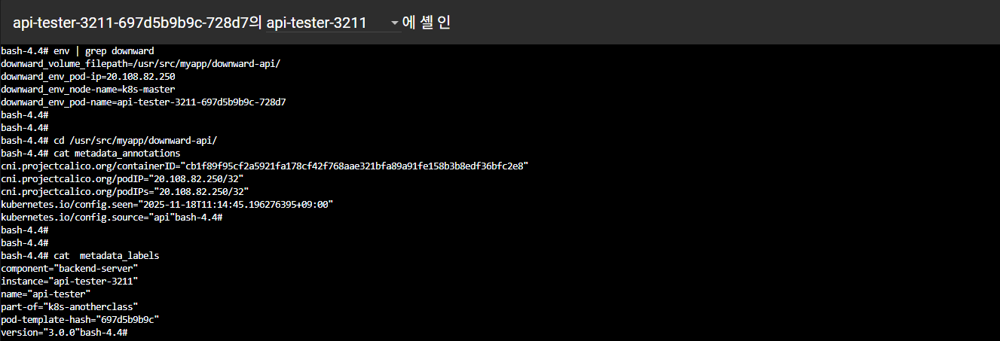

- https://kubernetes.io/ko/docs/concepts/workloads/pods/downward-api/

### 1-8. kube-apiserver 호출 설정 확인

- http://192.168.56.30:30211/pod-kube-api-server

### 1-9. Role 속성

- https://kubernetes.io/docs/reference/access-authn-authz/rbac/

#### 1) apiGroups 
- 코어 그룹: Pod나 Service 등의 기본적인 리소스 (apiVersion상 v1로 표기, API는 /api/v1)<br>
- 네임드 그룹: Deployment 등 특정 기능으로 확장한 리소스 (apiVersion상 apps/v1로 표기, API는 /apis/apps/v1)

    | 그룹                          | 포함 리소스                               |
    |-----------------------------|--------------------------------------|
    | `apps`                      | Deployment, DaemonSet, StatefulSet 등 |
    | `autoscaling`               | HorizontalPodAutoscaler              |
    | `batch`                     | Job, CronJob                         |
    | `networking.k8s.io`         | NetworkPolicy, Ingress               |
    | `rbac.authorization.k8s.io` | Role, RoleBinding                    |
    | `storage.k8s.io`            | Volume, StorageClass                 |

#### 2) resources
- 권한을 적용할 리소스 종류
- 여러 리소스를 동시에 지정 가능
- 예시: ["pods", "services", "deployment"]
- 확인 명령어
  ```
  kubectl api-resources
  ```

#### 3) verbs
- 허용할 행위

  | Verb   | 의미        |
  |--------|-----------|
  | get    | 특정 리소스 조회 |
  | list   | 리소스 목록 조회 |
  | watch  | 리소스 변경 감시 |
  | create | 리소스 생성    |
  | update | 리소스 수정    |
  | patch  | 일부 수정     |
  | delete | 리소스 삭제    |

---

### ※ Master Node에서 Yaml로 배포

```
[root@k8s-master ~]#
kubectl apply -f https://raw.githubusercontent.com/hyungeunShin/Kubernetes-Sprint3-Config/main/3211/deploy/k8s/namespace.yaml
kubectl apply -f https://raw.githubusercontent.com/hyungeunShin/Kubernetes-Sprint3-Config/main/3211/deploy/k8s/deployment.yaml
kubectl apply -f https://raw.githubusercontent.com/hyungeunShin/Kubernetes-Sprint3-Config/main/3211/deploy/k8s/configmap.yaml
kubectl apply -f https://raw.githubusercontent.com/hyungeunShin/Kubernetes-Sprint3-Config/main/3211/deploy/k8s/secret.yaml
kubectl apply -f https://raw.githubusercontent.com/hyungeunShin/Kubernetes-Sprint3-Config/main/3211/deploy/k8s/service.yaml
kubectl apply -f https://raw.githubusercontent.com/hyungeunShin/Kubernetes-Sprint3-Config/main/3211/deploy/k8s/secret-token.yaml
kubectl apply -f https://raw.githubusercontent.com/hyungeunShin/Kubernetes-Sprint3-Config/main/3211/deploy/k8s/rolebinding.yaml
kubectl apply -f https://raw.githubusercontent.com/hyungeunShin/Kubernetes-Sprint3-Config/main/3211/deploy/k8s/serviceaccount.yaml
kubectl apply -f https://raw.githubusercontent.com/hyungeunShin/Kubernetes-Sprint3-Config/main/3211/deploy/k8s/role.yaml
```

---

## 2. Application 안정적으로 종료

### 2-1. item name 입력 및 Pipeline 선택

```
3212-graceful-shutdown
```

### 2-2. Configure > General > GitHub project > Project url

```
https://github.com/hyungeunShin/Kubernetes-Sprint3-Config/
```

### 2-3. Configure > Pipeline

```
Definition: Pipeline script from SCM
SCM: Git
Repository URL: https://github.com/hyungeunShin/Kubernetes-Sprint3-Config.git
Branch Specifier: */main
Path: 3212
Script Path: 3212/Jenkinsfile
```

### 2-4. [Save] > [지금 빌드]


### 2-5. preStop API

▶ 다량의 트래픽 보내기

```
while true; do curl http://192.168.56.30:30212/hostname; sleep 0.1; echo ''; done;
```

▶ Deployment의 Replica를 1로 줄이고 트래픽 모니터링

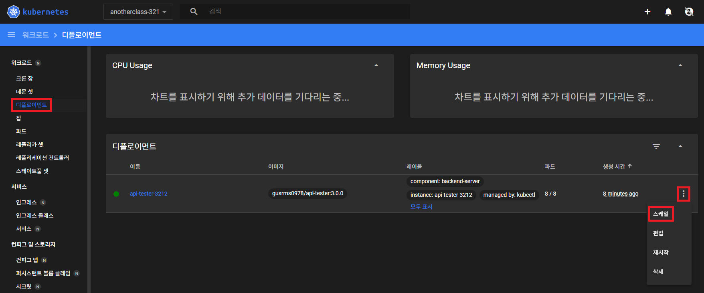

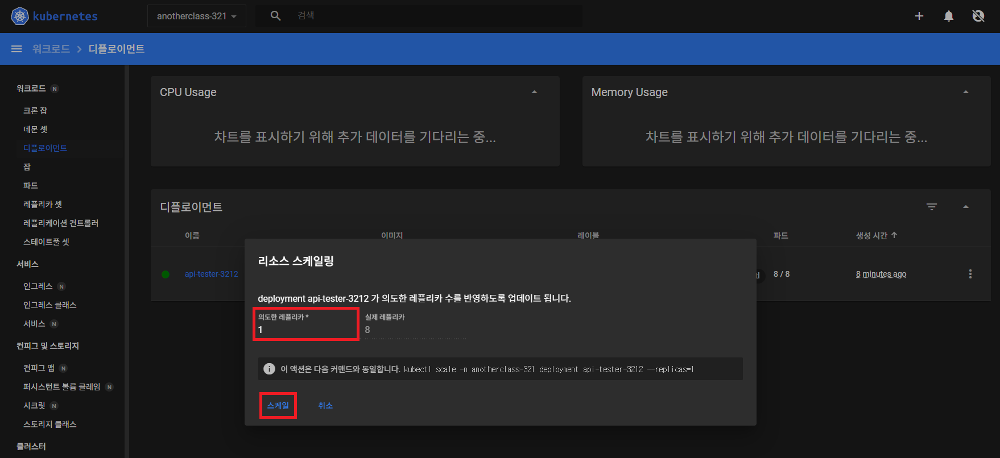

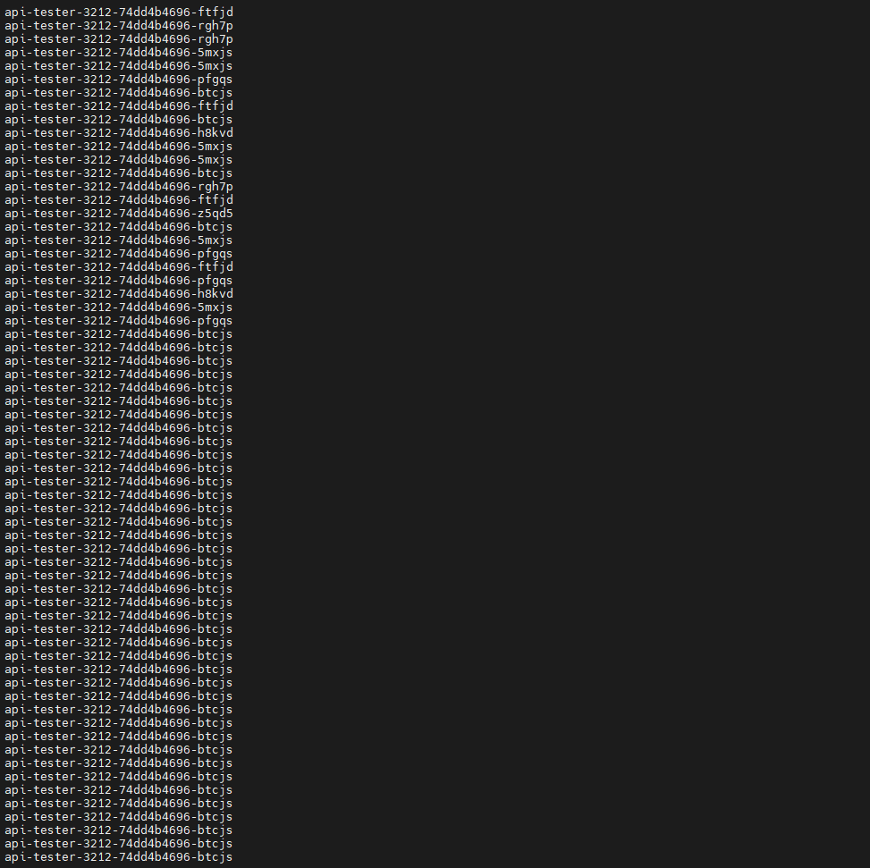

▶ Deployment 아래 내용 삭제 후 Replica를 다시 8로 만들기

```yaml
# 삭제
lifecycle:
  preStop:
    exec:
      command: ["sh", "-c", "sleep 5"]
```

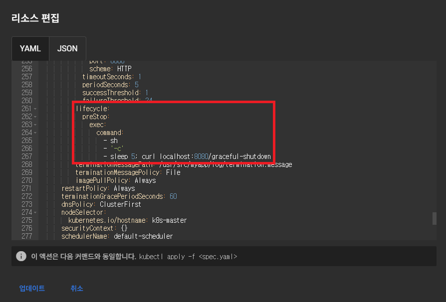

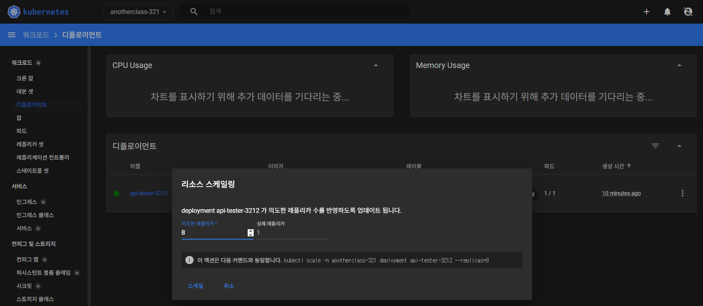

▶ 다량의 트래픽 보내기 > Deployment의 Replica를 1로 줄이고 트래픽 모니터링

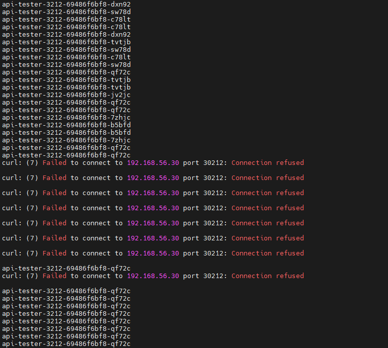

- https://kubernetes.io/ko/docs/concepts/containers/container-lifecycle-hooks/

### 2-6. 정상적인 종료 API

#### 1) SIGTERM에 의한 종료

▶ 상태 변경 과정 모니터링

```
kubectl get -n anotherclass-321 -o yaml -w pod <pod_name> 
kubectl logs -n anotherclass-321 -c api-tester-3212 --follow --tail 20 <pod_name>
```

▶ Pod 삭제

▶ 종료 상태 확인

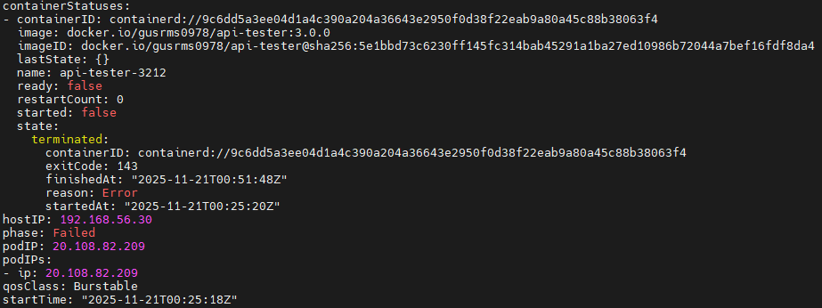

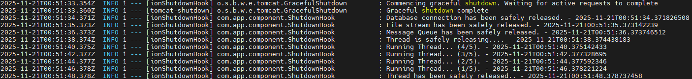

#### 2) SIGTERM을 못 받고 preStop에 의한 종료

▶ Deployment에 아래 내용 추가

```
          # 추가
          lifecycle:
            preStop:
              exec:
                command: ["sh", "-c", "sleep 5; curl localhost:8080/graceful-shutdown; sleep 5"]
```

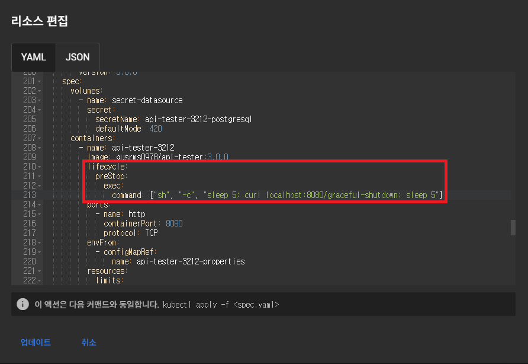

▶ 상태 변경 과정 모니터링

```
kubectl get -n anotherclass-321 -o yaml -w pod <pod_name> 
kubectl logs -n anotherclass-321 -c api-tester-3212 --follow --tail 20 <pod_name>
```

▶ Pod 삭제

▶ 종료 상태 확인

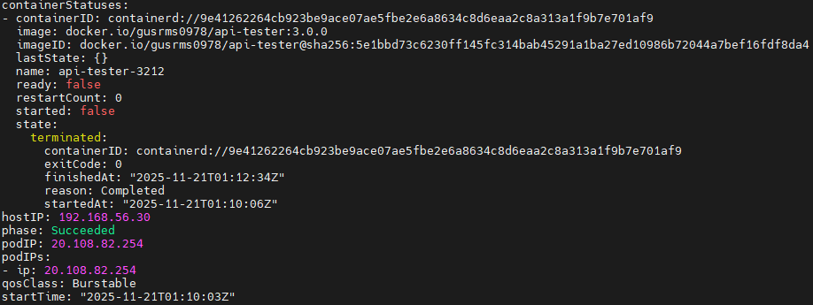

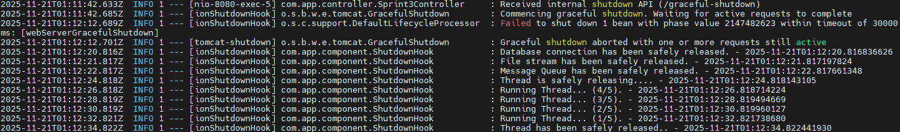

- https://kubernetes.io/ko/docs/concepts/workloads/pods/pod-lifecycle/#%ED%8C%8C%EB%93%9C%EC%9D%98-%EB%8B%A8%EA%B3%84

### 2-7. 비정상적인 종료 API

▶ 상태 변경 과정 모니터링

```
kubectl get -n anotherclass-321 -o yaml -w pod <pod_name> 
kubectl logs -n anotherclass-321 -c api-tester-3212 --follow --tail 20 <pod_name>
```

▶ 강제 종료 (내부 Memory Leak 발생) API 호출

```
http://192.168.56.30:30212/unexpected-shutdown
```

▶ Pod는 그대로 있고 컨테이너만 Restart 1 및 App 재기동 상태 확인

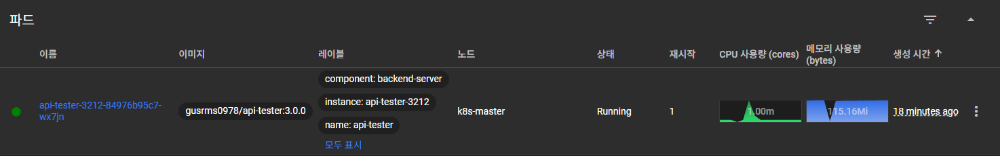

▶ 종료 상태 확인

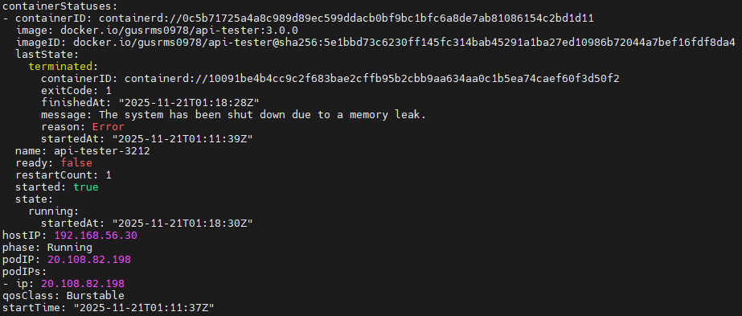

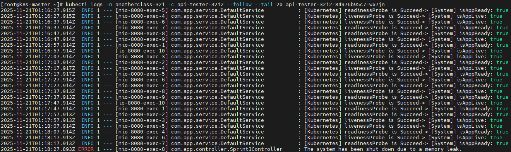

```
//jsonpath를 이용해서 lastState만 조회
kubectl get -n anotherclass-321 pod <pod-name> -o jsonpath='{.status.containerStatuses[*].lastState}'

//previous 옵션을 이용한 이전 컨테이너 로그 20줄만 보기
kubectl logs -n anotherclass-321 <pod-name> -c api-tester-3212 --previous --tail 20
```

---

### ※ Master Node에서 Yaml로 배포

```
[root@k8s-master ~]#
kubectl apply -f https://raw.githubusercontent.com/hyungeunShin/Kubernetes-Sprint3-Config/main/3212/deploy/k8s/namespace.yaml
kubectl apply -f https://raw.githubusercontent.com/hyungeunShin/Kubernetes-Sprint3-Config/main/3212/deploy/k8s/configmap.yaml
kubectl apply -f https://raw.githubusercontent.com/hyungeunShin/Kubernetes-Sprint3-Config/main/3212/deploy/k8s/secret.yaml
kubectl apply -f https://raw.githubusercontent.com/hyungeunShin/Kubernetes-Sprint3-Config/main/3212/deploy/k8s/service.yaml
kubectl apply -f https://raw.githubusercontent.com/hyungeunShin/Kubernetes-Sprint3-Config/main/3212/deploy/k8s/deployment.yaml
```

---

### 리소스 정리

```
kubectl delete -f https://raw.githubusercontent.com/hyungeunShin/Kubernetes-Sprint3-Config/main/3211/deploy/k8s/deployment.yaml
kubectl delete -f https://raw.githubusercontent.com/hyungeunShin/Kubernetes-Sprint3-Config/main/3211/deploy/k8s/configmap.yaml
kubectl delete -f https://raw.githubusercontent.com/hyungeunShin/Kubernetes-Sprint3-Config/main/3211/deploy/k8s/secret.yaml
kubectl delete -f https://raw.githubusercontent.com/hyungeunShin/Kubernetes-Sprint3-Config/main/3211/deploy/k8s/service.yaml
kubectl delete -f https://raw.githubusercontent.com/hyungeunShin/Kubernetes-Sprint3-Config/main/3211/deploy/k8s/secret-token.yaml
kubectl delete -f https://raw.githubusercontent.com/hyungeunShin/Kubernetes-Sprint3-Config/main/3211/deploy/k8s/rolebinding.yaml
kubectl delete -f https://raw.githubusercontent.com/hyungeunShin/Kubernetes-Sprint3-Config/main/3211/deploy/k8s/serviceaccount.yaml
kubectl delete -f https://raw.githubusercontent.com/hyungeunShin/Kubernetes-Sprint3-Config/main/3211/deploy/k8s/role.yaml
kubectl delete -f https://raw.githubusercontent.com/hyungeunShin/Kubernetes-Sprint3-Config/main/3211/deploy/k8s/namespace.yaml
```

```
kubectl delete -f https://raw.githubusercontent.com/hyungeunShin/Kubernetes-Sprint3-Config/main/3212/deploy/k8s/deployment.yaml
kubectl delete -f https://raw.githubusercontent.com/hyungeunShin/Kubernetes-Sprint3-Config/main/3212/deploy/k8s/configmap.yaml
kubectl delete -f https://raw.githubusercontent.com/hyungeunShin/Kubernetes-Sprint3-Config/main/3212/deploy/k8s/secret.yaml
kubectl delete -f https://raw.githubusercontent.com/hyungeunShin/Kubernetes-Sprint3-Config/main/3212/deploy/k8s/service.yaml
kubectl delete -f https://raw.githubusercontent.com/hyungeunShin/Kubernetes-Sprint3-Config/main/3212/deploy/k8s/namespace.yaml
```

---