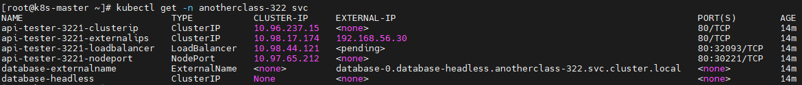
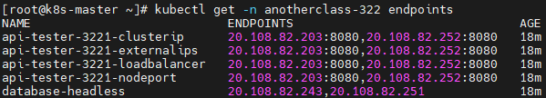
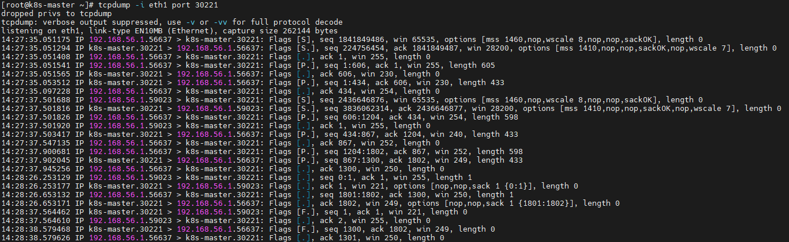
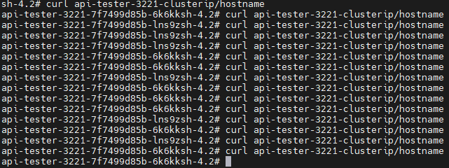
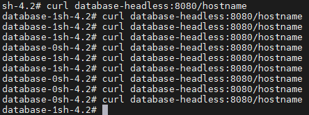
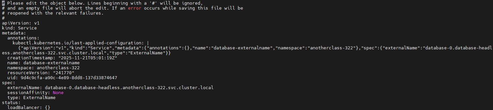

# Service 기능

<hr style="height:4px; border:none; color:#333; background-color:#333;" />

## 1. 배포

### 1-1. View 생성 후 [새로운 Item]

```
조회명: 322
Type: List View
```

### 1-2. item name 입력 및 Pipeline 선택

```
3221-service
```

### 1-3. Configure > General > GitHub project > Project url

```
https://github.com/hyungeunShin/Kubernetes-Sprint3-Config/
```

### 1-4. Configure > Pipeline

```
Definition: Pipeline script from SCM
SCM: Git
Repository URL: https://github.com/hyungeunShin/Kubernetes-Sprint3-Config.git
Branch Specifier: */main
Path: 3221
Script Path: 3221/Jenkinsfile
```

### 1-5. [Save] > [지금 빌드]

---

## 2. 서비스 퍼블리싱 / 레지스트리

### 2-1. 생성된 Service 확인

```
[root@k8s-master ~]# kubectl get -n anotherclass-322 svc
```



### 2-2. 서비스 퍼블리싱 확인

- https://kubernetes.io/ko/docs/concepts/services-networking/service/#publishing-services-service-types

▶ 외부에서 NodePort로 Pod에 접근 확인

```
http://192.168.56.30:30221/info
```

▶ 외부에서 LoadBalancer로 Pod에 접근 확인

```
//kubectl get -n anotherclass-322 svc에서 loadbalancer의 port번호
//http://192.168.56.30:32093/info
http://192.168.56.30:<loadbalancer port>/info
```

▶ 외부에서 ExternalIps로 Pod에 접근 확인

```
http://192.168.56.30/info
```

### 2-3. 서비스 레지스트리 확인

- https://kubernetes.io/ko/docs/concepts/services-networking/service/#%EC%97%94%EB%93%9C%ED%8F%AC%EC%9D%B8%ED%8A%B8

```
[root@k8s-master ~]# kubectl get -n anotherclass-322 endpoints
```



### 2-4. iptables 확인

- https://kubernetes.io/ko/docs/reference/networking/virtual-ips/#proxy-mode-iptables

▶ Service에 매핑된 Pod IP 확인

```
[root@k8s-master ~]# iptables -t nat -L | grep api-tester-3221-clusterip
```

▶ nodePort로 만들어진 Service 확인(리눅스 포트 조회 명령으로 볼 수 없음. 실제 리스닝 소켓을 열지 않고, iptables의 규칙을 사용해서 포트를 리디렉션 함)

```
//LISTENING된 Port는 조회되지 않음
[root@k8s-master ~]# yum install -y net-tools
[root@k8s-master ~]# netstat -anp | grep 30221

//iptables에서 Port 확인
[root@k8s-master ~]# iptables -t nat -L KUBE-NODEPORTS -n  | grep api-tester-3221-nodeport
```

▶ 모든 트래픽은 tcpdump를 이용해 확인 가능

```
//tcpdump 설치
[root@k8s-master ~]# yum install -y tcpdump

//호출한 IP에 대한 인터페이스 확인 -> eth1 확인
[root@k8s-master ~]# ip addr

//확인한 인터페이스로 port별 트래픽 확인
[root@k8s-master ~]# tcpdump -i eth1 port 30221
```

▶ 트래픽 보내기

- http://192.168.56.30:30221/info



---

## 3. 서비스 디스커버리

### 3-1. 서비스 디스커버리

▶ Service 이름으로 DNS 호출

- https://kubernetes.io/ko/docs/concepts/services-networking/dns-pod-service/

```
//Pod 내부로 들어가기
[root@k8s-master ~]# kubectl exec -n anotherclass-322 init -it -- /bin/sh

//DNS 호출
sh-4.2# nslookup api-tester-3221-clusterip

//도메인 명으로 curl 날리기
sh-4.2# curl api-tester-3221-clusterip/info
//nslookup api-tester-3221-clusterip 결과의 Address 입력
sh-4.2# curl <address>/info
sh-4.2# curl api-tester-3221-clusterip.anotherclass-322/info
sh-4.2# curl api-tester-3221-clusterip.anotherclass-322.svc.cluster.local/info
```

```
//iptables에서 로드밸런싱
sh-4.2# curl api-tester-3221-clusterip/hostname
```



▶ Headless를 통해 Pod의 IP 리스트 확인
(Service에 연결되 있는 IP 리스트 확인)

```
//Service 조회
[root@k8s-master ~]# kubectl get -n anotherclass-322 svc database-headless

//Pod 내부로 들어가기
[root@k8s-master ~]# kubectl exec -n anotherclass-322 init -it -- /bin/sh

//nslookup로 확인
sh-4.2# nslookup database-headless

//도메인 명으로 curl 날리기 (Port는 Pod의 포트를 줘야함)
sh-4.4# curl database-headless:8080/info

//DNS에서 Address 순서를 변경해줌
sh-4.4# curl database-headless:8080/hostname
```



▶ Headless를 통해 만들어 진 Pod의 DNS 사용
(데이터 베이스(StatefulSet)에서 Pod를 선택해서 트래픽을 보내기 위해 사용)

```
// Pod 조회
[root@k8s-master ~]# kubectl get -n anotherclass-322 pod | grep database

//Pod 내부에서 nslookup로 확인
[root@k8s-master ~]# kubectl exec -n anotherclass-322 init -it -- /bin/sh
sh-4.4#  nslookup database-0.database-headless

sh-4.4#  nslookup database-1.database-headless

//Pod이름으로 API 호출
sh-4.4# curl database-0.database-headless:8080/hostname
sh-4.4# curl database-1.database-headless:8080/hostname
```

▶ 클러스터 내부의 Pod들이 ExternalName을 통해서 타 서버로 연결
(개발환경에서 테스트 목적으로 다른 환경의 서버(DB or Solution)에 연결을 해야 할 경우)
(보안이 중요한 서버(google, github)를 접근할땐 DNS이름이 달라지면 인증서 상의 문제 때문에 정상동작 하지 않는 점 주의)

- https://kubernetes.io/ko/docs/concepts/services-networking/service/#externalname

```
[root@k8s-master ~]# kubectl get -n anotherclass-322 svc  database-externalname

[root@k8s-master ~]# kubectl exec -n anotherclass-322 init -it -- /bin/sh

//externalName이 database-0.database-headless.anotherclass-322.svc.cluster.local인 상태
sh-4.4# curl database-externalname:8080/hostname
database-0

//externalName을 database-1.database-headless.anotherclass-322.svc.cluster.local로 변경
[root@k8s-master ~]# kubectl edit -n anotherclass-322 svc database-externalname

[root@k8s-master ~]# kubectl exec -n anotherclass-322 init -it -- /bin/sh

sh-4.4# curl database-externalname:8080/hostname
database-1
```




▶ Pod의 DNS 구성 확인

```
sh-4.4# cat /etc/resolv.conf
search anotherclass-322.svc.cluster.local svc.cluster.local cluster.local
nameserver 10.96.0.10
options ndots:5
```

- nameserver : DNS 쿼리를 보낼 DNS 서버의 IP (여러 IP 등록 가능)
- search : 내가 준 도메인 이름에 여기 있는 리스트를 다 한번씩 붙여서 DNS로 검색<br>
  -> api-tester-3221-clusterip -> api-tester-3221-clusterip.anotherclass-322.svc.cluster.local<br>
  -> api-tester-3221-clusterip.anotherclass-322 -> api-tester-3221-clusterip.anotherclass-322.svc.cluster.local<br>
  -> api-tester-3221-clusterip.anotherclass-322.svc -> api-tester-3221-clusterip.anotherclass-322.svc.cluster.local<br>
- options ndots:5 : 도메인 이름에 점(.)이 5개를 넘지 않으면 search에 있는 리스트를 붙여서 조회함<br>
  -> api-tester-3221-clusterip.anotherclass-322.svc.cluster.local 이건 점(.)이 4개라 search<br>
  -> api-tester-3221-clusterip.anotherclass-322.svc.cluster.local. 이건 점(.) 5개라 search 안함

▶ CoreDNS의 DNS 구성 확인

```
//ip로 dns 서버 확인
[root@k8s-master ~]# kubectl get svc -A | grep 10.96.0.10

//kube-system의 전체 Pod 조회
[root@k8s-master ~]# kubectl get pods -n kube-system

//coredns의 설정(confimap) 확인
[root@k8s-master ~]# kubectl get -n kube-system configmaps coredns -o yaml
```

▶ Linux에서 DNS 구성 확인

(virtualbox에서 NAT 사용시, 리눅스를 설치 할때 별도로 DNS server를 지정해주지 않으면, 자동으로 Virtualbox의 내부 서버 IP(10.0.2.3)를 할당하고, 이 서버는 호스트 머신의 DNS 설정을 바탕으로 인터넷 DNS 서버에 연결됨)

```
[root@k8s-master ~]# cat /etc/resolv.conf
```

### 3-2. Pod에 직접 DNS 설정 주기

▶ Pod에서 원하는 DNS에 바로 연결하는 방법

```
containers:
- name: api-tester-3221
  dnsPolicy: None
  dnsConfig:
    nameservers:
      - "8.8.8.8"
      - "8.8.4.4"
```

▶ Pod에서 DNS로 호출 시 서버에 질의하지 않고 바로 IP를 설정하는 방법

```
containers:
- name: api-tester-3221
  hostAliases:
  - ip: "20.200.245.247"
    hostnames:
    - "github.com"
```

---

### ※ Master Node에서 Yaml로 배포

```
[root@k8s-master ~]#
kubectl apply -f https://raw.githubusercontent.com/hyungeunShin/Kubernetes-Sprint3-Config/main/3221/deploy/k8s/namespace.yaml
kubectl apply -f https://raw.githubusercontent.com/hyungeunShin/Kubernetes-Sprint3-Config/main/3221/deploy/k8s/configmap.yaml
kubectl apply -f https://raw.githubusercontent.com/hyungeunShin/Kubernetes-Sprint3-Config/main/3221/deploy/k8s/secret.yaml
kubectl apply -f https://raw.githubusercontent.com/hyungeunShin/Kubernetes-Sprint3-Config/main/3221/deploy/k8s/service-clusterip.yaml
kubectl apply -f https://raw.githubusercontent.com/hyungeunShin/Kubernetes-Sprint3-Config/main/3221/deploy/k8s/service-loadbalancer.yaml
kubectl apply -f https://raw.githubusercontent.com/hyungeunShin/Kubernetes-Sprint3-Config/main/3221/deploy/k8s/service-nodeport.yaml
kubectl apply -f https://raw.githubusercontent.com/hyungeunShin/Kubernetes-Sprint3-Config/main/3221/deploy/k8s/service-externalips.yaml
kubectl apply -f https://raw.githubusercontent.com/hyungeunShin/Kubernetes-Sprint3-Config/main/3221/deploy/k8s/deployment.yaml
kubectl apply -f https://raw.githubusercontent.com/hyungeunShin/Kubernetes-Sprint3-Config/main/3221/deploy/k8s/db-service-externalname.yaml
kubectl apply -f https://raw.githubusercontent.com/hyungeunShin/Kubernetes-Sprint3-Config/main/3221/deploy/k8s/db-service-headless.yaml
kubectl apply -f https://raw.githubusercontent.com/hyungeunShin/Kubernetes-Sprint3-Config/main/3221/deploy/k8s/db-statefulset.yaml
kubectl apply -f https://raw.githubusercontent.com/hyungeunShin/Kubernetes-Sprint3-Config/main/3221/deploy/k8s/pod.yaml
```

---

---

### 리소스 정리

```
[root@k8s-master ~]#
kubectl delete -f https://raw.githubusercontent.com/hyungeunShin/Kubernetes-Sprint3-Config/main/3221/deploy/k8s/configmap.yaml
kubectl delete -f https://raw.githubusercontent.com/hyungeunShin/Kubernetes-Sprint3-Config/main/3221/deploy/k8s/secret.yaml
kubectl delete -f https://raw.githubusercontent.com/hyungeunShin/Kubernetes-Sprint3-Config/main/3221/deploy/k8s/service-clusterip.yaml
kubectl delete -f https://raw.githubusercontent.com/hyungeunShin/Kubernetes-Sprint3-Config/main/3221/deploy/k8s/service-loadbalancer.yaml
kubectl delete -f https://raw.githubusercontent.com/hyungeunShin/Kubernetes-Sprint3-Config/main/3221/deploy/k8s/service-nodeport.yaml
kubectl delete -f https://raw.githubusercontent.com/hyungeunShin/Kubernetes-Sprint3-Config/main/3221/deploy/k8s/service-externalips.yaml
kubectl delete -f https://raw.githubusercontent.com/hyungeunShin/Kubernetes-Sprint3-Config/main/3221/deploy/k8s/deployment.yaml
kubectl delete -f https://raw.githubusercontent.com/hyungeunShin/Kubernetes-Sprint3-Config/main/3221/deploy/k8s/db-service-externalname.yaml
kubectl delete -f https://raw.githubusercontent.com/hyungeunShin/Kubernetes-Sprint3-Config/main/3221/deploy/k8s/db-service-headless.yaml
kubectl delete -f https://raw.githubusercontent.com/hyungeunShin/Kubernetes-Sprint3-Config/main/3221/deploy/k8s/db-statefulset.yaml
kubectl delete -f https://raw.githubusercontent.com/hyungeunShin/Kubernetes-Sprint3-Config/main/3221/deploy/k8s/pod.yaml
kubectl delete -f https://raw.githubusercontent.com/hyungeunShin/Kubernetes-Sprint3-Config/main/3221/deploy/k8s/namespace.yaml
```