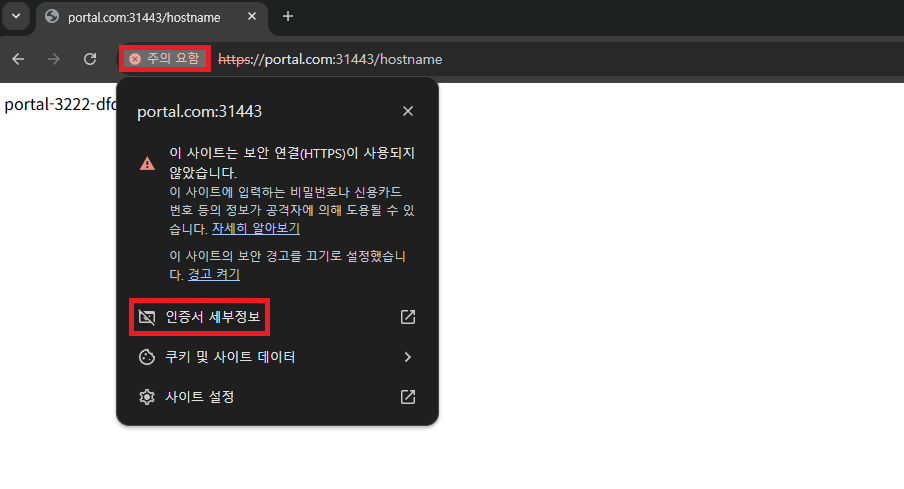
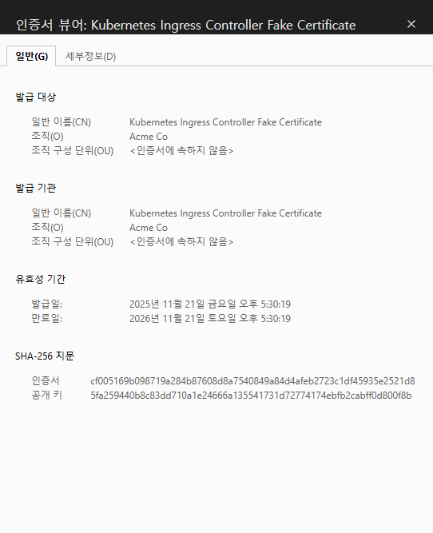
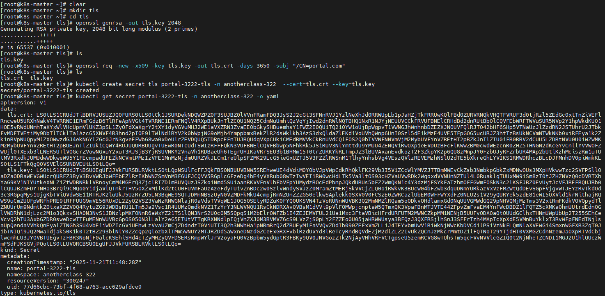
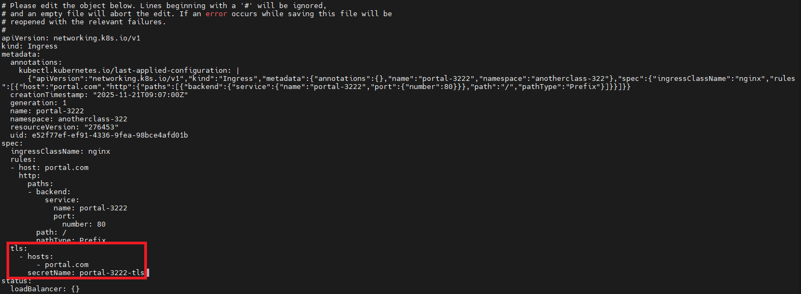
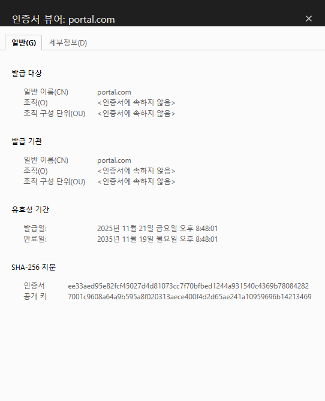
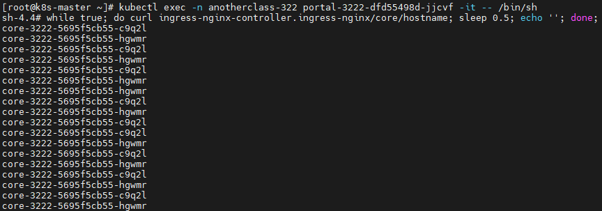
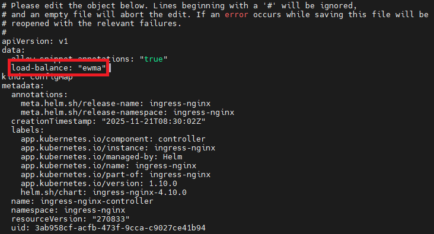
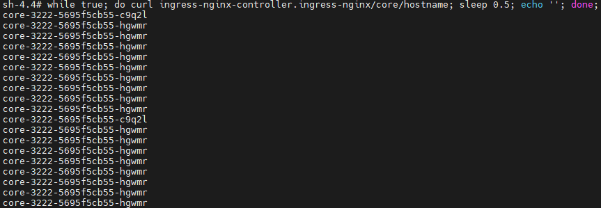
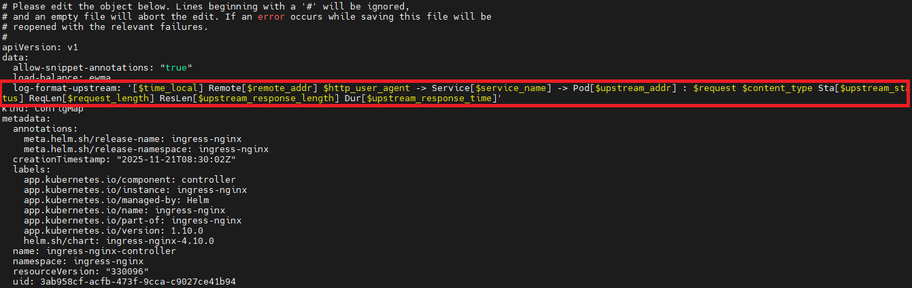
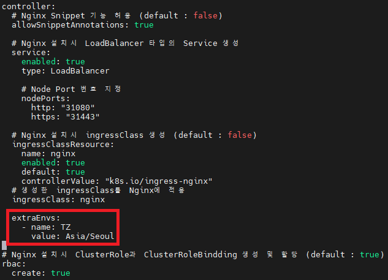

# Nginx 사용시 마주하게 되는 상황들과 해결 방법

<hr style="height:4px; border:none; color:#333; background-color:#333;" />

## 1. TLS 설정

- https://kubernetes.io/ko/docs/concepts/services-networking/ingress/#tls

### 1-1. 브라우저에서 API 호출

```
https://portal.com:31443/hostname
```





### 1-2. Portal 용 TLS Secret 생성

```
[root@k8s-master ~]# mkdir tls && cd tls

//개인키 생성
[root@k8s-master tls]# openssl genrsa -out tls.key 2048

//인증서 서명 요청 (CSR) 생성
[root@k8s-master tls]# openssl req -new -x509 -key tls.key -out tls.crt -days 3650 -subj "/CN=portal.com"

//TLS 타입의 Secret 생성
[root@k8s-master tls]# kubectl create secret tls portal-3222-tls -n anotherclass-322  --cert=tls.crt --key=tls.key

//확인
[root@k8s-master tls]# kubectl get secret portal-3222-tls -n anotherclass-322 -o yaml
```



### 1-3. Portal Ingress에 tls 추가

```
kubectl edit ingress -n anotherclass-322 portal-3222
```

```yaml
spec:
  ingressClassName: nginx
  rules:
  - host: portal.com
    http:
      paths:
      - backend:
          service:
            name: portal-3222
            port:
              number: 80
        path: /
        pathType: Prefix
  tls:                                 #추가
    - hosts:                           #추가
        - portal.com                   #추가 
      secretName: portal-3222-tls      #추가
status:
  loadBalancer: {}
```



### 1-4. 브라우저에서 API 호출

```
https://portal.com:31443/hostname
```



### 1-5. TLS 적용 후 http로 호출시 https로 리다이렉션

▶ portal.com:31080/hostname만 portal.com/hostname으로 변경 됨

```
http://portal.com:31080/hostname
http://k8s.core:31080/hostname
```

▶ Ingress에 TLS가 설정되 있을 경우 아래와 같이 설정이 기본값으로 적용됨

```yaml
apiVersion: networking.k8s.io/v1
kind: Ingress
metadata:
  annotations:
    nginx.ingress.kubernetes.io/ssl-redirect: "true" 
```

▶ configuration-snippet 옵션 추가

- https://kubernetes.github.io/ingress-nginx/user-guide/nginx-configuration/annotations/#configuration-snippet

```
kubectl edit -n anotherclass-322 ingress portal-3222
```

```yaml
  annotations:
    nginx.ingress.kubernetes.io/configuration-snippet: |
      if ($scheme = http) {
        return 301 https://$host:31443$request_uri;
      }
```


▶ 브라우저에서 확인

```
//https://portal.com:31443/hostname로 redirect 됨
http://portal.com:31080/hostname
```

---

## 2. Cluster 내부에서 호출시 트래픽 분리

### 2-1. Master Server에서 Yaml 파일 배포

```
[root@k8s-master ~]#
kubectl apply -f https://raw.githubusercontent.com/hyungeunShin/Kubernetes-Sprint3-Config/main/3222/deploy/k8s/core/ingress-internal.yaml
kubectl apply -f https://raw.githubusercontent.com/hyungeunShin/Kubernetes-Sprint3-Config/main/3222/deploy/k8s/cust/ingress-internal.yaml
kubectl apply -f https://raw.githubusercontent.com/hyungeunShin/Kubernetes-Sprint3-Config/main/3222/deploy/k8s/cust/service.yaml
kubectl apply -f https://raw.githubusercontent.com/hyungeunShin/Kubernetes-Sprint3-Config/main/3222/deploy/k8s/cust/deployment.yaml
```

### 2-2. 적용된 rewrite-target 기능 확인

- https://kubernetes.io/ko/docs/concepts/services-networking/ingress/#%EA%B2%BD%EB%A1%9C-%EC%9C%A0%ED%98%95

▶ Core의 Ingress 확인

- https://kubernetes.github.io/ingress-nginx/user-guide/nginx-configuration/annotations/#rewrite

```
[root@k8s-master ~]# kubectl get -n anotherclass-322 ingress core-3222-internal -o yaml
[root@k8s-master ~]# kubectl get -n anotherclass-322 ingress cust-3222-internal -o yaml
```

```yaml
apiVersion: networking.k8s.io/v1
kind: Ingress
metadata:
  annotations:
    nginx.ingress.kubernetes.io/rewrite-target: /$2
    nginx.ingress.kubernetes.io/use-regex: "true"
spec:
  rules:
    - http:
        paths:
          - backend:
              service:
                name: core-3222
                port:
                  number: 80
            path: /core(/|$)(.*)
            pathType: ImplementationSpecific
```

```yaml
apiVersion: networking.k8s.io/v1
kind: Ingress
metadata:
  annotations:
    nginx.ingress.kubernetes.io/rewrite-target: /$2
    nginx.ingress.kubernetes.io/use-regex: "true"
spec:
  rules:
  - http:
      paths:
      - backend:
          service:
            name: cust-3222
            port:
              number: 80
        path: /cust(/|$)(.*)
        pathType: ImplementationSpecific
```

▶ Portal Pod 내에서 API 호출

```
[root@k8s-master ~]# k exec -n anotherclass-322 portal-3222-<Press Tab> -it -- /bin/sh

sh-4.4# curl ingress-nginx-controller.ingress-nginx/core/hostname
sh-4.4# curl ingress-nginx-controller.ingress-nginx/cust/hostname
```

▶ Portal Ingress에 Rule 추가시 기존 Rule 이상 유무 확인

```
[root@k8s-master ~]# kubectl get ingress -n anotherclass-322
NAME                 CLASS   HOSTS        ADDRESS   PORTS     AGE
core-3222            nginx   k8s.core               80        53m
core-3222-internal   nginx   *                      80        22m
cust-3222-internal   nginx   *                      80        22m
portal-3222          nginx   portal.com             80, 443   53m
```

```
https://k8s.core:31443/hostname
//404
https://k8s.core:31443/core/hostname
```

---

## 3. Nginx 자체 설정 변경

- https://kubernetes.github.io/ingress-nginx/user-guide/nginx-configuration/configmap/

### 3-1. Nginx 로드밸런싱 방식 변경

- https://kubernetes.github.io/ingress-nginx/user-guide/nginx-configuration/configmap/#load-balance

▶ Portal Pod내에서 API 호출

```
[root@k8s-master ~]# kubectl exec -n anotherclass-322 portal-3222-<Press Tab> -it -- /bin/sh

sh-4.4# while true; do curl ingress-nginx-controller.ingress-nginx/core/hostname; sleep 0.5; echo ''; done; 
```



▶ 부하 분산 알고리즘 변경 (configmap 변경시 Nginx에서 바로 적용됨)<br>

```
[root@k8s-master ~]# kubectl edit -n ingress-nginx configmap ingress-nginx-controller
```

```yaml
#ewma: Pod의 Response 평균치를 기준으로 응답시간이 빠른 곳에 트래픽을 우선으로 보내줌 (기본값: 라운드로빈)
data:                   #추가
  load-balance: "ewma"  #추가
```



▶ Core Pod 한곳에 들어가서 부하 생성 후 API 모니터링

```
[root@k8s-master ~]# kubectl exec -n anotherclass-322 core-3222-<Press Tab> -it -- /bin/sh

sh-4.4# curl localhost:8080/cpu-load
```



### 3-2. Nginx 로그 포맷 변경

- https://kubernetes.github.io/ingress-nginx/user-guide/nginx-configuration/log-format/

▶ 기본 Nginx 로그 포맷

```
[root@k8s-master ~]# kubectl logs -n ingress-nginx ingress-nginx-controller-<Press Tab> --tail 10
20.108.82.248 - - [24/Nov/2025:08:16:24 +0000] "GET /core/hostname HTTP/1.1" 200 26 "-" "curl/7.61.1" 115 0.001 [anotherclass-322-core-3222-80] [] 20.108.82.203:8080 26 0.001 200 c8bba9db6ac96683e952bf6689acaf7e
20.108.82.248 - - [24/Nov/2025:08:16:25 +0000] "GET /core/hostname HTTP/1.1" 200 26 "-" "curl/7.61.1" 115 0.002 [anotherclass-322-core-3222-80] [] 20.108.82.205:8080 26 0.001 200 137da837aaec026b09fd08543dfca47a
20.108.82.248 - - [24/Nov/2025:08:16:26 +0000] "GET /core/hostname HTTP/1.1" 200 26 "-" "curl/7.61.1" 115 0.001 [anotherclass-322-core-3222-80] [] 20.108.82.203:8080 26 0.001 200 f4c490edf6c3441fcee2c97b828a0da4
```

▶ 로그 포맷 변경

```
[root@k8s-master ~]# kubectl edit -n ingress-nginx configmap ingress-nginx-controller
```

```
data:
  log-format-upstream: '[$time_local] Remote[$remote_addr] $http_user_agent -> Service[$service_name] -> Pod[$upstream_addr] : $request $content_type Sta[$upstream_status] ReqLen[$request_length] ResLen[$upstream_response_length] Dur[$upstream_response_time]'
```



▶ 변경 확인

```
//트래픽 전송
[root@k8s-master ~]# kubectl exec -n anotherclass-322 core-3222-<Press Tab> -it -- /bin/sh

sh-4.4# curl ingress-nginx-controller.ingress-nginx/core/hostname
```

```
//로그확인
[root@k8s-master ~]# kubectl logs -n ingress-nginx ingress-nginx-controller-<Press Tab> --tail 10
[24/Nov/2025:08:37:38 +0000] Remote[20.108.82.248] curl/7.61.1 -> Service[core-3222] -> Pod[20.108.82.203:8080] : GET /core/hostname HTTP/1.1 - Sta[200] ReqLen[115] ResLen[26] Dur[0.001]
[24/Nov/2025:08:40:03 +0000] Remote[20.108.82.248] curl/7.61.1 -> Service[core-3222] -> Pod[20.108.82.203:8080] : GET /core/hostname HTTP/1.1 - Sta[200] ReqLen[115] ResLen[26] Dur[0.001]
[24/Nov/2025:08:40:04 +0000] Remote[20.108.82.248] curl/7.61.1 -> Service[core-3222] -> Pod[20.108.82.205:8080] : GET /core/hostname HTTP/1.1 - Sta[200] ReqLen[115] ResLen[26] Dur[0.001]
```

### 3-3. Nginx 서버 시간 변경

▶ 기본 타임존 (글로벌 프로젝트일 때 모든 시스템의 timzone은 UTC를 사용하고, 로그를 볼 때 스크립트를 통해 Asia/Seoul로 Time으로 변경해서 봐야함)

```
[root@k8s-master ~]# kubectl logs -n ingress-nginx ingress-nginx-controller-<Press Tab> --tail 10
[24/Nov/2025:08:37:38 +0000] Remote[20.108.82.248] curl/7.61.1 -> Service[core-3222] -> Pod[20.108.82.203:8080] : GET /core/hostname HTTP/1.1 - Sta[200] ReqLen[115] ResLen[26] Dur[0.001]
[24/Nov/2025:08:40:03 +0000] Remote[20.108.82.248] curl/7.61.1 -> Service[core-3222] -> Pod[20.108.82.203:8080] : GET /core/hostname HTTP/1.1 - Sta[200] ReqLen[115] ResLen[26] Dur[0.001]
[24/Nov/2025:08:40:04 +0000] Remote[20.108.82.248] curl/7.61.1 -> Service[core-3222] -> Pod[20.108.82.205:8080] : GET /core/hostname HTTP/1.1 - Sta[200] ReqLen[115] ResLen[26] Dur[0.001]
```

▶ 타임존 변경 (국내 프로젝트 일 때는 timezone을 Asia/Seoul로 고정 하는 경우도 많음)

```
//Helm Values.yaml 파일 수정
[root@k8s-master ~]# cd ~/ingress-nginx
[root@k8s-master ~]# vi values-dev.yaml
```

```yaml
  #Timezone 설정
  extraEnvs:
    - name: TZ
      value: Asia/Seoul
```



```
//Nginx 재배포
[root@k8s-master ~]# helm upgrade ingress-nginx . -f ./values-dev.yaml -n ingress-nginx --install
```

▶ 시간 변경 확인

```
//트래픽 전송
[root@k8s-master ~]# kubectl exec -n anotherclass-322 portal-3222-<Press Tab> -it -- /bin/sh

sh-4.4# curl ingress-nginx-controller.ingress-nginx/core/hostname;

//로그 확인
[root@k8s-master ~]# kubectl logs -n ingress-nginx ingress-nginx-controller-<Press Tab> --tail 10
[24/Nov/2025:18:09:01 +0900] Remote[20.108.82.248] curl/7.61.1 -> Service[core-3222] -> Pod[20.108.82.203:8080] : GET /core/hostname HTTP/1.1 - Sta[200] ReqLen[115] ResLen[26] Dur[0.011]
[24/Nov/2025:18:09:02 +0900] Remote[20.108.82.248] curl/7.61.1 -> Service[core-3222] -> Pod[20.108.82.203:8080] : GET /core/hostname HTTP/1.1 - Sta[200] ReqLen[115] ResLen[26] Dur[0.002]
[24/Nov/2025:18:09:04 +0900] Remote[20.108.82.248] curl/7.61.1 -> Service[core-3222] -> Pod[20.108.82.203:8080] : GET /core/hostname HTTP/1.1 - Sta[200] ReqLen[115] ResLen[26] Dur[0.001]
```