# PV, PVC

## 1. File Storage - NFS Server 구축 및 Deployment 배포

### 1-1. CI/CD Server - NFS Server 설치

```
[root@cicd-server ~]#
yum -y install nfs-utils rpcbind
systemctl start rpcbind
systemctl start nfs-server
systemctl start rpc-statd
systemctl enable rpcbind
systemctl enable nfs-server

//상태 확인
[root@cicd-server ~]# systemctl status nfs-server
```

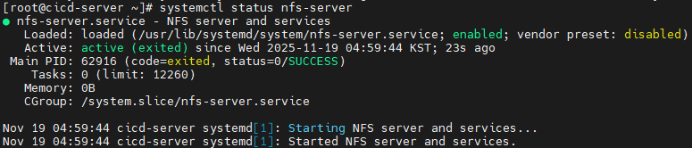

### 1-2. Volume(공유 폴더) 생성 및 설정

```
//폴더 생성
[root@cicd-server ~]# mkdir /file-storage

//exports 파일 설정
[root@cicd-server ~]# vi /etc/exports
```

```
/file-storage *(rw,sync,no_root_squash)
```

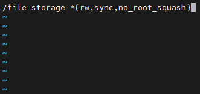

```
//설정 반영
[root@cicd-server ~]# exportfs -r

//재시작
[root@cicd-server ~]# systemctl restart nfs-server
```

- 특정 IP 대역에서만 접근 할 수 있도록 제한<br>
  /file-storage 192.168.56.0/24(rw,sync,no_root_squash)
- 특정 IP에서만 접근 할 수 있도록 제한<br>
  /file-storage 192.168.56.30(rw,sync,no_root_squash)
- 읽기 전용으로만 연결<br>
  /file-storage *(ro,sync,no_root_squash)
- sync / async : 데이터 쓰기에 대한 작업 모드 (sync 안정적-느림), (async 불안전-빠름)
- no_root_squash : 클라이언트의 root 사용자가 서버에서도 root 권한을 유지<br>
  기본값 root_squash: root 사용자가 서버에 접근하면 NFS 서버는 그 사용자를 "anonymous" 사용자로 매핑하여 root 권한을 제한)

### 1-3. Master Server에서 Yaml 파일 배포

```
[root@k8s-master ~]#
kubectl apply -f https://raw.githubusercontent.com/hyungeunShin/Kubernetes-Sprint3-Config/main/3231/deploy/k8s/namespace.yaml
kubectl apply -f https://raw.githubusercontent.com/hyungeunShin/Kubernetes-Sprint3-Config/main/3231/deploy/k8s/secret.yaml
kubectl apply -f https://raw.githubusercontent.com/hyungeunShin/Kubernetes-Sprint3-Config/main/3231/deploy/k8s/configmap.yaml
kubectl apply -f https://raw.githubusercontent.com/hyungeunShin/Kubernetes-Sprint3-Config/main/3231/deploy/k8s/file/deployment.yaml
kubectl apply -f https://raw.githubusercontent.com/hyungeunShin/Kubernetes-Sprint3-Config/main/3231/deploy/k8s/file/pv.yaml
kubectl apply -f https://raw.githubusercontent.com/hyungeunShin/Kubernetes-Sprint3-Config/main/3231/deploy/k8s/file/pvc.yaml
```

### 1-4. 파일 공유 확인

▶ Pod 내부 /mnt/shared 위치에서 파일 생성

```
//Pod 내부로 들어가기
[root@k8s-master ~]# k exec -n anotherclass-323 application-3231-<Press Tab> -it -- /bin/bash

//파일 생성
bash-4.4# cd /mnt/shared/
bash-4.4# touch file.txt
```

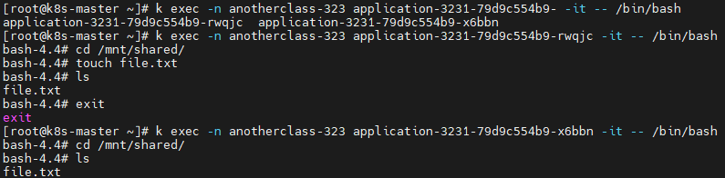

```
//NFS Server 확인
[root@cicd-server ~]# cd /file-storage/application-3231
[root@cicd-server application-3231]# ls
file.txt
```

---

## 2. Block Storage - Longhorn 설치 및 StatefulSet 배포

### 2-1. Master에 Longhorn 설치

- https://longhorn.io/docs/archives/1.4.2/deploy/install/#installation-requirements
- https://longhorn.io/docs/archives/1.4.2/deploy/install/install-with-kubectl/

```
//iscsi 설치 및 상태 확인
[root@k8s-master ~]# yum --setopt=tsflags=noscripts install iscsi-initiator-utils
[root@k8s-master ~]# echo "InitiatorName=$(/sbin/iscsi-iname)" > /etc/iscsi/initiatorname.iscsi
[root@k8s-master ~]# systemctl enable iscsid
[root@k8s-master ~]# systemctl start iscsid

//longhorn 배포
[root@k8s-master ~]# kubectl apply -f https://raw.githubusercontent.com/hyungeunShin/Kubernetes-Install/main/base/k8s-1.27/longhorn-1.4.2/longhorn.yaml

//replicas 수 조정
[root@k8s-master ~]# kubectl scale deploy -n longhorn-system csi-attacher --replicas=1
[root@k8s-master ~]# kubectl scale deploy -n longhorn-system csi-provisioner --replicas=1
[root@k8s-master ~]# kubectl scale deploy -n longhorn-system csi-resizer --replicas=1
[root@k8s-master ~]# kubectl scale deploy -n longhorn-system csi-snapshotter --replicas=1

//설치 확인
[root@k8s-master ~]# kubectl get pod -n longhorn-system 
```

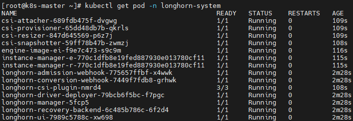

### 2-2. Longhorn UI 접속

```
http://192.168.56.30:30005/
```

### 2-3. Master Server에서 StatefulSet 배포

```
[root@k8s-master ~]# kubectl apply -f https://raw.githubusercontent.com/hyungeunShin/Kubernetes-Sprint3-Config/main/3231/deploy/k8s/block/statefulset.yaml
```

### 2-4. Resource 확인

- https://longhorn.io/docs/archives/1.4.2/references/storage-class-parameters/

▶ StorageClass

```
[root@k8s-master ~]# kubectl get storageclass -o yaml
```

▶ Longhorn의 경우 storage로 지정된 만큼만 Volume을 생성

```
[13MB 파일 다운로드 시]
//Pod 영역 저장 성공
bash-4.4# curl -L -o 13M.file https://github.com/hyungeunShin/Kubernetes-Sprint3-Config/raw/main/3231/deploy/k8s/block/13M

//Volume 영역 - 용량 부족으로 실패
bash-4.4# cd /data/db
bash-4.4# curl -L -o 13M.file https://github.com/hyungeunShin/Kubernetes-Sprint3-Config/raw/main/3231/deploy/k8s/block/13M
```

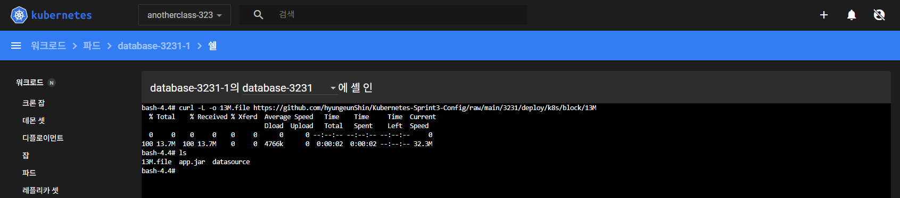

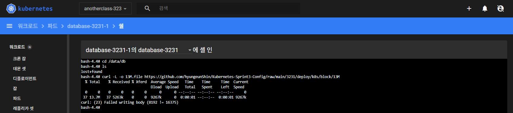

### 2-5. Longhorn 삭제(PVC, PV 모두 정리 후)

```
[root@k8s-master ~]# kubectl delete -f https://raw.githubusercontent.com/hyungeunShin/Kubernetes-Install/main/base/k8s-1.27/longhorn-1.4.2/longhorn.yaml
```

---

## 3. Object Storage - MinIO 설치 및 Deployment 배포

### 3-1. CI/CD Server - MinIO 설치

- https://docs.min.io/enterprise/aistor-object-store/

```
//MinIO 서버 다운
[root@cicd-server ~]# wget https://dl.min.io/server/minio/release/linux-amd64/minio

//설치
[root@cicd-server ~]# chmod +x minio
[root@cicd-server ~]# mv minio /usr/bin/minio

//서버 실행
[root@cicd-server ~]# mkdir /root/minio

//CI/CD 서버 재기동시 다시 실행 시켜야함
[root@cicd-server ~]# minio server /root/minio --console-address :9001 &
```

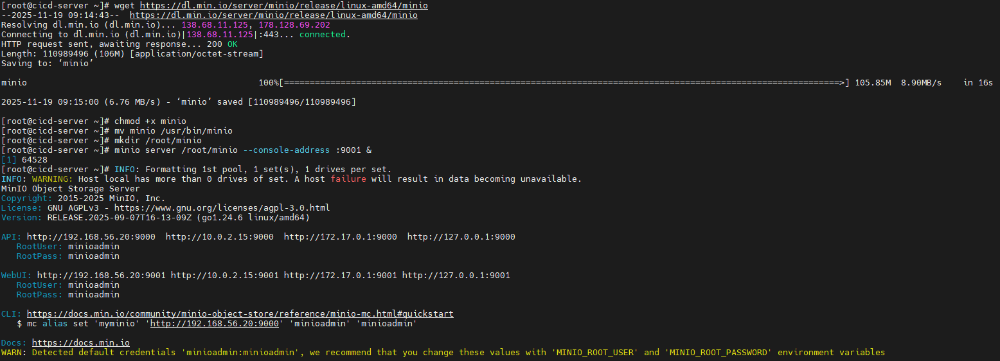

### 3-2. MinIO 접속

```
WebUI: http://192.168.56.20:9001
RootUser: minioadmin
RootPass: minioadmin

API: http://192.168.56.20:9000
RootUser: minioadmin
RootPass: minioadmin
```

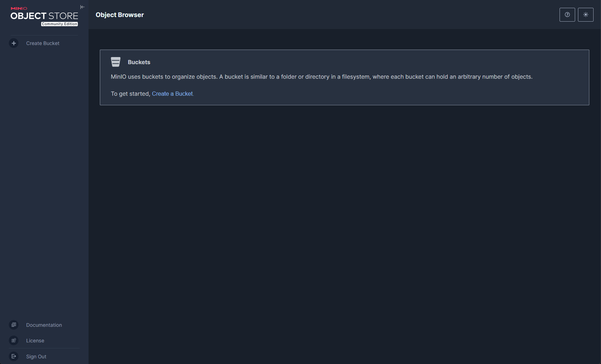

### 3-3. 접속 및 파일 업로드/다운로드

```
//MinIO 클라이언트 다운로드
bash-4.4# curl -L https://dl.min.io/client/mc/release/linux-amd64/mc -o /usr/local/bin/mc
bash-4.4# chmod +x /usr/local/bin/mc

//로그인 
bash-4.4# mc alias set myminio ${minio_endpoint} ${minio_access_key} ${minio_secret_key}

//서버 상태 확인
bash-4.4# mc admin info myminio

//버킷 생성
bash-4.4# mc mb myminio/test
```


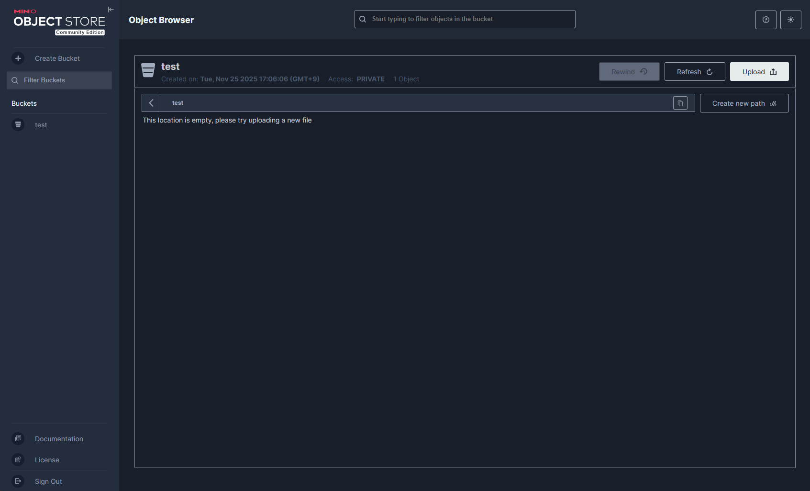

```
//업로드 
bash-4.4# touch upload.txt
bash-4.4# mc cp ./upload.txt myminio/test/upload.txt

//업로드 파일 확인
bash-4.4# mc ls myminio/test
```

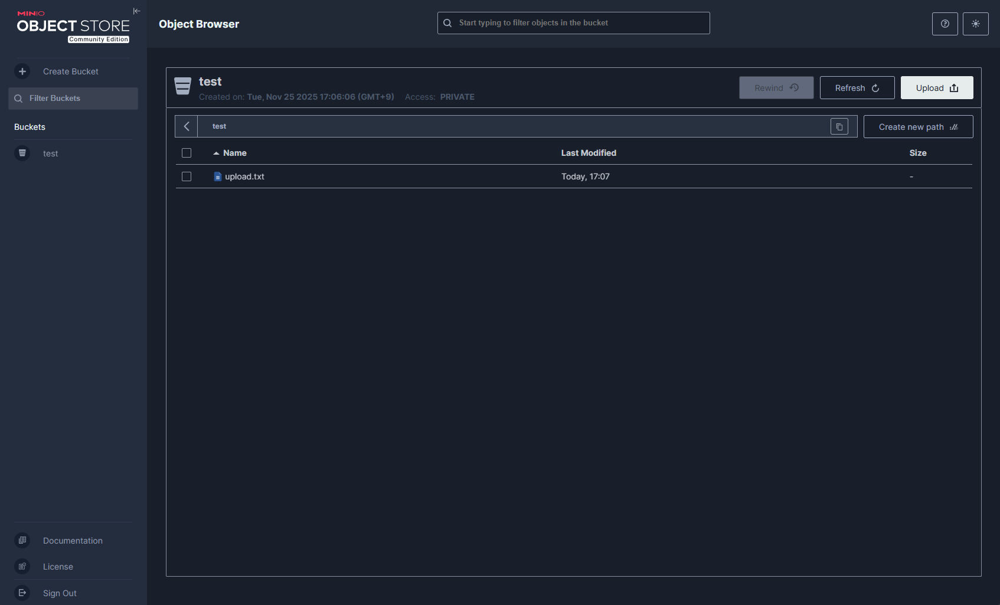

```
//다운로드 
bash-4.4# mc cp myminio/test/upload.txt ~/download.txt
```

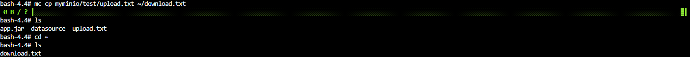

```
//파일 삭제
bash-4.4# mc rm myminio/test/upload.txt
bash-4.4# mc ls myminio/test
```

### 3-4. 리소스 정리

```
[root@k8s-master ~]#
kubectl delete -f https://raw.githubusercontent.com/hyungeunShin/Kubernetes-Sprint3-Config/main/3231/deploy/k8s/file/deployment.yaml
kubectl delete -f https://raw.githubusercontent.com/hyungeunShin/Kubernetes-Sprint3-Config/main/3231/deploy/k8s/file/pvc.yaml
kubectl delete -f https://raw.githubusercontent.com/hyungeunShin/Kubernetes-Sprint3-Config/main/3231/deploy/k8s/file/pv.yaml
kubectl delete -f https://raw.githubusercontent.com/hyungeunShin/Kubernetes-Sprint3-Config/main/3231/deploy/k8s/configmap.yaml
kubectl delete -f https://raw.githubusercontent.com/hyungeunShin/Kubernetes-Sprint3-Config/main/3231/deploy/k8s/secret.yaml
kubectl delete -f https://raw.githubusercontent.com/hyungeunShin/Kubernetes-Sprint3-Config/main/3231/deploy/k8s/namespace.yaml
```
